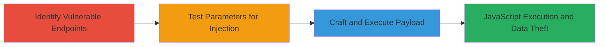

---
tags:
  - xss
  - reflected-xss
  - asp.net
  - javascript-injection
type: attack_chain
tools: []
tactics:
  - '[[Execution]]'
  - '[[Collection]]'
verified: false
platforms:
  - Web
submitted: true
complexity: medium
created_at: '2023-10-01T00:00:00Z'
procedures:
  - '[[procedures/Identify-Vulnerable-ASPX-Endpoints]]'
  - '[[procedures/Test-Parameters-for-XSS]]'
  - '[[procedures/Craft-and-Execute-XSS-Payload]]'
step_count: 3
techniques:
  - '[[JavaScript]]'
updated_at: '2025-12-14T03:16:08.326Z'
description: >-
  A multi-step attack chain exploiting a reflected XSS vulnerability in
  parameters of ASPX pages on videostore.mtnonline.com, allowing arbitrary
  JavaScript execution to steal session data.
skill_level: intermediate
impact_level: high
id: b87e5a88-2213-4e20-b8f0-2998ad35f171
validated: true
mitre_tactics:
  - '[[Execution]]'
  - '[[Collection]]'
mitre_techniques:
  - '[[JavaScript]]'
---
# Reflected XSS in ASP.NET Parameters for JavaScript Execution on MTN Video Store

Multi-stage attack chain demonstrating exploitation of a reflected Cross-Site Scripting (XSS) vulnerability in the parameters of ASPX pages on videostore.mtnonline.com/GL/*.aspx. The attack involves identifying vulnerable endpoints, testing for injection points, and crafting a payload to execute JavaScript, such as alerting or stealing session cookies, in the victim's browser context.

## Chain Metrics Dashboard

| Metric | Value |
|--------|-------|
| Chain Status | Unverified |
| Total Steps | 3 |
| Execution Time | ~5 minutes |
| Skill Level | Intermediate |
| Complexity | Medium |
| Impact Level | High |

## Attack Flow Visualization

## Prerequisites & Requirements

### Required Tools

- Web browser (e.g., Chrome Developer Tools for testing)
- [[tools/curl]] (optional for automated testing)

### Target Environment

- Web platform
- ASP.NET-based application
- Accessible via HTTP/HTTPS on port 80/443

### Initial Access Requirements

- Public network access to videostore.mtnonline.com
- No authentication required for initial testing
- Victim must visit the crafted malicious URL

## Detailed Attack Procedures

### Step 1: Identify Vulnerable Endpoints
procedure: [[procedures/Identify-Vulnerable-ASPX-Endpoints]]

**Objective**: Locate ASPX pages under /GL/ that accept parameters susceptible to injection.

**Instructions**: Manually browse or use reconnaissance to target pages like MyAccount.aspx. Focus on endpoints with query parameters such as PId, CID, and OprId.

**Expected Output**: Confirmation of endpoint like https://videostore.mtnonline.com/GL/MyAccount.aspx?PId=126&CID=5&OprId=11.

**Success Indicators**:
- Endpoint responds with unfiltered output
- Parameters are reflected in the response

### Step 2: Test Parameters for XSS
procedure: [[procedures/Test-Parameters-for-XSS]]

**Objective**: Verify if special characters in parameters lead to HTML/JS injection without sanitization.

**Instructions**: Append test payloads with characters like <, >, ", /, ' to parameters. Use a browser or [[commands/curl-test-xss]] to send requests and inspect responses for unescaped output.

**Expected Output**: Response shows injected characters breaking HTML context, e.g., <script> not encoded.

**Success Indicators**:
- Special characters appear unescaped in HTML
- No error or sanitization observed

### Step 3: Craft and Execute XSS Payload
procedure: [[procedures/Craft-and-Execute-XSS-Payload]]

**Objective**: Inject and trigger JavaScript execution to demonstrate exploitation, such as popping an alert or exfiltrating data.

**Instructions**: Construct a URL with a payload that breaks out of the parameter context, e.g., using %27><input onfocus=... to inject an autofocus element. Send via browser or [[commands/curl-execute-xss]] and observe execution on load/focus. For real attacks, replace alert with code to steal document.cookie.

**Expected Output**: JavaScript executes, e.g., alert('XSS') pops in the browser.

**Success Indicators**:
- Alert or scripted action triggers
- Potential for session hijacking confirmed

## Attack Chain Summary

### Key Achievements

1. Identified unfiltered parameters in ASP.NET pages
2. Confirmed reflected XSS via special character injection
3. Demonstrated arbitrary JS execution for data theft

## Technique & Tactic Coverage

### MITRE ATT&CK Techniques

- [[JavaScript]]

### MITRE ATT&CK Tactics

- [[Execution]]
- [[Collection]]

---
*Last updated: 2023-10-01T00:00:00Z*
