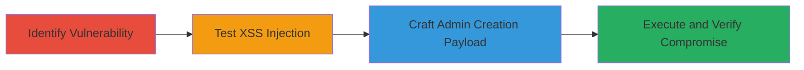

---
tags:
  - xss
  - reflected-xss
  - wordpress
  - admin-creation
  - javascript-injection
type: attack_chain
tools: []
tactics:
  - '[[Initial Access]]'
  - '[[Execution]]'
  - '[[Persistence]]'
verified: false
platforms:
  - Web
  - WordPress
submitted: true
complexity: medium
created_at: '2023-10-01T00:00:00Z'
procedures:
  - '[[procedures/Identify-Vulnerable-Email-Parameter-on-Acronis-Thank-You-Page]]'
  - '[[procedures/Test-Reflected-XSS-with-Alert-Payload-on-Acronis-Page]]'
  - '[[procedures/Craft-XSS-Payload-to-Create-WordPress-Admin-User-via-AJAX]]'
  - '[[procedures/Verify-XSS-Payload-Execution-and-Admin-User-Creation]]'
step_count: 4
techniques:
  - '[[Drive-by Compromise]]'
  - '[[JavaScript]]'
updated_at: '2025-12-14T03:16:31.431Z'
description: >-
  A multi-stage attack exploiting a reflected XSS vulnerability in the email
  parameter of the Acronis newsletter thank-you page to inject JavaScript that
  creates a new administrator user in the underlying WordPress CMS when visited
  by a logged-in admin.
skill_level: intermediate
impact_level: high
id: e21af7ad-a2c9-4482-810d-103969735b76
validated: true
mitre_tactics:
  - '[[Initial Access]]'
  - '[[Execution]]'
  - '[[Persistence]]'
mitre_techniques:
  - '[[Drive-by Compromise]]'
  - '[[JavaScript]]'
---
# Reflected XSS in Acronis Newsletter Thank-You Page Leading to WordPress Admin User Creation

Multi-stage attack chain demonstrating a complete attack workflow exploiting a reflected XSS vulnerability to gain administrative access to a WordPress site.

## Chain Metrics Dashboard

| Metric | Value |
|--------|-------|
| Chain Status | Unverified |
| Total Steps | 4 |
| Execution Time | ~5 minutes |
| Skill Level | Intermediate |
| Complexity | Medium |
| Impact Level | High |

## Attack Flow Visualization

## Prerequisites & Requirements

### Required Tools

- Web browser with developer tools (e.g., Chrome DevTools)
- URL encoding tool (built-in browser or online encoder)

### Target Environment

- Web platform with WordPress CMS
- Access to the Acronis thank-you page: https://cz.acronis.com/dekujeme-za-odber-novinek-produktu-disk-director/
- Victim must be logged in as WordPress admin

### Initial Access Requirements

- No prior credentials needed for identification and testing
- Social engineering to lure admin to malicious URL
- Network access to the public-facing site

## Detailed Attack Procedures

### Step 1: Identify Vulnerable Parameter
procedure: [[procedures/Identify-Vulnerable-Email-Parameter-on-Acronis-Thank-You-Page]]

**Objective**: Locate the reflected input parameter on the thank-you page that lacks sanitization.

**Instructions**: Navigate to the Acronis newsletter subscription thank-you page and inspect how the 'email' parameter is handled in the URL query string. Append a test value to the email parameter and observe if it is reflected back in the page source without escaping.

**Expected Output**: The email value appears directly in the HTML response, confirming potential for XSS.

**Success Indicators**:
- Parameter reflection observed in page source
- No HTML entity encoding applied to input

### Step 2: Test Basic XSS
procedure: [[procedures/Test-Reflected-XSS-with-Alert-Payload-on-Acronis-Page]]

**Objective**: Confirm XSS vulnerability by injecting and executing a simple JavaScript alert.

**Instructions**: Craft a URL with a basic XSS payload in the email parameter, URL-encode it, and visit the page. Use developer tools to monitor for script execution.

**Expected Output**: Browser alert dialog pops up displaying '1' or similar.

**Success Indicators**:
- Alert executes in the browser context
- Payload reflected and interpreted as JavaScript

### Step 3: Craft Advanced Payload for Admin Creation
procedure: [[procedures/Craft-XSS-Payload-to-Create-WordPress-Admin-User-via-AJAX]]

**Objective**: Develop a JavaScript payload that uses AJAX to extract a nonce and create a new admin user in WordPress.

**Instructions**: Encode a complex eval-based JavaScript payload that fetches the nonce from /wp-admin/user-new.php and posts user creation data. Insert into the email parameter and ensure the victim (logged-in admin) visits the URL.

**Expected Output**: Network tab shows GET and POST requests to WordPress admin endpoints.

**Success Indicators**:
- Nonce successfully extracted
- New admin user created in WordPress database

### Step 4: Verify Execution
procedure: [[procedures/Verify-XSS-Payload-Execution-and-Admin-User-Creation]]

**Objective**: Confirm the payload's success by checking for the new admin user and reviewing network activity.

**Instructions**: While logged in as admin, load the malicious URL and inspect the browser's network tab for AJAX calls. Log into WordPress admin panel to check for the new user.

**Expected Output**: Evidence of user creation in WordPress users list; network logs show successful POST.

**Success Indicators**:
- New administrator account appears in WordPress
- Site compromise achieved via unauthorized access

## Attack Chain Summary

### Key Achievements

1. Identified and confirmed reflected XSS in email parameter
2. Executed JavaScript to automate WordPress admin user creation
3. Achieved full site takeover without direct authentication
4. Demonstrated high-impact privilege escalation from a simple reflection flaw

## Technique & Tactic Coverage

### MITRE ATT&CK Techniques

- [[Drive-by Compromise]]
- [[JavaScript]]

### MITRE ATT&CK Tactics

- [[Initial Access]]
- [[Execution]]
- [[Persistence]]

---
*Last updated: 2023-10-01T00:00:00Z*
