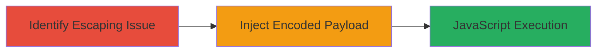

---
tags:
  - xss
  - reflected-xss
  - url-encoding
  - bypass
  - web
type: attack_chain
tools: []
tactics:
  - '[[Execution]]'
verified: false
platforms:
  - Web
submitted: true
complexity: low
created_at: '2023-10-01T00:00:00Z'
procedures:
  - '[[procedures/Test-Search-Parameter-for-XSS-Escaping-Issues]]'
  - '[[procedures/Inject-URL-Encoded-XSS-Payload]]'
step_count: 2
techniques:
  - '[[JavaScript]]'
updated_at: '2025-12-14T03:16:14.543Z'
description: >-
  A multi-stage attack exploiting a reflected XSS vulnerability in the Adobe
  eDex search functionality by bypassing input sanitization with URL-encoded
  equals (%3D) to execute arbitrary JavaScript.
skill_level: intermediate
impact_level: high
id: cbd6032e-af84-4184-a696-7c9ba697e249
validated: true
mitre_tactics:
  - '[[Execution]]'
mitre_techniques:
  - '[[JavaScript]]'
---
# Reflected XSS in Adobe eDex Search via URL Encoding Bypass

Multi-stage attack chain demonstrating a complete reflected XSS exploitation workflow in the Adobe eDex search functionality.

## Chain Metrics Dashboard

| Metric | Value |
|--------|-------|
| Chain Status | Unverified |
| Total Steps | 2 |
| Execution Time | ~5 minutes |
| Skill Level | Intermediate |
| Complexity | Low |
| Impact Level | High |

## Attack Flow Visualization

## Prerequisites & Requirements

### Required Tools

- Web browser (e.g., Chrome Developer Tools for payload testing)

### Target Environment

- Web platform
- Accessible search endpoint at http://edex.adobe.com/search/global/
- No authentication required for public search

### Initial Access Requirements

- Direct network access to the target URL
- No prior credentials needed

## Detailed Attack Procedures

### Step 1: Identify Escaping Issue
procedure: [[procedures/Test-Search-Parameter-for-XSS-Escaping-Issues]]

**Objective**: Test the search parameter for improper input escaping, specifically checking for '=' stripping without handling URL encodings.

**Instructions**: Access the search endpoint http://edex.adobe.com/search/global/[SEARCH_HERE] in a web browser. Replace [SEARCH_HERE] with a test string containing an unencoded '=' (e.g., test=alert(1)). Observe that the system strips the unencoded '=' to prevent XSS. Then, test with URL-encoded '%3D' (e.g., test%3Dalert(1)) and note that it is not stripped.

**Expected Output**: The page reflects the input without stripping '%3D', indicating a potential bypass.

**Success Indicators**:
- Unencoded '=' is stripped from the reflected output
- URL-encoded '%3D' appears unfiltered in the page source

### Step 2: Inject Encoded Payload
procedure: [[procedures/Inject-URL-Encoded-XSS-Payload]]

**Objective**: Craft and deliver a malicious search URL with an URL-encoded XSS payload to execute arbitrary JavaScript in the victim's browser.

**Instructions**: Construct a search URL using the encoded bypass, such as http://edex.adobe.com/search/global/test%3D%3Cscript%3Ealert('XSS')%3C/script%3E. Share this URL with the victim (e.g., via phishing). When accessed, the payload executes due to the filter bypass.

**Expected Output**: An alert box or other JavaScript execution in the browser upon loading the URL.

**Success Indicators**:
- Payload reflected without sanitization
- JavaScript executes, confirming XSS

## Attack Chain Summary

### Key Achievements

1. Identified filter limitation in search input handling
2. Bypassed XSS protection using URL encoding
3. Achieved arbitrary JavaScript execution for potential data theft or session hijacking

## Technique & Tactic Coverage

### MITRE ATT&CK Techniques

- [[JavaScript]]

### MITRE ATT&CK Tactics

- [[Execution]]

---
*Last updated: 2023-10-01T00:00:00Z*
