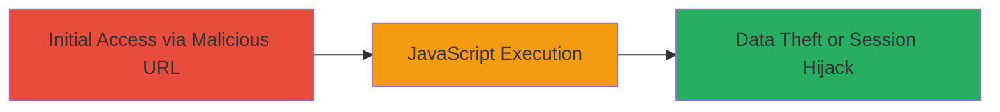

# Reflected XSS in Akamai ARL Endpoint for Arbitrary JavaScript Execution

Multi-stage attack chain demonstrating a complete attack workflow.

## Chain Metrics Dashboard

| Metric | Value |
|--------|-------|
| Chain Status | Unverified |
| Total Steps | 1 |
| Execution Time | ~1 minute |
| Skill Level | Beginner |
| Complexity | Low |
| Impact Level | High |

## Attack Flow Visualization

## Prerequisites & Requirements

### Required Tools

- Web browser (e.g., Chrome, Firefox)

### Target Environment

- Akamai Absolute Redirect List (ARL) endpoint
- Publicly accessible web application
- No specific ports required beyond standard HTTP/HTTPS (80/443)

### Initial Access Requirements

- No credentials needed
- Victim must visit the crafted malicious URL
- Attacker requires ability to distribute the URL (e.g., via phishing)

## Detailed Attack Procedures

### Step 1: Inject Payload into ARL Endpoint
procedure: [[procedures/Exploit-Reflected-XSS-in-Akamai-ARL-Parameter]]

**Objective**: Deliver a malicious URL to the victim that triggers reflected XSS on the Akamai ARL endpoint, executing arbitrary JavaScript in the browser context.

**Instructions**: Craft a URL targeting the vulnerable Akamai ARL endpoint, such as http://master-config-████████/7/0/33/1d/www.citysearch.com/search?what=x&where=place%22%3E%3Csvg+onload=confirm(document.domain)%3E. The payload %22%3E%3Csvg+onload=confirm(document.domain)%3E is injected into the 'where' parameter. Send this URL to the victim via email, social engineering, or a phishing site. When the victim accesses it, the payload reflects unsanitized, executing the SVG onload JavaScript to confirm the document domain (proof of execution).

**Expected Output**: A browser alert or confirmation dialog displaying the document domain, indicating successful JavaScript execution.

**Success Indicators**:
- JavaScript alert fires in the victim's browser
- No sanitization errors; payload executes without breaking the page
- Potential for further payloads to steal cookies or session tokens

## Attack Chain Summary

### Key Achievements

1. Successful reflection of HTML/JavaScript payload without sanitization
2. Arbitrary code execution in victim browser context
3. Potential for session hijacking, phishing, or data exfiltration

## Technique & Tactic Coverage

### MITRE ATT&CK Techniques

- [[Exploit Public-Facing Application]]
- [[JavaScript]]

### MITRE ATT&CK Tactics

- [[Initial Access]]
- [[Execution]]

---
*Last updated: 2023-10-01T00:00:00Z*
