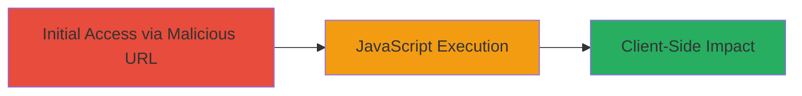

# Reflected XSS in Akamai ARL Search Parameter for Arbitrary JavaScript Execution

Multi-stage attack chain demonstrating a complete attack workflow.

## Chain Metrics Dashboard

| Metric | Value |
|--------|-------|
| Chain Status | Unverified |
| Total Steps | 1 |
| Execution Time | ~1 minute |
| Skill Level | Beginner |
| Complexity | Low |
| Impact Level | High |

## Attack Flow Visualization

## Prerequisites & Requirements

### Required Tools

- Web browser (e.g., Chrome, Firefox)

### Target Environment

- Web platform with Akamai ARL configuration
- Accessible search endpoint at http://media.████████/7/0/33/1d/www.citysearch.com/search
- No authentication required for public search

### Initial Access Requirements

- Victim must click or be tricked into visiting the malicious URL (e.g., via phishing)
- Direct network access to the target domain
- No prior access needed

## Detailed Attack Procedures

### Step 1: Trigger Reflected XSS
procedure: [[procedures/Exploit-Reflected-XSS-in-Search-Where-Parameter]]

**Objective**: Inject a malicious payload into the 'where' parameter to reflect and execute arbitrary JavaScript in the victim's browser.

**Instructions**: Construct a malicious URL by appending the payload to the 'where' parameter. For testing, use a simple alert payload like `<svg onload=confirm(document.domain)>`. The full URL example is:

http://media.██████/7/0/33/1d/www.citysearch.com/search?what=x&where=place%22%3E%3Csvg+onload=confirm(document.domain)%3E

Navigate to this URL in a browser. The payload breaks out of the attribute context and executes the onload event.

**Expected Output**: A browser dialog (confirm box) displaying the document domain, confirming JavaScript execution.

**Success Indicators**:
- JavaScript alert or confirm dialog appears
- No sanitization errors; payload reflects directly in HTML
- Victim's session cookies or other client-side data could be exfiltrated if payload is modified

## Attack Chain Summary

### Key Achievements

1. Successful reflection of unsanitized user input in the search page
2. Arbitrary JavaScript execution without server-side validation
3. Potential for session hijacking or phishing via cookie theft

## Technique & Tactic Coverage

### MITRE ATT&CK Techniques

- [[Exploit Public-Facing Application]]
- [[JavaScript]]

### MITRE ATT&CK Tactics

- [[Execution]]

---

*Last updated: 2023-10-01T00:00:00Z*
