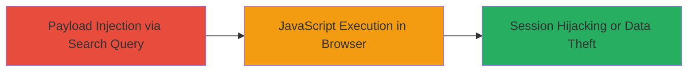

---
tags:
  - xss
  - reflected-xss
  - algolia
  - javascript-execution
type: attack_chain
tools: []
tactics:
  - '[[Execution]]'
  - '[[Collection]]'
verified: false
platforms:
  - Web
submitted: true
complexity: low
created_at: '2023-10-01T00:00:00Z'
procedures:
  - '[[procedures/Exploit-Reflected-XSS-in-Algolia-Search]]'
step_count: 1
techniques:
  - '[[JavaScript]]'
updated_at: '2025-12-14T03:46:37.715Z'
description: >-
  A single-stage attack exploiting a reflected XSS vulnerability in Algolia's
  search functionality to execute arbitrary JavaScript in the victim's browser,
  enabling session hijacking or data theft.
skill_level: basic
impact_level: high
id: e540d7ac-fd85-46a8-b9c9-ff8fb0eb88c9
validated: true
mitre_tactics:
  - '[[Execution]]'
  - '[[Collection]]'
mitre_techniques:
  - '[[JavaScript]]'
---
# Reflected XSS in Algolia Search for Arbitrary JavaScript Execution

Multi-stage attack chain demonstrating a complete attack workflow.

## Chain Metrics Dashboard

| Metric | Value |
|--------|-------|
| Chain Status | Unverified |
| Total Steps | 1 |
| Execution Time | ~1 minute |
| Skill Level | Basic |
| Complexity | Low |
| Impact Level | High |

## Attack Flow Visualization



## Prerequisites & Requirements

### Required Tools

- Browser developer tools for payload testing

### Target Environment

- Web application integrating Algolia search service
- Accessible search endpoint (e.g., via URL parameter)
- No specific ports required beyond standard HTTP/HTTPS (80/443)

### Initial Access Requirements

- Public access to the web application
- No credentials needed for reflected XSS
- Victim must interact with the malicious link (e.g., via phishing)

## Detailed Attack Procedures

### Step 1: Inject Malicious Search Query
procedure: [[procedures/Exploit-Reflected-XSS-in-Algolia-Search]]

**Objective**: Inject a malicious payload into the Algolia search query to trigger reflected XSS, executing arbitrary JavaScript in the victim's browser context.

**Instructions**: Craft a URL with a JavaScript payload in the search query parameter. For example, use [[commands/curl-inject-xss-payload]] to test the endpoint:

```bash
curl -X GET "https://target-site.com/search?q=%3Cscript%3Ealert%28%27XSS%27%29%3C%2Fscript%3E" -v
```

Then, deliver the payload via a phishing link or direct access to confirm execution. In a browser, navigate to the URL and observe the alert or inspect the DOM for payload reflection.

**Expected Output**: The search page reflects the unsanitized query, executing the script (e.g., alert popup or console log).

**Success Indicators**:
- JavaScript alert or custom action (e.g., cookie theft) triggers
- Payload visible in page source without escaping
- Network requests show reflected input in HTML/JS context

## Attack Chain Summary

### Key Achievements

1. Successful injection of JavaScript payload via search query
2. Arbitrary code execution in victim browser
3. Potential for session hijacking or sensitive data exfiltration

## Technique & Tactic Coverage

### MITRE ATT&CK Techniques

- [[JavaScript]]

### MITRE ATT&CK Tactics

- [[Execution]]
- [[Collection]]

---
*Last updated: 2023-10-01T00:00:00Z*
