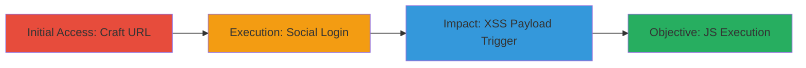

---
tags:
  - xss
  - reflected-xss
  - login-redirect
  - javascript-uri
type: attack_chain
tools: []
tactics:
  - '[[Execution]]'
verified: false
platforms:
  - Web
submitted: true
complexity: medium
created_at: '2024-10-01T00:00:00Z'
procedures:
  - '[[procedures/Craft-Malicious-Login-URL-with-XSS-Payload]]'
  - '[[procedures/Initiate-Social-Login-on-Avito]]'
  - '[[procedures/Trigger-and-Verify-XSS-Payload-Execution]]'
step_count: 3
techniques:
  - '[[JavaScript]]'
updated_at: '2025-12-14T00:11:09.755Z'
description: >-
  A multi-stage attack exploiting a reflected XSS vulnerability in Avito.ru's
  login redirect functionality by injecting a javascript: URI into the 'next'
  parameter, leading to arbitrary JavaScript execution post-authentication.
skill_level: intermediate
impact_level: high
id: 3f52d7ca-0a24-418f-99ea-cfe8cd721a0c
validated: true
mitre_tactics:
  - '[[Execution]]'
mitre_techniques:
  - '[[JavaScript]]'
---
# Reflected XSS in Avito Login Redirect via Unsanitized 'next' Parameter

Multi-stage attack chain demonstrating a complete attack workflow exploiting a reflected XSS in Avito.ru's login redirect, where the 'next' parameter after the #login fragment is not sanitized, allowing javascript: URIs to execute post-login.

## Chain Metrics Dashboard

| Metric | Value |
|--------|-------|
| Chain Status | Unverified |
| Total Steps | 3 |
| Execution Time | ~5 minutes |
| Skill Level | Intermediate |
| Complexity | Medium |
| Impact Level | High |

## Attack Flow Visualization

## Prerequisites & Requirements

### Required Tools

- Web browser (e.g., Chrome, Firefox)

### Target Environment

- Web platform
- Avito.ru website
- Access to social login providers (OK.ru, VK.com)

### Initial Access Requirements

- No prior credentials needed
- Public network access to Avito.ru
- Ability to craft and share URLs (e.g., via phishing email or direct link)

## Detailed Attack Procedures

### Step 1: Initial Access
procedure: [[procedures/Craft-Malicious-Login-URL-with-XSS-Payload]]

**Objective**: Create a malicious URL that injects an XSS payload into the login redirect parameter to set up the reflected attack.

**Instructions**: Manually construct the URL by appending the #login fragment and injecting the javascript:alert() payload into the 'next' parameter. Example URL: https://www.avito.ru/sankt-peterburg?verifyUserLocation=1#login?next=javascript:alert(document.cookie);/

**Expected Output**: A shareable URL that, when visited, directs to the login page with the embedded payload.

**Success Indicators**:
- URL is valid and loads the Avito login page without errors
- Payload is present in the browser's address bar

### Step 2: Execution
procedure: [[procedures/Initiate-Social-Login-on-Avito]]

**Objective**: Trick the victim into authenticating via social login, which triggers the redirect and reflects the unsanitized parameter.

**Instructions**: Have the victim visit the crafted URL and select a social login option (e.g., OK or VK). Complete the authentication flow on the social provider's site, which redirects back to Avito.

**Expected Output**: Successful login to Avito.ru, with the browser redirecting to the 'next' parameter's value.

**Success Indicators**:
- User is logged in to Avito
- Redirect occurs without blocking the javascript: URI

### Step 3: Privilege Escalation
procedure: [[procedures/Trigger-and-Verify-XSS-Payload-Execution]]

**Objective**: Execute the injected JavaScript in the authenticated context, demonstrating arbitrary code execution for potential session theft or phishing.

**Instructions**: Upon redirect after login, the payload automatically executes. Observe the alert box popping up with document.cookie, confirming XSS success.

**Expected Output**: JavaScript alert displays session cookies or other client-side data.

**Success Indicators**:
- Alert box appears post-login
- Console logs or network requests indicate JS execution
- Potential for further exploits like cookie exfiltration

## Attack Chain Summary

### Key Achievements

1. Successful injection of javascript: URI into login redirect
2. Bypassing sanitization via social login flow
3. Arbitrary JS execution in authenticated session, enabling session hijacking

## Technique & Tactic Coverage

### MITRE ATT&CK Techniques

- [[JavaScript]]

### MITRE ATT&CK Tactics

- [[Execution]]

---
*Last updated: 2024-10-01T00:00:00Z*
