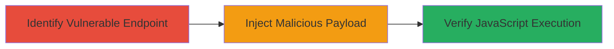

---
tags:
  - xss
  - reflected-xss
  - javascript-execution
  - bittorrent
type: attack_chain
tools: []
tactics:
  - '[[Execution]]'
verified: false
platforms:
  - Web
submitted: true
complexity: low
created_at: '2024-10-01'
procedures:
  - '[[procedures/Exploit-Reflected-XSS-in-Logout-Parameter]]'
step_count: 3
techniques:
  - '[[JavaScript]]'
  - '[[Exploit Public-Facing Application]]'
updated_at: '2025-12-14T03:16:13.863Z'
description: >-
  A multi-step attack exploiting a reflected XSS vulnerability in the message
  parameter of the /talon/logout endpoint on remote.bittorrent.com, allowing
  arbitrary JavaScript execution in the victim's browser.
skill_level: intermediate
impact_level: high
id: 5949f219-324e-419a-91aa-df2d91ec1c9c
validated: true
mitre_tactics:
  - '[[Execution]]'
mitre_techniques:
  - '[[JavaScript]]'
  - '[[Exploit Public-Facing Application]]'
---
# Reflected XSS in BitTorrent Remote Logout Endpoint for JavaScript Execution

Multi-stage attack chain demonstrating a complete attack workflow exploiting a reflected Cross-Site Scripting (XSS) vulnerability.

## Chain Metrics Dashboard

| Metric | Value |
|--------|-------|
| Chain Status | Unverified |
| Total Steps | 3 |
| Execution Time | ~5 minutes |
| Skill Level | Intermediate |
| Complexity | Low |
| Impact Level | High |

## Attack Flow Visualization

## Prerequisites & Requirements

### Required Tools

- Web browser (e.g., Chrome or Firefox with developer tools)

### Target Environment

- Web platform
- Access to https://remote.bittorrent.com
- No specific services or ports required beyond standard HTTPS (443)

### Initial Access Requirements

- Public internet access
- No credentials needed; the endpoint is publicly accessible
- Victim must visit the crafted URL

## Detailed Attack Procedures

### Step 1: Identify the Logout Endpoint
procedure: [[procedures/Exploit-Reflected-XSS-in-Logout-Parameter]]

**Objective**: Locate the vulnerable /talon/logout endpoint on the subdomain and confirm reflection of the message parameter.

**Instructions**: Navigate to https://remote.bittorrent.com/talon/logout?message=test in a web browser. Inspect the HTML response using developer tools (F12) to observe that the 'message' parameter value is directly reflected into the page without sanitization.

**Expected Output**: The page displays the reflected input, e.g., "test" appears unsanitized in the HTML.

**Success Indicators**:
- Parameter reflection visible in source code
- No encoding or escaping applied to user input

### Step 2: Inject Malicious Payload
procedure: [[procedures/Exploit-Reflected-XSS-in-Logout-Parameter]]

**Objective**: Craft and deliver a payload to break out of the HTML context and execute JavaScript.

**Instructions**: Modify the URL to include a malicious payload in the message parameter: https://remote.bittorrent.com/talon/logout?message="></img>. Load this URL in the browser. The payload uses an img tag with an invalid src to trigger the onerror handler, executing the JavaScript.

**Expected Output**: The page loads with the injected HTML, and the onerror event fires.

**Success Indicators**:
- HTML injection successful (view source shows injected tag)
- No blocking by content security policy or sanitization

### Step 3: Verify XSS Execution
procedure: [[procedures/Exploit-Reflected-XSS-in-Logout-Parameter]]

**Objective**: Confirm arbitrary JavaScript execution and assess potential impact.

**Instructions**: Upon loading the payload URL, observe the browser behavior. The alert(1) should pop up, proving code execution. For real attacks, replace alert(1) with code to steal cookies (e.g., document.cookie) or redirect to a phishing site.

**Expected Output**: Alert dialog with "1" appears, confirming execution in the site's context.

**Success Indicators**:
- JavaScript alert triggers
- Screenshots or console logs show execution; potential for session hijacking if cookies are accessible

## Attack Chain Summary

### Key Achievements

1. Identified unsanitized reflection in logout endpoint
2. Successfully injected and executed JavaScript via onerror handler
3. Demonstrated potential for client-side attacks like session theft

## Technique & Tactic Coverage

### MITRE ATT&CK Techniques

- [[JavaScript]]
- [[Exploit Public-Facing Application]]

### MITRE ATT&CK Tactics

- [[Execution]]

---

*Last updated: 2024-10-01*
