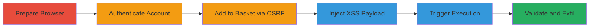

# Reflected XSS in Canonical Link with CSRF Automation for Payment Phishing on Starbucks UK

Multi-stage attack chain demonstrating exploitation of a reflected XSS vulnerability in the canonical link tag on the Starbucks UK website, bypassed via URL encoding, combined with CSRF to automate the attack flow, ultimately enabling JavaScript execution on authenticated payment pages to redirect iframes and steal credit card information.

## Chain Metrics Dashboard

| Metric | Value |
|--------|-------|
| Chain Status | Unverified |
| Total Steps | 6 |
| Execution Time | ~5 minutes |
| Skill Level | Intermediate |
| Complexity | Medium |
| Impact Level | High |

## Attack Flow Visualization

## Prerequisites & Requirements

### Required Tools

- [[tools/Firefox]]

### Target Environment

- Web platform
- Starbucks UK website (https://www.starbucks.co.uk)
- Authenticated user session required
- No specific ports or services beyond standard HTTPS (443)

### Initial Access Requirements

- Valid Starbucks account credentials
- Direct network access to the website
- No prior access needed beyond public internet

## Detailed Attack Procedures

### Step 1: Prepare Browser for XSS Reproduction
procedure: [[procedures/Prepare-Firefox-for-XSS-Reproduction]]

**Objective**: Set up the required browser environment to handle URL-encoded payloads and decoding behaviors specific to the exploit.

**Instructions**: Launch Firefox as it is necessary for proper handling of %u0022 encoding in the payload.

**Expected Output**: Firefox browser instance ready for navigation.

**Success Indicators**:
- Browser launches without errors
- Encoding behaviors are supported (test with simple URL decode if needed)

### Step 2: Authenticate Starbucks Account
procedure: [[procedures/Authenticate-Starbucks-Account]]

**Objective**: Gain an authenticated session to access protected pages like payment methods.

**Instructions**: Navigate to the sign-in page and enter credentials.

**Expected Output**: Successful login redirect to account dashboard.

**Success Indicators**:
- User is logged in
- Session cookies are set

### Step 3: Add Egift Card to Basket via CSRF
procedure: [[procedures/Add-Egift-Card-to-Basket-via-CSRF]]

**Objective**: Add an egift card to the basket without CSRF protection, enabling automation in phishing scenarios.

**Instructions**: Visit the egift page and perform the add action.

**Expected Output**: Item added to basket confirmation.

**Success Indicators**:
- Basket updated
- No CSRF token prompt or validation

### Step 4: Inject XSS Payload into Payment Page
procedure: [[procedures/Inject-XSS-Payload-into-Payment-Page]]

**Objective**: Deliver the reflected XSS payload via query parameters to inject malicious attributes into the canonical link.

**Instructions**: Navigate to the payment method page with the crafted URL-encoded payload.

**Expected Output**: Page loads with reflected payload in the canonical link tag.

**Success Indicators**:
- Payload visible in page source
- No WAF block

### Step 5: Trigger XSS via Checkout Click
procedure: [[procedures/Trigger-XSS-via-Checkout-Click]]

**Objective**: Execute the injected JavaScript by interacting with the page elements.

**Instructions**: Wait for page load and click the Checkout element, which triggers the onclick handler.

**Expected Output**: JavaScript execution, such as a confirmation prompt.

**Success Indicators**:
- Onclick handler fires
- Alert or redirect occurs

### Step 6: Validate XSS Execution and Exfiltration
procedure: [[procedures/Validate-XSS-Execution-and-Exfiltration]]

**Objective**: Confirm XSS success and demonstrate potential for data theft via iframe redirection.

**Instructions**: Observe the confirmation dialog and note how it could be extended to phish payment details.

**Expected Output**: Domain confirmation in alert; in full exploit, stolen form data.

**Success Indicators**:
- Alert displays domain
- Potential for iframe manipulation confirmed

## Attack Chain Summary

### Key Achievements

1. Bypassed WAF using %u0022 encoding to inject XSS into canonical link.
2. Automated attack flow via CSRF on basket addition.
3. Achieved JavaScript execution on authenticated payment page.
4. Enabled phishing redirection of credit card iframes for data theft.

## Technique & Tactic Coverage

### MITRE ATT&CK Techniques

- [[Exploit Public-Facing Application]] Exploit Public-Facing Application
- [[JavaScript]] JavaScript

### MITRE ATT&CK Tactics

- [[Initial Access]] Initial Access
- [[Execution]] Execution
- [[Collection]] Collection

---
*Last updated: 2023-10-01T00:00:00Z*
