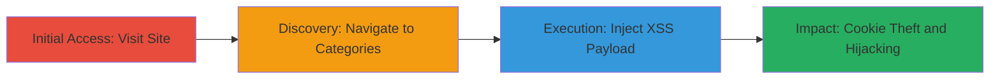

---
tags:
  - xss
  - reflected-xss
  - cookie-theft
  - session-hijacking
  - phishing
type: attack_chain
tools: []
tactics:
  - '[[Initial Access]]'
  - '[[Execution]]'
  - '[[Collection]]'
verified: false
platforms:
  - Web
submitted: true
complexity: low
created_at: '2023-10-01T00:00:00Z'
procedures:
  - '[[procedures/Access-Target-Website]]'
  - '[[procedures/Navigate-to-Categories-Endpoint]]'
  - '[[procedures/Inject-XSS-Payload-in-Category-ID]]'
step_count: 3
techniques:
  - '[[Drive-by Compromise]]'
  - '[[JavaScript]]'
updated_at: '2025-12-14T03:46:38.128Z'
description: >-
  A multi-step attack exploiting a reflected XSS vulnerability in the
  category_id parameter of dailydeals.mtn.co.za to execute JavaScript and steal
  user session cookies.
skill_level: beginner
impact_level: high
id: 01c5d890-e62f-444f-811f-0d2e9c54baa7
validated: true
mitre_tactics:
  - '[[Initial Access]]'
  - '[[Execution]]'
  - '[[Collection]]'
mitre_techniques:
  - '[[Drive-by Compromise]]'
  - '[[JavaScript]]'
---
# Reflected XSS in Category ID Parameter for Cookie Theft and Session Hijacking

Multi-stage attack chain demonstrating exploitation of a reflected Cross-Site Scripting (XSS) vulnerability in the 'category_id' parameter on dailydeals.mtn.co.za, allowing arbitrary JavaScript execution to steal user cookies and enable session hijacking or phishing attacks.

## Chain Metrics Dashboard

| Metric | Value |
|--------|-------|
| Chain Status | Unverified |
| Total Steps | 3 |
| Execution Time | ~2 minutes |
| Skill Level | Beginner |
| Complexity | Low |
| Impact Level | High |

## Attack Flow Visualization

## Prerequisites & Requirements

### Required Tools

- Web browser (e.g., Chrome, Firefox)

### Target Environment

- Web platform
- ColdFusion-based web application
- No specific ports or services required beyond standard HTTP/HTTPS

### Initial Access Requirements

- Public internet access to https://dailydeals.mtn.co.za/
- No credentials needed
- Victim must be tricked into visiting the crafted malicious URL

## Detailed Attack Procedures

### Step 1: Access Target Website
procedure: [[procedures/Access-Target-Website]]

**Objective**: Gain initial access to the vulnerable website to begin reconnaissance.

**Instructions**: Open a web browser and navigate to the homepage of the target site.

**Expected Output**: The homepage loads successfully, displaying the daily deals interface.

**Success Indicators**:
- Homepage accessible without errors
- Site responds to HTTP requests

### Step 2: Navigate to Categories Endpoint
procedure: [[procedures/Navigate-to-Categories-Endpoint]]

**Objective**: Identify and access the categories section to expose the vulnerable 'category_id' parameter in the URL.

**Instructions**: From the homepage, click on the 'Categories' link and select any category item to append the query parameters to the URL.

**Expected Output**: URL updates to include ?GO=DEALS&category_id= followed by a numeric value, loading the category page.

**Success Indicators**:
- URL contains the 'category_id' parameter
- Category page renders without errors

### Step 3: Inject XSS Payload in Category ID
procedure: [[procedures/Inject-XSS-Payload-in-Category-ID]]

**Objective**: Exploit the lack of input sanitization by injecting a malicious JavaScript payload into the 'category_id' parameter, leading to reflected XSS execution.

**Instructions**: Modify the URL manually in the browser's address bar to include the payload. For proof-of-concept, use a simple alert: replace the category_id value with '3mh8r', URL-encoded as '3mh8r%3cimg%20src%3da%20onerror%3dalert(1)%3e'. Load the modified URL.

**Expected Output**: The page loads, and an alert popup with '1' appears, confirming JavaScript execution. In a real attack, replace alert(1) with code to exfiltrate document.cookie to an attacker-controlled server.

**Success Indicators**:
- JavaScript alert executes
- Payload reflects unsanitized in the page source
- Cookies can be captured if payload is adapted for theft

## Attack Chain Summary

### Key Achievements

1. Successful identification of reflected XSS in URL parameter
2. Execution of arbitrary JavaScript in victim browser
3. Potential for cookie theft enabling session hijacking and phishing

## Technique & Tactic Coverage

### MITRE ATT&CK Techniques

- [[Drive-by Compromise]] Drive-by Compromise
- [[JavaScript]] JavaScript

### MITRE ATT&CK Tactics

- [[Initial Access]] Initial Access
- [[Execution]] Execution
- [[Collection]] Collection

---
*Last updated: 2023-10-01T00:00:00Z*
