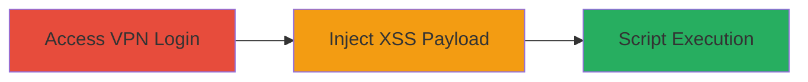

---
tags:
  - xss
  - reflected-xss
  - cisco-asa
  - saml
  - vpn
type: attack_chain
tools:
  - '[[tools/Burp-Suite]]'
tactics:
  - '[[Initial Access]]'
verified: false
platforms:
  - Web
submitted: true
complexity: medium
created_at: '2023-10-01T00:00:00Z'
procedures:
  - '[[procedures/Access-VPN-Login-Page]]'
  - '[[procedures/Inject-XSS-Payload-in-SAMLResponse]]'
step_count: 2
techniques:
  - '[[Exploit Public-Facing Application]]'
  - '[[JavaScript]]'
updated_at: '2025-12-13T23:52:21.001Z'
description: >-
  A multi-step attack exploiting a reflected XSS vulnerability in the Cisco ASA
  web services interface via the SAML endpoint on a VPN login page, allowing
  unauthenticated script execution.
skill_level: intermediate
impact_level: high
id: a561a14c-16c0-498e-a26e-8d4316c4cfbd
validated: true
mitre_tactics:
  - '[[Initial Access]]'
mitre_techniques:
  - '[[Exploit Public-Facing Application]]'
  - '[[JavaScript]]'
---
# Reflected XSS in Cisco ASA SAML Endpoint for Arbitrary Script Execution

Multi-stage attack chain demonstrating exploitation of CVE-2020-3580, a reflected Cross-Site Scripting flaw in Cisco Adaptive Security Appliance Software, to execute arbitrary JavaScript in the victim's browser.

## Chain Metrics Dashboard

| Metric | Value |
|--------|-------|
| Chain Status | Unverified |
| Total Steps | 2 |
| Execution Time | ~5 minutes |
| Skill Level | Intermediate |
| Complexity | Medium |
| Impact Level | High |

## Attack Flow Visualization

## Prerequisites & Requirements

### Required Tools

- [[tools/Burp-Suite]]

### Target Environment

- Web platform with Cisco ASA Software
- Services: VPN (WebVPN), SAML
- Ports: Standard HTTPS (443)
- Network access: Public internet access to the VPN portal

### Initial Access Requirements

- No credentials required (unauthenticated)
- Direct network access to the target VPN URL
- No prior access needed

## Detailed Attack Procedures

### Step 1: Access VPN Login Page
procedure: [[procedures/Access-VPN-Login-Page]]

**Objective**: Initiate the login process to trigger the SAML POST request, exposing the vulnerable endpoint.

**Instructions**: Open a web browser and navigate to the target VPN login page at `https://myvpn.mtncameroon.net/`. Attempt to log in by submitting the login form, which will generate a POST request to the SAML assertion consumer service endpoint.

**Expected Output**: The browser redirects to the SAML endpoint, and a POST request is observable in network tools, containing the SAMLResponse parameter.

**Success Indicators**:
- Login page loads successfully
- POST request to `/+CSCOE+/saml/sp/acs?tgname=a` is initiated

### Step 2: Inject XSS Payload in SAMLResponse
procedure: [[procedures/Inject-XSS-Payload-in-SAMLResponse]]

**Objective**: Intercept the SAML POST request and inject a malicious JavaScript payload into the SAMLResponse parameter to achieve reflected XSS execution.

**Instructions**: Configure [[tools/Burp-Suite]] as a proxy for the browser. Intercept the POST request to `/+CSCOE+/saml/sp/acs?tgname=a`. Modify the SAMLResponse body by prepending the payload `"><svg/onload=alert('Renzi')>` to the existing value (e.g., `SAMLResponse="><svg/onload=alert('Renzi')>[original_value]`). Forward the modified request and observe the response.

**Expected Output**: The response reflects the payload in the HTML without sanitization, triggering a JavaScript alert box displaying 'Renzi' in the browser.

**Success Indicators**:
- Payload reflected unencoded in the HTML response
- JavaScript alert executes, confirming arbitrary script execution
- Potential for session hijacking or data theft if further exploited

## Attack Chain Summary

### Key Achievements

1. Successful access to the vulnerable VPN SAML endpoint without authentication
2. Injection and reflection of XSS payload, demonstrating script execution capability
3. Highlighted impact on sensitive browser data access and user-targeted attacks

## Technique & Tactic Coverage

### MITRE ATT&CK Techniques

- [[Exploit Public-Facing Application]]
- [[JavaScript]]

### MITRE ATT&CK Tactics

- [[Initial Access]]

---
*Last updated: 2023-10-01T00:00:00Z*
