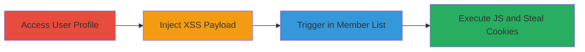

# Reflected XSS in Concrete CMS Member List via User Profile City Field

Multi-stage attack chain demonstrating a complete workflow to exploit a reflected XSS vulnerability in Concrete CMS by injecting malicious JavaScript into the user profile's City field, which executes when viewing the member list.

## Chain Metrics Dashboard

| Metric | Value |
|--------|-------|
| Chain Status | Unverified |
| Total Steps | 3 |
| Execution Time | ~5 minutes |
| Skill Level | Intermediate |
| Complexity | Medium |
| Impact Level | High |

## Attack Flow Visualization

## Prerequisites & Requirements

### Required Tools

- Web browser (e.g., Chrome with developer tools)

### Target Environment

- Concrete CMS instance (version vulnerable to this issue, e.g., pre-5.7.5)
- Access to a user account with profile editing permissions
- Member list view accessible to other users

### Initial Access Requirements

- Valid user credentials for the target Concrete CMS
- No special privileges required beyond standard user access
- Network access to the web application

## Detailed Attack Procedures

### Step 1: Access and Edit User Profile
procedure: [[procedures/Access-and-Edit-User-Profile-in-Concrete-CMS]]

**Objective**: Gain access to the user profile editing interface to prepare for payload injection.

**Instructions**: Log in to the Concrete CMS dashboard and navigate to the profile section. Locate the edit option for personal details.

**Expected Output**: User profile editing form loaded in the browser.

**Success Indicators**:
- Profile edit page accessible
- City textbox visible and editable

### Step 2: Inject XSS Payload into City Field
procedure: [[procedures/Inject-XSS-Payload-into-City-Field]]

**Objective**: Insert a malicious JavaScript payload into the City field to escape HTML context and execute code.

**Instructions**: In the City textbox, enter the payload `">`. Save the profile changes.

**Expected Output**: Profile updated successfully without errors; payload stored in the backend.

**Success Indicators**:
- Profile saves without validation errors
- No immediate JS execution (payload is reflected later)

### Step 3: Trigger XSS via Member List View
procedure: [[procedures/Trigger-XSS-via-Member-List-View]]

**Objective**: View the member list to reflect the unsanitized City field value, executing the injected JavaScript in the viewer's browser.

**Instructions**: Navigate to the member list page in Concrete CMS. The injected payload from the City field will render unsanitized, triggering the alert with document.cookie.

**Expected Output**: JavaScript alert box displaying cookie contents in the browser.

**Success Indicators**:
- Alert pops up showing cookies
- Potential for further exploitation like session hijacking

## Attack Chain Summary

### Key Achievements

1. Successful injection of XSS payload into user profile without detection
2. Reflection and execution of arbitrary JavaScript in victim browsers viewing the member list
3. Demonstration of cookie theft, enabling session hijacking or data exfiltration

## Technique & Tactic Coverage

### MITRE ATT&CK Techniques

- [[JavaScript]]
- [[Exploit Public-Facing Application]]

### MITRE ATT&CK Tactics

- [[Initial Access]]
- [[Execution]]
- [[Collection]]

---
*Last updated: 2023-10-01T00:00:00Z*
