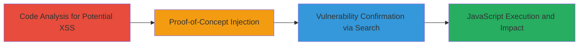

# Reflected XSS in Concrete CMS Search Dialog via Unsanitized sitemap_select_mode

Multi-stage attack chain demonstrating the discovery and exploitation of a reflected Cross-Site Scripting (XSS) vulnerability in Concrete CMS, where the 'sitemap_select_mode' parameter is unsanitized and echoed into HTML attributes in the search dialog, allowing arbitrary JavaScript execution.

## Chain Metrics Dashboard

| Metric | Value |
|--------|-------|
| Chain Status | Unverified |
| Total Steps | 3 |
| Execution Time | ~15 minutes |
| Skill Level | Intermediate |
| Complexity | Medium |
| Impact Level | High |

## Attack Flow Visualization



## Prerequisites & Requirements

### Required Tools

- [[tools/grep]]

### Target Environment

- Concrete CMS (concrete5) running on PHP web server
- Access to source code for analysis (local or remote)
- Web browser for testing payloads

### Initial Access Requirements

- Authenticated access to Concrete CMS dashboard
- Network access to the target instance (e.g., http://localhost/concrete)
- No prior credentials needed beyond standard user login for impact demonstration

## Detailed Attack Procedures

### Step 1: Code Analysis for Potential XSS
procedure: [[procedures/Identify-Potential-XSS-in-Concrete-CMS-Dashboard]]

**Objective**: Examine PHP source code to identify unsanitized parameter echoes in HTML attributes.

**Instructions**: Review the dashboard sitemap file for direct output of user-controlled variables. Focus on line 40 in /concrete/concrete/elements/dashboard/sitemap.php where $callback is echoed without filtering into an HTML attribute.

**Expected Output**: Identification of potential injection point: <div id="tree" sitemap-wrapper="1" sitemap-select-callback="<?php echo $callback?>".

**Success Indicators**:
- Unsanitized echo detected in HTML context
- Parameter linked to user input

### Step 2: Proof-of-Concept Injection
procedure: [[procedures/Create-and-Test-XSS-Proof-of-Concept]]

**Objective**: Inject a malicious payload into the sitemap_select_mode parameter to break out of HTML attributes and execute JavaScript.

**Instructions**: Construct a URL with the payload and access it in a browser. Use: http://localhost/concrete/index.php/tools/required/pages/search_dialog?sitemap_select_mode=%22%3E%3Cscript%3Ealert%280%29%3C/script%3E

**Expected Output**: Alert dialog with '0' pops up, confirming JavaScript execution.

**Success Indicators**:
- Payload executes without errors
- No sanitization blocks the script tag

### Step 3: Vulnerability Confirmation via Search
procedure: [[procedures/Locate-Vulnerability-Source-Using-Grep]]

**Objective**: Pinpoint the exact file and line where the parameter is unsafely passed to HTML rendering.

**Instructions**: Use [[commands/grep-search-php-code]] to search for the parameter in source files:

```bash
grep -r "sitemap_select_mode" /path/to/concrete/src/
```

This reveals the issue in /concrete/concrete/tools/pages/search_dialog.php at line 47.

**Expected Output**: Matches showing $sitemap_select_mode passed unfiltered to Loader::element('pages/search_results', ...).

**Success Indicators**:
- Exact location confirmed
- Root cause identified as lack of escaping

## Attack Chain Summary

### Key Achievements

1. Discovered reflected XSS through code review
2. Validated exploit with PoC leading to JS execution
3. Confirmed impact for session theft and data exfiltration in authenticated contexts

## Technique & Tactic Coverage

### MITRE ATT&CK Techniques

- [[Exploit Public-Facing Application]]
- [[JavaScript]]

### MITRE ATT&CK Tactics

- [[Initial Access]]
- [[Execution]]

---
*Last updated: 2023-10-01T00:00:00Z*
