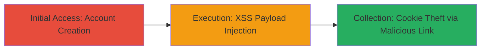

---
tags:
  - xss
  - reflected-xss
  - confluence
  - cve-2018-5230
  - session-hijacking
type: attack_chain
tools: []
tactics:
  - '[[Execution]]'
  - '[[Collection]]'
commands: []
platforms:
  - Web
complexity: low
procedures:
  - '[[procedures/Create-Account-on-TopCoder-Platform]]'
  - '[[procedures/Exploit-XSS-in-Confluence-Labels-Endpoint]]'
step_count: 2
techniques:
  - '[[Exploit Public-Facing Application]]'
  - '[[JavaScript]]'
description: >-
  A multi-stage attack exploiting a reflected XSS vulnerability in Atlassian
  Confluence's labels feature to execute arbitrary JavaScript and steal session
  cookies.
skill_level: intermediate
impact_level: high
id: 6ecf4f77-c40e-42bd-a6c6-3defe2dff222
created_at: '2025-12-13T23:52:39.176Z'
updated_at: '2025-12-13T23:52:39.176Z'
verified: false
validated: true
submitted: true
mitre_tactics:
  - '[[Execution]]'
  - '[[Collection]]'
mitre_techniques:
  - '[[Exploit Public-Facing Application]]'
  - '[[JavaScript]]'
---
# Reflected XSS in Confluence Labels Endpoint via CVE-2018-5230

Multi-stage attack chain demonstrating exploitation of CVE-2018-5230 in Atlassian Confluence to achieve reflected XSS, enabling JavaScript execution and potential session hijacking.

## Chain Metrics Dashboard

| Metric | Value |
|--------|-------|
| Chain Status | Unverified |
| Total Steps | 2 |
| Execution Time | ~5 minutes |
| Skill Level | Intermediate |
| Complexity | Low |
| Impact Level | High |

## Attack Flow Visualization

## Prerequisites & Requirements

### Required Tools

- Web browser (e.g., Chrome or Firefox with developer tools)

### Target Environment

- Web platform hosting Atlassian Confluence
- Access to https://apps.topcoder.com/wiki
- No special ports required; standard HTTPS (443)

### Initial Access Requirements

- No prior credentials needed for registration
- Public internet access to the target site
- Ability to create a free account

## Detailed Attack Procedures

### Step 1: Initial Access
procedure: [[procedures/Create-Account-on-TopCoder-Platform]]

**Objective**: Gain authenticated access to the Confluence wiki functionality to test the labels endpoint.

**Instructions**: Navigate to the TopCoder registration page and complete the account creation process. Provide a valid email address and verify it if required. Once logged in, confirm access to the wiki at https://apps.topcoder.com/wiki.

**Expected Output**: Successful login and redirection to the user dashboard with wiki access.

**Success Indicators**:
- Account creation confirmation email received
- Ability to navigate to /wiki without authentication errors

### Step 2: Execution
procedure: [[procedures/Exploit-XSS-in-Confluence-Labels-Endpoint]]

**Objective**: Inject and trigger a reflected XSS payload in the labels endpoint to execute arbitrary JavaScript, such as an alert or cookie-stealing script.

**Instructions**: Construct a URL-encoded XSS payload targeting the /wiki/labels/ endpoint. For testing, use a payload like <IFRAME SRC="javascript:alert('XSS')">. URL-encode it and append to the endpoint: https://apps.topcoder.com/wiki/labels/%3CIFRAME%20SRC%3D%22javascript%3Aalert('XSS')%22%3E.vm. Visit the URL in the browser. The payload reflects unsanitized in an error message, executing the JavaScript. To escalate, replace the alert with a script to exfiltrate cookies to an attacker-controlled server.

**Expected Output**: JavaScript alert box pops up, or network request to attacker server with stolen cookies.

**Success Indicators**:
- Alert dialog appears confirming execution
- Browser developer tools show reflected payload in the DOM
- Cookies transmitted to external endpoint if escalated

## Attack Chain Summary

### Key Achievements

1. Account creation enables wiki access without prior privileges
2. Successful XSS execution via reflected input in labels error handling
3. Potential for session hijacking by stealing authentication cookies

## Technique & Tactic Coverage

### MITRE ATT&CK Techniques

- [[Exploit Public-Facing Application]]
- [[JavaScript]]

### MITRE ATT&CK Tactics

- [[Execution]]
- [[Collection]]

---
*Last updated: 2023-10-01*
