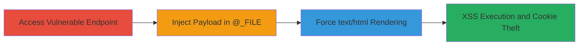

---
tags:
  - xss
  - reflected-xss
  - corda-server
  - javascript-injection
type: attack_chain
tools:
  - '[[tools/Firefox]]'
tactics:
  - '[[Execution]]'
  - '[[Collection]]'
verified: false
platforms:
  - Web
submitted: true
complexity: medium
created_at: '2023-10-01T00:00:00Z'
procedures:
  - '[[procedures/Inject-XSS-Payload-in-_FILE-Parameter]]'
  - '[[procedures/Force-HTML-Rendering-with-_TEXTDESCRIPTIONEN]]'
step_count: 2
techniques:
  - '[[Exploit Public-Facing Application]]'
  - '[[JavaScript]]'
updated_at: '2025-12-14T03:16:24.995Z'
description: >-
  A multi-step attack exploiting a reflected XSS vulnerability in the Corda
  Server's ctredirector.dll endpoint by injecting payloads into the @_FILE
  parameter and forcing HTML rendering with @_TEXTDESCRIPTIONEN to execute
  malicious JavaScript in the victim's browser.
skill_level: intermediate
impact_level: high
id: c3a7ba2b-fc2f-4d33-a4bb-423578d4d502
validated: true
mitre_tactics:
  - '[[Execution]]'
  - '[[Collection]]'
mitre_techniques:
  - '[[Exploit Public-Facing Application]]'
  - '[[JavaScript]]'
---
---

# Reflected XSS in Corda Server via ctredirector.dll Error Echoing

Multi-stage attack chain demonstrating a complete reflected XSS workflow in the Corda Server application.

## Chain Metrics Dashboard

| Metric | Value |
|--------|-------|
| Chain Status | Unverified |
| Total Steps | 2 |
| Execution Time | ~2 minutes |
| Skill Level | Intermediate |
| Complexity | Medium |
| Impact Level | High |

## Attack Flow Visualization



## Prerequisites & Requirements

### Required Tools

- [[tools/Firefox]]

### Target Environment

- Web platform with Corda Server
- Access to /scripts/ctredirector.dll endpoint
- No specific ports required beyond standard HTTP/HTTPS (80/443)

### Initial Access Requirements

- Network access to the target Corda Server
- No credentials needed for public-facing endpoint
- Victim must visit the crafted malicious URL

## Detailed Attack Procedures

### Step 1: Inject XSS Payload
procedure: [[procedures/Inject-XSS-Payload-in-_FILE-Parameter]]

**Objective**: Trigger an error on the ctredirector.dll endpoint by providing an invalid URL in the @_FILE parameter, causing the server to echo the input unsanitized in the error message.

**Instructions**: Use a web browser or [[commands/curl-inject-xss-file]] to send a request to the endpoint with a malicious payload embedded in @_FILE, such as an SVG tag that executes JavaScript on load.

```bash
curl "http://target.com/scripts/ctredirector.dll?_FILE=http://google.com/<svg/onload=confirm(document.cookie)>"
```

**Expected Output**: Server returns an error page echoing the invalid @_FILE value without escaping, but initially may not render as HTML.

**Success Indicators**:
- Error response contains the injected payload verbatim
- No script execution yet due to content type

### Step 2: Force HTML Rendering for Execution
procedure: [[procedures/Force-HTML-Rendering-with-_TEXTDESCRIPTIONEN]]

**Objective**: Append the @_TEXTDESCRIPTIONEN parameter to override the response content type to text/html, allowing the browser to interpret and execute the echoed XSS payload as JavaScript.

**Instructions**: Extend the request from Step 1 by adding @_TEXTDESCRIPTIONEN=1 (or similar value) to force HTML rendering, using [[commands/curl-force-html-xss]] or the browser.

```bash
curl "http://target.com/scripts/ctredirector.dll?_FILE=http://google.com/<svg/onload=confirm(document.cookie)>&_TEXTDESCRIPTIONEN=1"
```

**Expected Output**: The response renders as HTML, executing the JavaScript payload, such as displaying a confirm dialog with document cookies.

**Success Indicators**:
- JavaScript executes in the browser (e.g., alert or confirm box appears)
- Session cookies can be exfiltrated to attacker-controlled server

## Attack Chain Summary

### Key Achievements

1. Successful injection and echoing of unsanitized user input via @_FILE error handling
2. Content type override enabling client-side script execution
3. Potential for session hijacking and phishing through cookie theft

## Technique & Tactic Coverage

### MITRE ATT&CK Techniques

- [[Exploit Public-Facing Application]]
- [[JavaScript]]

### MITRE ATT&CK Tactics

- [[Execution]]
- [[Collection]]

---

*Last updated: 2023-10-01T00:00:00Z*
