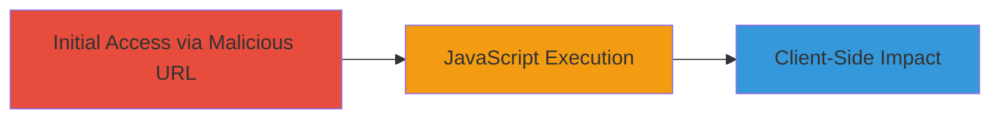

# Reflected XSS in Crop-Image Endpoint via Type Parameter

Multi-stage attack chain demonstrating a complete attack workflow.

## Chain Metrics Dashboard

| Metric | Value |
|--------|-------|
| Chain Status | Unverified |
| Total Steps | 1 |
| Execution Time | ~1 minute |
| Skill Level | Beginner |
| Complexity | Low |
| Impact Level | Medium |

## Attack Flow Visualization



## Prerequisites & Requirements

### Required Tools

- Browser (e.g., Chrome, Firefox)
- Optional: [[tools/Burp-Suite]] for payload crafting

### Target Environment

- Web application on staging.uzbey.com
- Accessible /crop-image endpoint
- No authentication required for public endpoint

### Initial Access Requirements

- Valid 'fid' parameter (e.g., from existing image ID)
- Network access to the target URL
- No prior credentials needed

## Detailed Attack Procedures

### Step 1: Inject and Execute XSS Payload
procedure: [[procedures/Exploit-Reflected-XSS-in-Type-Parameter]]

**Objective**: Inject a JavaScript payload into the 'type' parameter to execute arbitrary code in the victim's browser context, demonstrating potential for session hijacking or data theft.

**Instructions**: Construct a malicious URL by appending the payload to the 'type' parameter. Use a browser to access the URL or simulate with curl for testing:

First, encode the payload to bypass basic filters: The payload `<script>alert(1)</script>` URL-encodes to `%3Cscript%3Ealert(1)%3C/script%3E`.

Access the endpoint using [[commands/curl-xss-test]]:

```bash
curl "https://staging.uzbey.com/crop-image?fid=1996&type=%22%3E%3Cscript%3Ealert(1)%3C/script%3E"
```

In a real attack, send this URL to the victim via phishing or social engineering. When accessed in the browser, the payload reflects and executes.

**Expected Output**: In the browser, an alert popup displays "1". In curl, the response may include the injected script if not fully sanitized.

**Success Indicators**:
- Alert box pops up in the browser
- Browser console shows JavaScript execution errors or logs
- No server-side errors blocking the request

## Attack Chain Summary

### Key Achievements

1. Successful injection of JavaScript payload via reflected XSS
2. Demonstration of arbitrary code execution in victim browser
3. Highlighted risks like session token theft or keylogging

## Technique & Tactic Coverage

### MITRE ATT&CK Techniques

- [[JavaScript]]

### MITRE ATT&CK Tactics

- [[Execution]]

---
*Last updated: 2023-10-01T12:00:00Z*
