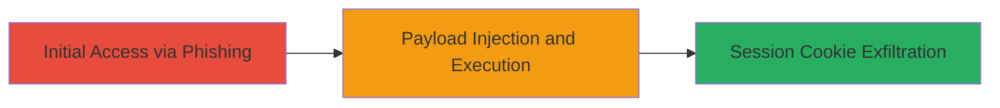

---
tags:
  - xss
  - reflected-xss
  - dnn
  - aspnet
  - session-hijacking
type: attack_chain
tools: []
tactics:
  - '[[Initial Access]]'
  - '[[Execution]]'
  - '[[Collection]]'
commands:
  - '[[commands/send-malicious-xss-post]]'
platforms:
  - Web
complexity: low
procedures:
  - '[[procedures/Exploit-Reflected-XSS-in-DNN-Parameter]]'
step_count: 1
techniques:
  - '[[Exploit Public-Facing Application]]'
  - '[[JavaScript]]'
description: >-
  A single-stage attack exploiting a reflected XSS vulnerability in an ASP.NET
  web application using a DNN parameter to inject JavaScript and steal user
  session cookies.
skill_level: intermediate
impact_level: high
id: 802ef81a-5ac7-4615-8158-2951676c7ab9
created_at: '2025-12-14T03:16:13.925Z'
updated_at: '2025-12-14T03:16:13.925Z'
verified: false
validated: true
submitted: true
mitre_tactics:
  - '[[Initial Access]]'
  - '[[Execution]]'
  - '[[Collection]]'
mitre_techniques:
  - '[[Exploit Public-Facing Application]]'
  - '[[JavaScript]]'
---
# Reflected XSS in DNN ViewTabs Parameter for Session Cookie Theft

## Overview

This attack chain demonstrates a reflected cross-site scripting (XSS) vulnerability in a web application built on ASP.NET with DNN (DotNetNuke) framework. The vulnerability arises from insufficient input sanitization in the 'dnn$ctr5099$ViewTabs$hidCurrentTabIndex' parameter within a multipart/form-data POST request. By injecting a malicious JavaScript payload, an attacker can execute arbitrary code in the victim's browser, leading to session cookie theft, phishing, and unauthorized account actions. The attack requires tricking a user into submitting the crafted form, typically via a phishing link.

## Chain Metrics Dashboard

| Metric | Value |
|--------|-------|
| Chain Status | Unverified |
| Total Steps | 1 |
| Execution Time | ~1 minute |
| Skill Level | Intermediate |
| Complexity | Low |
| Impact Level | High |

## Attack Flow Visualization



## Prerequisites & Requirements

### Required Tools

- None (uses standard HTTP client like curl or browser dev tools)

### Target Environment

- ASP.NET web application with DNN framework
- Vulnerable endpoint: POST /█████/Directorate-of-Human-Resources/
- Multipart/form-data submission support

### Initial Access Requirements

- Ability to craft and deliver a phishing link or form to the victim
- Network access to the target web application
- No prior credentials needed, but victim must be authenticated for impact

## Detailed Attack Procedures

### Step 1: Payload Injection
procedure: [[procedures/Exploit-Reflected-XSS-in-DNN-Parameter]]

**Objective**: Submit a malicious POST request to inject JavaScript via the unsanitized parameter, triggering XSS execution in the victim's browser to steal session cookies.

**Instructions**: Craft a multipart/form-data POST request targeting the vulnerable endpoint. Use [[commands/send-malicious-xss-post]] to send the payload:

```bash
curl -X POST 'https://target.com/█████/Directorate-of-Human-Resources/' \
  -F 'dnn$ctr5099$ViewTabs$hidCurrentTabIndex=111111111"; prompt(1); a="' \
  -F 'other_form_fields=values' \
  --cookie 'session_cookie=value'
```

To deliver to a victim, embed this in a phishing form or link that submits the data automatically upon interaction.

**Expected Output**: The response reflects the payload without sanitization, executing JavaScript like prompt(1) in the browser, confirming XSS. For exfiltration, modify payload to send document.cookie to attacker-controlled server.

**Success Indicators**:
- JavaScript alert or prompt appears in the browser
- Reflected payload visible in the HTML response
- Session cookies captured on attacker's server (if exfiltration payload used)

## Attack Chain Summary

### Key Achievements

1. Successful injection of JavaScript via reflected parameter
2. Execution of arbitrary code in victim's browser context
3. Potential theft of session cookies enabling account takeover

## Technique & Tactic Coverage

### MITRE ATT&CK Techniques

- [[Exploit Public-Facing Application]]
- [[JavaScript]]

### MITRE ATT&CK Tactics

- [[Initial Access]]
- [[Execution]]
- [[Collection]]

---
*Last updated: 2023-10-01*
