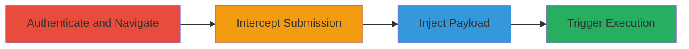

---
tags:
  - xss
  - reflected-xss
  - cookie-theft
  - web-vulnerability
  - dod
type: attack_chain
tools:
  - '[[tools/Burp-Suite]]'
tactics:
  - '[[Execution]]'
  - '[[Collection]]'
verified: false
platforms:
  - Web
submitted: true
complexity: medium
created_at: '2023-10-01T00:00:00Z'
procedures:
  - '[[procedures/Authenticate-and-Navigate-to-Subscription-Page]]'
  - '[[procedures/Intercept-Form-Submission-with-Burp-Suite]]'
  - '[[procedures/Inject-XSS-Payload-into-Parameter]]'
  - '[[procedures/Forward-Request-to-Trigger-XSS]]'
step_count: 4
techniques:
  - '[[JavaScript]]'
updated_at: '2025-12-14T03:16:19.895Z'
description: >-
  A multi-step attack exploiting a reflected XSS vulnerability in a U.S.
  Department of Defense web application's forum subscription page to execute
  JavaScript and steal session cookies.
skill_level: intermediate
impact_level: high
id: dcf9dd60-f143-4b67-a14d-d8541c064177
validated: true
mitre_tactics:
  - '[[Execution]]'
  - '[[Collection]]'
mitre_techniques:
  - '[[JavaScript]]'
---
# Reflected XSS in DoD Forum Subscription Parameter Leading to Cookie Theft

Multi-stage attack chain demonstrating exploitation of a reflected XSS vulnerability in a U.S. Department of Defense web application. The attack targets a parameter in the forum subscription form, which reflects user input without proper sanitization, allowing JavaScript execution to steal non-HttpOnly cookies, enable open redirects, and facilitate phishing via iframes.

## Chain Metrics Dashboard

| Metric | Value |
|--------|-------|
| Chain Status | Unverified |
| Total Steps | 4 |
| Execution Time | ~5 minutes |
| Skill Level | Intermediate |
| Complexity | Medium |
| Impact Level | High |

## Attack Flow Visualization



## Prerequisites & Requirements

### Required Tools

- [[tools/Burp-Suite]]

### Target Environment

- Web application (PHP-based, inferred)
- Forum subscription page at https://██████
- No specific ports; standard HTTPS

### Initial Access Requirements

- Valid authentication credentials for the DoD application
- Network access to the target domain
- Burp Suite configured as a proxy for the browser

## Detailed Attack Procedures

### Step 1: Authenticate and Navigate to Subscription Page
procedure: [[procedures/Authenticate-and-Navigate-to-Subscription-Page]]

**Objective**: Gain access to the vulnerable forum subscription form.

**Instructions**: Log in to the application and navigate to the target page to prepare for form submission.

**Expected Output**: The forum subscription form is loaded and ready for interaction.

**Success Indicators**:
- Successful authentication confirmed
- Vulnerable page (https://██████) accessible

### Step 2: Intercept Form Submission with Burp Suite
procedure: [[procedures/Intercept-Form-Submission-with-Burp-Suite]]

**Objective**: Capture the POST request during form submission for modification.

**Instructions**: Submit the form while intercepting with Burp Suite to pause the request before it reaches the server.

**Expected Output**: Intercepted POST request to /██████_█████████ visible in Burp.

**Success Indicators**:
- Request intercepted successfully
- Redacted parameter visible in the request body

### Step 3: Inject XSS Payload into Parameter
procedure: [[procedures/Inject-XSS-Payload-into-Parameter]]

**Objective**: Modify the vulnerable parameter to include a JavaScript payload that bypasses basic filtering.

**Instructions**: In Burp, replace the parameter value with an encoded XSS payload, such as using [[commands/inject-xss-payload-img-onerror]]:

```http
██████████=
```

Ensure URL encoding for '=' as %3d to bypass filters.

**Expected Output**: Modified request ready for forwarding.

**Success Indicators**:
- Payload correctly encoded and inserted
- No syntax errors in the request

### Step 4: Forward Request to Trigger XSS
procedure: [[procedures/Forward-Request-to-Trigger-XSS]]

**Objective**: Send the tampered request to execute the XSS and observe the impact.

**Instructions**: Forward the modified request using Burp and monitor the response for payload execution, expecting an alert with cookie contents via [[commands/inject-xss-payload-img-onerror]].

**Expected Output**: JavaScript alert popup displaying document.cookie.

**Success Indicators**:
- Alert executes in the browser
- Cookies (non-HttpOnly) visible in alert

## Attack Chain Summary

### Key Achievements

1. Successful reflection of unsanitized input leading to JavaScript execution
2. Bypass of '=' filter using URL encoding (%3d)
3. Cookie theft demonstration, enabling session hijacking
4. Potential for further impacts like phishing or redirects

## Technique & Tactic Coverage

### MITRE ATT&CK Techniques

- [[JavaScript]]

### MITRE ATT&CK Tactics

- [[Execution]]
- [[Collection]]

---

*Last updated: 2023-10-01T00:00:00Z*
