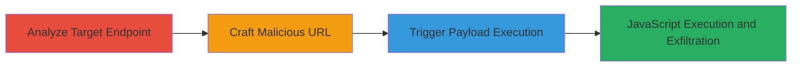

# Reflected XSS in DoD Logout Endpoint via javascript: URI Scheme

Multi-stage attack chain demonstrating exploitation of a reflected XSS vulnerability in the /auth/logout.jsx endpoint on a U.S. Department of Defense subdomain for the national levee database. The attack leverages unsanitized user input in the 'home' GET parameter to inject a javascript: URI scheme, leading to arbitrary JavaScript execution upon user interaction. This enables stealing authentication cookies, phishing, or other client-side exploits in the victim's browser.

## Chain Metrics Dashboard

| Metric | Value |
|--------|-------|
| Chain Status | Unverified |
| Total Steps | 3 |
| Execution Time | ~2 minutes |
| Skill Level | Intermediate |
| Complexity | Medium |
| Impact Level | High |

## Attack Flow Visualization

## Prerequisites & Requirements

### Required Tools

- [[tools/Browser-Unspecified]]

### Target Environment

- Web platform
- JavaScript-based framework (e.g., React with .jsx endpoints)
- Access to public-facing DoD subdomain (e.g., national levee database)

### Initial Access Requirements

- No credentials required (public endpoint)
- Direct network access to the target URL
- No prior access needed; social engineering to lure victim to URL

## Detailed Attack Procedures

### Step 1: Analyze Target for XSS Vulnerable Endpoints
procedure: [[procedures/Analyze-Target-for-XSS-Vulnerable-Endpoints]]

**Objective**: Identify endpoints that reflect user input without sanitization, focusing on authentication flows like logout.

**Instructions**: Use a browser to navigate to the target site and inspect the logout functionality. Examine GET parameters in requests to /auth/logout.jsx, such as 'home', for reflection in the response HTML.

**Expected Output**: Confirmation that the 'home' parameter is echoed back unsanitized, e.g., in a link href attribute.

**Success Indicators**:
- Parameter reflection observed in page source
- No output encoding for javascript: schemes detected

### Step 2: Craft Malicious javascript: URI Payload
procedure: [[procedures/Craft-Malicious-javascript-URI-Payload]]

**Objective**: Construct a URL that injects JavaScript via the vulnerable parameter to prepare for execution.

**Instructions**: Build the payload URL by appending the javascript: scheme to the 'home' parameter, URL-encoding special characters. For testing, use an alert: https://████████████/auth/logout.jsx?home=javascript:(alert(%27XSS%20Success!%27))(). Visit the URL in a browser to load the page.

**Expected Output**: Page loads with the malicious URI reflected in a link, but no immediate execution.

**Success Indicators**:
- Payload appears in page source without sanitization
- No automatic redirection or blocking occurs

### Step 3: Trigger XSS Payload via User Interaction
procedure: [[procedures/Trigger-XSS-Payload-via-User-Interaction]]

**Objective**: Execute the injected JavaScript by simulating victim interaction, leading to code execution.

**Instructions**: After loading the crafted URL, press the ESC key to halt any auto-redirect. Then, click the reflected 'return to application' link, which triggers the javascript: URI and runs the payload.

**Expected Output**: JavaScript alert or other code executes, e.g., alert('XSS Success!'). In a real attack, this could log cookies to an attacker-controlled server.

**Success Indicators**:
- Alert box or console output confirms execution
- Victim's cookies or session data accessible via executed JS

## Attack Chain Summary

### Key Achievements

1. Identified and confirmed reflected XSS in a sensitive DoD endpoint
2. Bypassed redirection to execute client-side JavaScript
3. Enabled potential session hijacking or phishing on authenticated users

## Technique & Tactic Coverage

### MITRE ATT&CK Techniques

- [[JavaScript]]
- [[Drive-by Compromise]]

### MITRE ATT&CK Tactics

- [[Initial Access]]
- [[Execution]]
- [[Collection]]

---
*Last updated: 2023-10-01T00:00:00Z*
