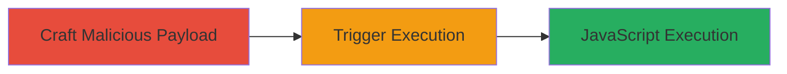

---
tags:
  - xss
  - reflected-xss
  - javascript
  - web-vulnerability
  - protocol-bypass
type: attack_chain
tools: []
tactics:
  - '[[Execution]]'
verified: false
platforms:
  - Web
submitted: true
complexity: low
created_at: '2024-01-01T00:00:00Z'
procedures:
  - '[[procedures/Bypass-isSafeHost-Validation-with-JavaScript-Protocol-Payload]]'
  - '[[procedures/Trigger-Reflected-XSS-via-Malicious-Redirect-URL]]'
step_count: 2
techniques:
  - '[[JavaScript]]'
updated_at: '2025-12-13T23:52:24.729Z'
description: >-
  A multi-step attack exploiting a reflected XSS vulnerability in the redirect
  parameter of a U.S. Department of Defense web endpoint through improper host
  validation in client-side JavaScript.
skill_level: intermediate
impact_level: high
id: 59287a6d-4b7f-41dc-b9a2-a5f7215e6b3b
validated: true
mitre_tactics:
  - '[[Execution]]'
mitre_techniques:
  - '[[JavaScript]]'
---
# Reflected XSS in DoD Redirect Parameter via Flawed Protocol Validation

Multi-stage attack chain demonstrating a complete attack workflow exploiting a reflected XSS vulnerability in a U.S. Department of Defense web application.

## Chain Metrics Dashboard

| Metric | Value |
|--------|-------|
| Chain Status | Unverified |
| Total Steps | 2 |
| Execution Time | ~1 minute |
| Skill Level | Intermediate |
| Complexity | Low |
| Impact Level | High |

## Attack Flow Visualization

## Prerequisites & Requirements

### Required Tools

- Web browser (e.g., Chrome, Firefox)

### Target Environment

- Web platform
- JavaScript-enabled client-side application
- Access to the target DoD domain endpoint (/sec.html)

### Initial Access Requirements

- Ability to send links to victims (e.g., via phishing)
- No prior credentials needed; relies on victim interaction
- Network access to the public-facing DoD domain

## Detailed Attack Procedures

### Step 1: Construct Malicious Redirect URL
procedure: [[procedures/Bypass-isSafeHost-Validation-with-JavaScript-Protocol-Payload]]

**Objective**: Create a payload that bypasses the isSafeHost validation function to inject a javascript: URL into the redirect parameter.

**Instructions**: Analyze the client-side JavaScript to identify the flaw in isSafeHost, which checks the host after the first '://' without protocol verification. Prefix the payload with 'javascript:' and append '//://' followed by a commented-out invalid host to trick the validation. The full URL becomes `https://█████████/sec.html?redirect=javascript:alert(1);//://████/`. Test the payload in a browser console or URL encoder if needed to ensure proper encoding.

**Expected Output**: A valid URL that passes client-side checks but executes JavaScript.

**Success Indicators**:
- Payload crafts without syntax errors
- Validation bypass confirmed by inspecting the isSafeHost function behavior

### Step 2: Trigger the XSS Execution
procedure: [[procedures/Trigger-Reflected-XSS-via-Malicious-Redirect-URL]]

**Objective**: Deliver the malicious URL to a victim, causing the browser to execute the injected JavaScript payload.

**Instructions**: Share the crafted URL with the victim via email, link, or social engineering. When the victim clicks it, the application assigns the raw redirect value to window.location.href without sanitization, executing the javascript:alert(1) payload. For demonstration, replace alert(1) with more malicious code like alert(document.cookie) to steal session data.

**Expected Output**: Arbitrary JavaScript execution in the victim's browser, such as an alert box or data exfiltration.

**Success Indicators**:
- Alert or scripted action triggers in the browser
- Potential session cookies or data captured if payload is enhanced

## Attack Chain Summary

### Key Achievements

1. Bypassed client-side redirect validation using protocol prefix and comment trick
2. Achieved reflected XSS execution leading to arbitrary JavaScript in victim context
3. Enabled high-impact outcomes like account takeover or phishing on a sensitive DoD domain

## Technique & Tactic Coverage

### MITRE ATT&CK Techniques

- [[JavaScript]]

### MITRE ATT&CK Tactics

- [[Execution]]

---

*Last updated: 2024-01-01T00:00:00Z*
