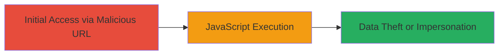

# Reflected XSS in DoD Search Parameter Leading to Arbitrary JavaScript Execution

Multi-stage attack chain demonstrating a complete attack workflow.

## Chain Metrics Dashboard

| Metric | Value |
|--------|-------|
| Chain Status | Unverified |
| Total Steps | 1 |
| Execution Time | ~1 minute |
| Skill Level | Beginner |
| Complexity | Low |
| Impact Level | High |

## Attack Flow Visualization



## Prerequisites & Requirements

### Required Tools

- None (browser or curl sufficient)

### Target Environment

- Web application (DoD search endpoint)
- Required services/ports: HTTP/HTTPS on port 80/443
- Network access requirements: Internet access to the target URL

### Initial Access Requirements

- No credentials required
- Victim must visit the malicious URL (e.g., via phishing or direct link)
- Prior access needed: None

## Detailed Attack Procedures

### Step 1: Craft and Deliver Malicious Search URL
procedure: [[procedures/Exploit-Reflected-XSS-via-Search-Parameter]]

**Objective**: Inject a malicious payload into the 'where' parameter of the search endpoint to reflect unsanitized input, triggering JavaScript execution in the victim's browser.

**Instructions**: Construct a URL with the XSS payload in the 'where' parameter. The payload uses an SVG element with an onload handler to execute JavaScript, such as confirming the document domain via alert. Use [[commands/curl-fetch-xss-payload]] to test the request or deliver via a link for social engineering.

```bash
curl -X GET "https://█████/7/0/33/1d/www.citysearch.com/search?what=x&where=place%22%3E%3Csvg+onload=confirm(document.domain)%3E" -v
```

For browser execution, navigate directly to the URL or embed in an email/link.

**Expected Output**: The response includes the reflected payload, and in a browser, an alert box displays the document domain (e.g., "www.citysearch.com").

**Success Indicators**:
- Payload reflected in HTML without encoding
- JavaScript executes (alert pops up)
- No errors in response indicating sanitization

## Attack Chain Summary

### Key Achievements

1. Successful injection and reflection of XSS payload in DoD web app search parameter
2. Arbitrary JavaScript execution confirming control over victim's browser session
3. Potential for cookie theft, data modification, or user impersonation

## Technique & Tactic Coverage

### MITRE ATT&CK Techniques

- [[JavaScript]]

### MITRE ATT&CK Tactics

- [[Initial Access]]
- [[Execution]]
- [[Collection]]

---
*Last updated: 2023-10-01T00:00:00Z*
