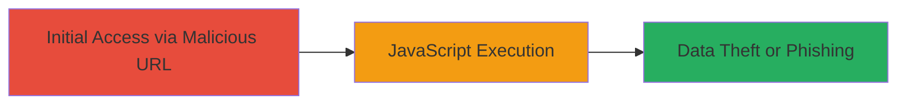

# Reflected XSS in DoD Web Application Parameter Leading to Arbitrary JavaScript Execution

Multi-stage attack chain demonstrating a complete attack workflow.

## Chain Metrics Dashboard

| Metric | Value |
|--------|-------|
| Chain Status | Unverified |
| Total Steps | 1 |
| Execution Time | ~1 minute |
| Skill Level | Beginner |
| Complexity | Low |
| Impact Level | High |

## Attack Flow Visualization



## Prerequisites & Requirements

### Required Tools

- Web browser for testing payloads

### Target Environment

- Web application hosted on DoD infrastructure
- Accessible via public URL
- Vulnerable parameter in query string

### Initial Access Requirements

- No credentials required (public-facing application)
- Direct network access to the target URL
- No prior access needed

## Detailed Attack Procedures

### Step 1: Inject Malicious Payload
procedure: [[procedures/Inject-Malicious-JavaScript-Payload-for-Reflected-XSS]]

**Objective**: Exploit the reflected XSS vulnerability by injecting a JavaScript payload into the URL parameter to execute arbitrary code in the victim's browser.

**Instructions**: Construct a malicious URL by appending a URL-encoded JavaScript payload to the vulnerable parameter. For example, access the target URL with the payload injected as follows:

```url
https://█████/████████?████████=%22%3E%3Cscript%3Ealert(/frenchvlad/);%3C/script%3E&██████████
```

This decodes to injecting `"><script>alert(/frenchvlad/);</script>` into the parameter, which is reflected unsanitized on the page, triggering JavaScript execution.

**Expected Output**: An alert box displaying "frenchvlad" pops up in the browser, confirming successful payload execution.

**Success Indicators**:
- Alert box or any JavaScript execution observed
- Payload reflected without encoding in the page source
- No server-side sanitization errors

## Attack Chain Summary

### Key Achievements

1. Successful injection and execution of arbitrary JavaScript via reflected XSS
2. Demonstration of potential for session hijacking or data theft
3. Identification of unsanitized user input in URL parameters

## Technique & Tactic Coverage

### MITRE ATT&CK Techniques

- [[Exploit Public-Facing Application]]
- [[JavaScript]]

### MITRE ATT&CK Tactics

- [[Initial Access]]
- [[Collection]]

---
*Last updated: 2023-10-01T00:00:00Z*
