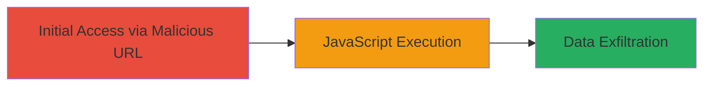

---
tags:
  - xss
  - reflected-xss
  - javascript-injection
  - dod
type: attack_chain
tools: []
tactics:
  - '[[Initial Access]]'
  - '[[Execution]]'
verified: false
platforms:
  - Web
submitted: true
complexity: low
created_at: '2023-10-01T00:00:00Z'
procedures:
  - '[[procedures/Inject-Reflected-XSS-Payload-via-URL-Parameter]]'
step_count: 1
techniques:
  - '[[JavaScript]]'
updated_at: '2025-12-14T03:46:32.073Z'
description: >-
  A single-stage attack exploiting a reflected XSS vulnerability in a U.S.
  Department of Defense web application by injecting a JavaScript payload into a
  URL parameter, leading to arbitrary code execution in the victim's browser.
skill_level: intermediate
impact_level: high
id: ff35115a-e155-4e00-a191-30ebdc832c6d
validated: true
mitre_tactics:
  - '[[Initial Access]]'
  - '[[Execution]]'
mitre_techniques:
  - '[[JavaScript]]'
---
# Reflected XSS in DoD Web Application via Unsanitized URL Parameter

Multi-stage attack chain demonstrating a complete attack workflow.

## Chain Metrics Dashboard

| Metric | Value |
|--------|-------|
| Chain Status | Unverified |
| Total Steps | 1 |
| Execution Time | ~1 minutes |
| Skill Level | Intermediate |
| Complexity | Low |
| Impact Level | High |

## Attack Flow Visualization

## Prerequisites & Requirements

### Required Tools

- Browser (e.g., Chrome, Firefox)

### Target Environment

- Web application hosted on DoD infrastructure
- Accessible via public URL
- No specific ports required beyond standard HTTP/HTTPS (80/443)

### Initial Access Requirements

- Ability to craft and share malicious URLs
- Victim interaction (e.g., clicking the link)
- No prior credentials needed

## Detailed Attack Procedures

### Step 1: Exploit Reflected XSS
procedure: [[procedures/Inject-Reflected-XSS-Payload-via-URL-Parameter]]

**Objective**: Inject a JavaScript payload into a URL parameter to execute arbitrary code in the victim's browser, potentially stealing session data or cookies.

**Instructions**: Craft a malicious URL by appending an unsanitized parameter like 'onload' with the payload %22prompt(1)%22 (URL-encoded "prompt(1)"). For example, access https://██████████/███?onload=%22prompt(1)%22 in a browser. The payload reflects back without sanitization, triggering the onload event to execute the JavaScript.

**Expected Output**: A browser prompt dialog appears, confirming JavaScript execution.

**Success Indicators**:
- JavaScript alert or prompt executes
- Page content is modified or altered
- Network requests reveal session theft potential

## Attack Chain Summary

### Key Achievements

1. Successful injection and execution of JavaScript payload
2. Demonstration of arbitrary code execution in victim browser
3. Potential for session hijacking or data exfiltration

## Technique & Tactic Coverage

### MITRE ATT&CK Techniques

- [[JavaScript]]

### MITRE ATT&CK Tactics

- [[Initial Access]]
- [[Execution]]

---
*Last updated: 2023-10-01T00:00:00Z*
