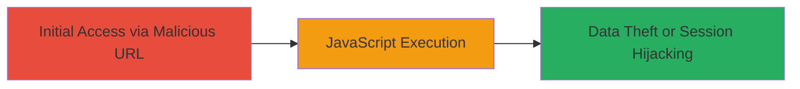

# Reflected XSS in DoD Web Application via Unsanitized sub_div_ofc_sym_cd Parameter

Multi-stage attack chain demonstrating a complete attack workflow.

## Chain Metrics Dashboard

| Metric | Value |
|--------|-------|
| Chain Status | Unverified |
| Total Steps | 1 |
| Execution Time | ~1 minutes |
| Skill Level | Intermediate |
| Complexity | Medium |
| Impact Level | High |

## Attack Flow Visualization



## Prerequisites & Requirements

### Required Tools

- Web browser (e.g., Chrome, Firefox)
- Optional: Proxy tool like Burp Suite for crafting requests

### Target Environment

- Web platform
- Access to a U.S. Department of Defense web application at https://███████/
- No specific services or ports beyond standard HTTP/HTTPS (80/443)

### Initial Access Requirements

- Ability to send a malicious URL to a victim (e.g., via phishing)
- No prior credentials needed; social engineering to trick victim into clicking
- Network access to the public-facing DoD application

## Detailed Attack Procedures

### Step 1: Craft and Deliver Malicious URL
procedure: [[procedures/Exploit-Reflected-XSS-in-sub_div_ofc_sym_cd-Parameter]]

**Objective**: Inject a JavaScript payload into the 'sub_div_ofc_sym_cd' query parameter to reflect and execute arbitrary code in the victim's browser, enabling session hijacking or data theft.

**Instructions**: Construct a URL with the payload encoded for the query parameter. For testing, use a browser or curl to access the endpoint. Example payload: `<svg/onload=alert('nagli')>` URL-encoded as `%3Csvg%2Fonload%3Dalert%28%27nagli%27%29%3E`.

Use [[commands/curl-reflected-xss-test]] to simulate the request:

```bash
curl -G "https://███████/███████=" --data-urlencode "sub_div_ofc_sym_cd=%3Csvg%2Fonload%3Dalert%28%27nagli%27%29%3E" -v
```

In a real attack, deliver the full URL to the victim via email or link.

**Expected Output**: The response reflects the payload unsanitized, e.g., `<svg/onload=alert('nagli')>` appears in HTML, triggering execution on load.

**Success Indicators**:
- Alert box or JavaScript execution observed in browser
- No sanitization errors; payload reflected verbatim
- Victim's session cookies or data accessible via executed script

## Attack Chain Summary

### Key Achievements

1. Successful injection and reflection of JavaScript payload without validation
2. Arbitrary code execution in victim's browser context
3. Potential for session hijacking, keystroke logging, or sensitive data exfiltration from DoD application

## Technique & Tactic Coverage

### MITRE ATT&CK Techniques

- [[JavaScript]]

### MITRE ATT&CK Tactics

- [[Execution]]
- [[Collection]]

---
*Last updated: 2024-01-01T00:00:00Z*
