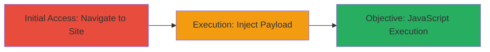

---
tags:
  - xss
  - reflected-xss
  - html-injection
  - javascript
type: attack_chain
tools: []
tactics:
  - '[[Initial Access]]'
  - '[[Execution]]'
commands: []
platforms:
  - Web
complexity: low
procedures:
  - '[[procedures/Navigate-to-DoD-Website]]'
  - '[[procedures/Inject-Reflected-XSS-Payload]]'
step_count: 2
techniques:
  - '[[Exploit Public-Facing Application]]'
  - '[[JavaScript]]'
description: >-
  Exploits a reflected XSS vulnerability in the search field of a U.S.
  Department of Defense website, allowing HTML injection and JavaScript
  execution due to lack of input sanitization.
skill_level: beginner
impact_level: high
id: 3108db35-38b1-44cd-992b-b49a4a8fd056
created_at: '2025-12-14T03:16:02.492Z'
updated_at: '2025-12-14T03:16:02.492Z'
verified: false
validated: true
submitted: true
mitre_tactics:
  - '[[Initial Access]]'
  - '[[Execution]]'
mitre_techniques:
  - '[[Exploit Public-Facing Application]]'
  - '[[JavaScript]]'
---
# Reflected XSS in DoD Website Search Field for JavaScript Execution

Multi-stage attack chain demonstrating exploitation of a reflected Cross-Site Scripting (XSS) vulnerability on a U.S. Department of Defense website. The attack leverages insufficient input sanitization in the search field to inject HTML and JavaScript, resulting in arbitrary code execution in the victim's browser. This can lead to session hijacking, credential theft, or site defacement, with impacts amplified by the site's sensitivity and user privileges.

## Chain Metrics Dashboard

| Metric | Value |
|--------|-------|
| Chain Status | Unverified |
| Total Steps | 2 |
| Execution Time | ~1 minutes |
| Skill Level | Beginner |
| Complexity | Low |
| Impact Level | High |

## Attack Flow Visualization

## Prerequisites & Requirements

### Required Tools

- Web browser (e.g., Chrome, Firefox)

### Target Environment

- Web platform
- Publicly accessible DoD website
- No specific ports or services required beyond HTTP/HTTPS

### Initial Access Requirements

- Internet connectivity
- No credentials needed for public-facing search functionality
- Direct network access to the target URL

## Detailed Attack Procedures

### Step 1: Initial Access
procedure: [[procedures/Navigate-to-DoD-Website]]

**Objective**: Gain access to the vulnerable search field on the target website.

**Instructions**: Open a web browser and navigate to the target DoD website URL: https://██████████/. This positions the attacker to interact with the search functionality where the XSS vulnerability resides.

**Expected Output**: The website loads successfully, displaying the search input field.

**Success Indicators**:
- Website accessible without errors
- Search field visible and interactive

### Step 2: Execution
procedure: [[procedures/Inject-Reflected-XSS-Payload]]

**Objective**: Inject a crafted payload into the search field to trigger reflected XSS, executing JavaScript in the browser context.

**Instructions**: Locate the search input field on the page. Enter the following payload exactly: `'html+injection+xss"><h1><marquee>Ismail Tasdelen</marquee></h1>'`. Submit the search form. The payload will be reflected unsanitized in the response, rendering the HTML (including the marquee) and executing the JavaScript alert via the onerror handler on the invalid image source.

**Expected Output**: A marquee element displaying "Ismail Tasdelen" appears on the page, followed by a JavaScript alert box popping up with the message "ismailtasdelen".

**Success Indicators**:
- HTML elements (e.g., marquee) render dynamically
- JavaScript alert executes, confirming code injection

## Attack Chain Summary

### Key Achievements

1. Successful navigation to the vulnerable DoD website search interface
2. Injection and reflection of arbitrary HTML and JavaScript without sanitization
3. Demonstration of potential for broader impacts like credential theft or impersonation

## Technique & Tactic Coverage

### MITRE ATT&CK Techniques

- [[Exploit Public-Facing Application]]
- [[JavaScript]]

### MITRE ATT&CK Tactics

- [[Initial Access]]
- [[Execution]]

---
*Last updated: 2023-10-01*
