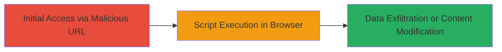

# Reflected XSS in DoD Website via URL Parameter Injection

Multi-stage attack chain demonstrating a complete attack workflow.

## Chain Metrics Dashboard

| Metric | Value |
|--------|-------|
| Chain Status | Unverified |
| Total Steps | 1 |
| Execution Time | ~1 minutes |
| Skill Level | Beginner |
| Complexity | Low |
| Impact Level | High |

## Attack Flow Visualization



## Prerequisites & Requirements

### Required Tools

- Browser with developer tools (e.g., Chrome DevTools)

### Target Environment

- Web platform
- Publicly accessible DoD website
- No specific ports or services required beyond HTTP/HTTPS

### Initial Access Requirements

- No credentials needed
- Direct network access to the website
- Ability to craft and share URLs

## Detailed Attack Procedures

### Step 1: Discover and Exploit Reflected XSS
procedure: [[procedures/Exploit-Reflected-XSS-via-URL-Parameter]]

**Objective**: Identify a vulnerable URL parameter and inject malicious JavaScript to execute in the victim's browser, potentially stealing session data or altering page content.

**Instructions**: Craft a URL with a malicious payload in a reflected parameter (e.g., a search or redirect parameter). For example, append a payload like ?param=<script>alert('XSS')</script> to the target URL. Send the URL to a victim via phishing or social engineering. Upon clicking, the script reflects and executes in their browser.

Use a browser to test locally first:

```bash
# No specific command; use browser URL bar or curl to fetch and inspect
curl "https://target-dod-site.com/search?q=<script>alert('XSS')</script>" -v
```

Then, verify execution by checking for the alert popup or inspecting the response for reflected payload.

**Expected Output**: The website response includes the injected script unescaped, leading to JavaScript execution (e.g., alert box or console log).

**Success Indicators**:
- Malicious script appears in the page source without sanitization
- JavaScript executes (e.g., alert triggers)
- Potential session cookies or data can be exfiltrated via further payload refinement

## Attack Chain Summary

### Key Achievements

1. Successful injection and reflection of malicious script via URL parameter
2. Demonstration of browser-based code execution on a high-value DoD target
3. Potential for session hijacking or phishing escalation

## Technique & Tactic Coverage

### MITRE ATT&CK Techniques

- [[Exploit Public-Facing Application]]
- [[JavaScript]]

### MITRE ATT&CK Tactics

- [[Initial Access]]
- [[Execution]]
- [[Collection]]

---
*Last updated: 2023-10-01T00:00:00Z*
