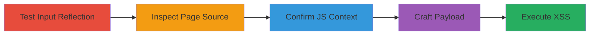

---
tags:
  - xss
  - reflected-xss
  - javascript-injection
  - client-side-execution
type: attack_chain
tools: []
tactics:
  - '[[Execution]]'
verified: false
platforms:
  - Web
submitted: true
created_at: '2023-10-01T00:00:00Z'
procedures:
  - '[[procedures/Test-Input-Reflection-in-Equifax-Search-Query]]'
  - '[[procedures/Inspect-Page-Source-for-Reflection]]'
  - '[[procedures/Confirm-JavaScript-Context-Reflection]]'
  - '[[procedures/Craft-XSS-Payload-for-JavaScript-Injection]]'
  - '[[procedures/Execute-Reflected-XSS-Payload]]'
step_count: 5
techniques:
  - '[[JavaScript]]'
updated_at: '2025-12-14T00:11:15.896Z'
description: >-
  A multi-step attack exploiting a reflected XSS vulnerability in the Equifax
  personal search endpoint's 'q' parameter, allowing arbitrary JavaScript
  execution in victims' browsers.
id: ca3d469c-7868-4873-92fe-6c5dee06268a
validated: true
mitre_tactics:
  - '[[Execution]]'
mitre_techniques:
  - '[[JavaScript]]'
---
---

# Reflected XSS in Equifax Search Endpoint via Unsanitized Query Parameter

Multi-stage attack chain demonstrating a complete reflected XSS exploitation workflow on the Equifax search functionality.

## Chain Metrics Dashboard

| Metric | Value |
|--------|-------|
| Chain Status | Unverified |
| Total Steps | 5 |
| Execution Time | ~5 minutes |
| Skill Level | Beginner |
| Complexity | Low |
| Impact Level | High |

## Attack Flow Visualization

## Prerequisites & Requirements

### Required Tools

- Web browser (e.g., Chrome, Firefox)

### Target Environment

- Web platform
- Access to https://www.equifax.com/personal/search endpoint
- No special services or ports required beyond standard HTTPS (443)

### Initial Access Requirements

- Public internet access
- No credentials needed
- Victim must visit the crafted malicious URL

## Detailed Attack Procedures

### Step 1: Test Input Reflection
procedure: [[procedures/Test-Input-Reflection-in-Equifax-Search-Query]]

**Objective**: Submit a benign test input to the search endpoint to check if user input is reflected in the response.

**Instructions**: Open a web browser and navigate to the search URL with a test string in the 'q' parameter.

**Expected Output**: The search results page loads, and the test string appears in the page content.

**Success Indicators**:
- Test string 'broook' is visible in the page source
- No errors or sanitization applied

### Step 2: Inspect Page Source
procedure: [[procedures/Inspect-Page-Source-for-Reflection]]

**Objective**: Examine the HTML source to locate where and how the input is reflected, identifying potential injection points.

**Instructions**: Right-click on the page and select 'View Page Source', then search for the test string.

**Expected Output**: The string 'broook' appears unsanitized within JavaScript code.

**Success Indicators**:
- Reflection found in client-side JavaScript
- Input inserted without encoding

### Step 3: Confirm JavaScript Context
procedure: [[procedures/Confirm-JavaScript-Context-Reflection]]

**Objective**: Verify that the reflection occurs inside a JavaScript execution context, such as an object literal in a function call.

**Instructions**: In the page source, locate the Analytics.trackEvent function and observe the parameter structure.

**Expected Output**: Input reflected as {internalSearchTerm: "broook" , numOfSearchResultsReturned: 1} inside the function.

**Success Indicators**:
- Input is part of a JavaScript object
- Potential for payload injection via syntax manipulation

### Step 4: Craft XSS Payload
procedure: [[procedures/Craft-XSS-Payload-for-JavaScript-Injection]]

**Objective**: Develop a URL-encoded payload that breaks out of the string context and injects executable JavaScript code.

**Instructions**: Construct the payload to close the string, add a comma, and inject an array.map call to execute alert.

**Expected Output**: A valid URL with encoded payload ready for testing.

**Success Indicators**:
- Payload syntax correctly manipulates the JavaScript object
- Encoded to bypass basic URL filtering

### Step 5: Execute XSS Payload
procedure: [[procedures/Execute-Reflected-XSS-Payload]]

**Objective**: Deliver the payload via the search URL to trigger JavaScript execution in the browser.

**Instructions**: Navigate to the full malicious URL in a browser.

**Expected Output**: An alert popup executes, confirming arbitrary code execution.

**Success Indicators**:
- Alert box appears with payload content
- No server-side blocking

## Attack Chain Summary

### Key Achievements

1. Identified unsanitized reflection in JavaScript context
2. Crafted payload for arbitrary JS execution
3. Demonstrated client-side impact like cookie theft potential

## Technique & Tactic Coverage

### MITRE ATT&CK Techniques

- [[JavaScript]]

### MITRE ATT&CK Tactics

- [[Execution]]

---

*Last updated: 2023-10-01T00:00:00Z*
