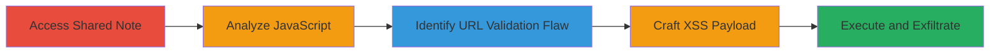

---
tags:
  - xss
  - reflected-xss
  - javascript
  - url-redirection
  - evernote
  - cookie-theft
type: attack_chain
tools: []
tactics:
  - '[[Initial Access]]'
  - '[[Execution]]'
  - '[[Collection]]'
commands: []
platforms:
  - Web
complexity: medium
procedures:
  - '[[procedures/Access-Evernote-Shared-Note-and-Observe-Redirect]]'
  - '[[procedures/Fetch-and-Analyze-Evernote-Client-JavaScript]]'
  - '[[procedures/Identify-Vulnerable-URL-Handling-in-JavaScript]]'
  - '[[procedures/Craft-Reflected-XSS-Payload-for-ionUrl]]'
  - '[[procedures/Execute-XSS-Payload-via-Shared-Note-Viewer]]'
step_count: 5
techniques:
  - '[[Exploit Public-Facing Application]]'
  - '[[JavaScript]]'
description: >-
  A multi-stage attack exploiting a reflected XSS vulnerability in Evernote's
  shared note viewer by bypassing URL validation in the client JavaScript,
  leading to arbitrary JavaScript execution and potential account takeover.
skill_level: intermediate
impact_level: high
id: 712aa53b-f79d-4d5b-9372-abfe194b0009
created_at: '2025-12-14T03:47:23.559Z'
updated_at: '2025-12-14T03:47:23.559Z'
verified: false
validated: true
submitted: true
mitre_tactics:
  - '[[Initial Access]]'
  - '[[Execution]]'
  - '[[Collection]]'
mitre_techniques:
  - '[[Exploit Public-Facing Application]]'
  - '[[JavaScript]]'
---
# Reflected XSS in Evernote Shared Note Viewer via ionUrl Parameter

Multi-stage attack chain demonstrating exploitation of a reflected XSS vulnerability in Evernote's shared note viewer. The attack begins with accessing a shared note, analyzes the client-side JavaScript to identify a flaw in URL validation, crafts a malicious payload using the 'ionUrl' parameter, and executes it to run arbitrary JavaScript, such as stealing session cookies for account takeover.

## Chain Metrics Dashboard

| Metric | Value |
|--------|-------|
| Chain Status | Unverified |
| Total Steps | 5 |
| Execution Time | ~10 minutes |
| Skill Level | Intermediate |
| Complexity | Medium |
| Impact Level | High |

## Attack Flow Visualization

## Prerequisites & Requirements

### Required Tools

- Web browser (e.g., Chrome with developer tools)
- Text editor for payload crafting

### Target Environment

- Evernote web application
- Publicly accessible shared notes
- No authentication required for shared notes

### Initial Access Requirements

- Internet access
- Valid shared note URL from Evernote (e.g., https://www.evernote.com/shard/s[SHARD_NUMBER]/sh/[NOTE_GUID]/[NOTE_KEY])
- No prior credentials needed

## Detailed Attack Procedures

### Step 1: Access Shared Note and Observe Redirect
procedure: [[procedures/Access-Evernote-Shared-Note-and-Observe-Redirect]]

**Objective**: Gain initial access to the shared note viewer and observe the internal redirect behavior to understand the endpoint structure.

**Instructions**: Open a web browser and navigate to a valid Evernote shared note URL, such as `https://www.evernote.com/shard/s1/sh/[NOTE_GUID]/[NOTE_KEY]`. Monitor the network traffic using browser developer tools (F12 > Network tab) to observe the redirect to the client/snv endpoint.

**Expected Output**: The page loads the shared note, and a redirect occurs to `https://www.evernote.com/shard/s1/client/snv?noteGuid=[NOTE_GUID]&noteKey=[NOTE_KEY]&sn=[PREVIOUS_LINK]&title=[NOTE_TITLE]`.

**Success Indicators**:
- Shared note content displays
- Redirect to /client/snv endpoint confirmed in network logs

### Step 2: Fetch and Analyze Client JavaScript
procedure: [[procedures/Fetch-and-Analyze-Evernote-Client-JavaScript]]

**Objective**: Download and inspect the main JavaScript bundle to understand the rendering logic.

**Instructions**: In the browser developer tools (F12 > Sources or Network tab), locate and download the `main.68d4af6d45d9dcaab6e6.js` file loaded from `https://dashboard.svc.www.evernote.com/app/nv/`. Use a tool like an online beautifier or VS Code to format the minified code, then search for rendering functions.

**Expected Output**: Beautified JavaScript code revealing functions like `renderWithContext()` around line 3353.

**Success Indicators**:
- JavaScript file downloaded and beautified
- Key rendering functions identified

### Step 3: Identify Vulnerable URL Handling
procedure: [[procedures/Identify-Vulnerable-URL-Handling-in-JavaScript]]

**Objective**: Locate the flaw in URL validation within the JavaScript code to confirm the XSS vector.

**Instructions**: In the beautified `main.68d4af6d45d9dcaab6e6.js`, navigate to the `renderWithContext()` function. Examine the switch statement on `this.view`; focus on the 'after-save-note' case, which calls `renderAfterSaveNoteView()`. Note that it sets `window.location.href = ionUrl` after checking if `ionUrl.indexOf(J.baseUrl) === -1`, where `J.baseUrl` is 'https://www.evernote.com/', allowing substring bypasses.

**Expected Output**: Confirmation of inadequate prefix validation, enabling javascript: URLs with appended comments.

**Success Indicators**:
- Vulnerable code snippet identified
- Bypass method understood (substring vs. prefix check)

### Step 4: Craft Reflected XSS Payload
procedure: [[procedures/Craft-Reflected-XSS-Payload-for-ionUrl]]

**Objective**: Build a malicious payload that evades the substring check and executes JavaScript.

**Instructions**: Construct the payload as `view=after-save-note&ionUrl=javascript:alert(document.cookie)//https://www.evernote.com/`. Append this to the /client/snv endpoint, e.g., `https://www.evernote.com/shard/s1/client/snv?view=after-save-note&ionUrl=javascript:alert(document.cookie)//https://www.evernote.com/`. Test in browser to verify execution before the comment.

**Expected Output**: Alert box displaying document cookies upon page load.

**Success Indicators**:
- Payload executes without error
- JavaScript runs (e.g., alert fires)

### Step 5: Execute and Verify Exploitation
procedure: [[procedures/Execute-XSS-Payload-via-Shared-Note-Viewer]]

**Objective**: Trigger the full exploit to demonstrate impact like cookie theft.

**Instructions**: Access the POC URL directly: `https://www.evernote.com/shard/s1/client/snv?view=after-save-note&ionUrl=javascript:alert(document.cookie)//https://www.evernote.com/`. Observe the execution; in a real attack, replace alert with code to exfiltrate data to an attacker-controlled server.

**Expected Output**: Arbitrary JavaScript execution, such as cookie alert or data sent to external endpoint.

**Success Indicators**:
- XSS triggered successfully
- Potential for account takeover confirmed

## Attack Chain Summary

### Key Achievements

1. Bypassed URL validation using javascript: protocol with comments
2. Achieved reflected XSS in a public-facing shared note viewer
3. Enabled cookie theft and potential account takeover without authentication

## Technique & Tactic Coverage

### MITRE ATT&CK Techniques

- [[Exploit Public-Facing Application]]
- [[JavaScript]]

### MITRE ATT&CK Tactics

- [[Initial Access]]
- [[Execution]]
- [[Collection]]

---
*Last updated: 2023-10-01*
