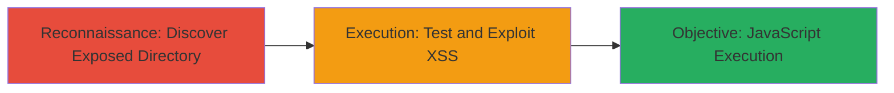

---
tags:
  - xss
  - tomcat
  - jsp
  - web-vulnerability
type: attack_chain
tools: []
tactics:
  - '[[Reconnaissance]]'
  - '[[Execution]]'
verified: false
platforms:
  - Web
submitted: true
complexity: medium
created_at: '2023-10-01T00:00:00Z'
procedures:
  - '[[procedures/Discover-Exposed-Tomcat-JSP-Examples-Directory]]'
  - '[[procedures/Test-and-Exploit-Reflected-XSS-in-JSP-Pages]]'
step_count: 2
techniques:
  - '[[Active Scanning]]'
  - '[[Exploit Public-Facing Application]]'
  - '[[JavaScript]]'
updated_at: '2025-12-14T03:16:08.338Z'
description: >-
  A multi-step attack exploiting an exposed Apache Tomcat /jsp-examples
  directory to identify and leverage reflected XSS vulnerabilities for
  JavaScript execution in user browsers.
skill_level: intermediate
impact_level: high
id: b2cff1ae-c3b6-403f-95c0-f3f8bae73de7
validated: true
mitre_tactics:
  - '[[Reconnaissance]]'
  - '[[Execution]]'
mitre_techniques:
  - '[[Active Scanning]]'
  - '[[Exploit Public-Facing Application]]'
  - '[[JavaScript]]'
---
# Reflected XSS in Exposed Apache Tomcat JSP Examples Directory

Multi-stage attack chain demonstrating discovery and exploitation of reflected XSS in an exposed Apache Tomcat /jsp-examples directory on a pilot environment.

## Chain Metrics Dashboard

| Metric | Value |
|--------|-------|
| Chain Status | Unverified |
| Total Steps | 2 |
| Execution Time | ~5 minutes |
| Skill Level | Intermediate |
| Complexity | Medium |
| Impact Level | High |

## Attack Flow Visualization

## Prerequisites & Requirements

### Required Tools

- Web browser (e.g., Chrome with developer tools)
- Optional: Proxy tool like Burp Suite for payload crafting

### Target Environment

- Web platform with Apache Tomcat server
- Exposed /jsp-examples directory
- Publicly accessible pilot or production host

### Initial Access Requirements

- Internet access to the target host (e.g., 8x8pilot.com)
- No credentials required for public directory access
- Basic knowledge of web vulnerabilities

## Detailed Attack Procedures

### Step 1: Discover Exposed Directory
procedure: [[procedures/Discover-Exposed-Tomcat-JSP-Examples-Directory]]

**Objective**: Identify publicly accessible Apache Tomcat /jsp-examples directory to uncover potential vulnerabilities.

**Instructions**: Navigate to the target host in a web browser and append common Tomcat paths to check for exposure. For example, visit `http://8x8pilot.com/jsp-examples/` to confirm the directory listing or example JSP files are accessible without authentication.

**Expected Output**: Directory listing or JSP pages load, revealing example files like ssn.jsp or color.jsp that handle user input.

**Success Indicators**:
- Directory is publicly accessible
- JSP example files are viewable and interactable

### Step 2: Test and Exploit Reflected XSS
procedure: [[procedures/Test-and-Exploit-Reflected-XSS-in-JSP-Pages]]

**Objective**: Confirm reflected XSS by injecting payloads into JSP parameters and execute malicious JavaScript in the victim's browser.

**Instructions**: Access a vulnerable JSP page, such as `http://8x8pilot.com/jsp-examples/ssn.jsp`, and manipulate input parameters (e.g., name or number fields) to inject a script tag like ``. Observe if the input is reflected unsanitized in the response. For exploitation, craft a URL with a payload targeting session theft, e.g., `http://8x8pilot.com/jsp-examples/ssn.jsp?name=`.

**Expected Output**: Alert box pops up or JavaScript executes, confirming vulnerability; in exploitation, data is sent to attacker's server.

**Success Indicators**:
- Payload reflects without escaping
- Malicious JavaScript executes in browser context

## Attack Chain Summary

### Key Achievements

1. Exposed directory discovery without specialized tools
2. Confirmation of reflected XSS via simple payload injection
3. Potential for session theft or phishing via crafted URLs

## Technique & Tactic Coverage

### MITRE ATT&CK Techniques

- [[Active Scanning]] Active Scanning
- [[Exploit Public-Facing Application]] Exploit Public-Facing Application
- [[JavaScript]] JavaScript

### MITRE ATT&CK Tactics

- [[Reconnaissance]] Reconnaissance
- [[Execution]] Execution

---
*Last updated: 2023-10-01T00:00:00Z*
