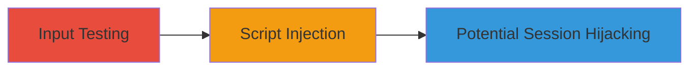

---
tags:
  - xss
  - reflected-xss
  - web-vulnerability
type: attack_chain
tools: []
tactics:
  - '[[Execution]]'
verified: false
platforms:
  - Web
submitted: true
complexity: low
created_at: '2024-01-01T00:00:00Z'
procedures:
  - '[[procedures/Test-Reflected-XSS-in-External-Asset]]'
step_count: 1
techniques:
  - '[[JavaScript]]'
updated_at: '2025-12-13T23:52:55.684Z'
description: >-
  A single-stage attack exploiting a reflected XSS vulnerability in an external
  fraud detection service on secure.chaturbate.com, allowing arbitrary script
  execution in users' browsers.
skill_level: beginner
impact_level: high
id: b4704550-9a05-4275-9bcb-5550719f55e2
validated: true
mitre_tactics:
  - '[[Execution]]'
mitre_techniques:
  - '[[JavaScript]]'
---
# Reflected XSS in External Fraud Detection Asset for Script Injection

Multi-stage attack chain demonstrating a complete attack workflow.

## Chain Metrics Dashboard

| Metric | Value |
|--------|-------|
| Chain Status | Unverified |
| Total Steps | 1 |
| Execution Time | ~5 minutes |
| Skill Level | Beginner |
| Complexity | Low |
| Impact Level | High |

## Attack Flow Visualization



## Prerequisites & Requirements

### Required Tools

- Browser developer tools or proxy like Burp Suite for payload testing

### Target Environment

- Web platform
- Access to secure.chaturbate.com and its external fraud detection asset
- No specific ports required beyond standard HTTPS (443)

### Initial Access Requirements

- Public internet access to the target site
- No credentials needed for initial testing
- Ability to craft and send HTTP requests with malicious payloads

## Detailed Attack Procedures

### Step 1: Identify and Exploit Unsanitized Inputs
procedure: [[procedures/Test-Reflected-XSS-in-External-Asset]]

**Objective**: Discover and confirm the reflected XSS vulnerability by testing input parameters in the external fraud detection asset, enabling arbitrary JavaScript execution.

**Instructions**: Access the secure.chaturbate.com site and interact with features that invoke the external fraud detection service. Use a browser or tool to append a test payload like `<script>alert('XSS')</script>` to input parameters in the URL or form data. Observe if the payload is reflected unsanitized in the response, triggering script execution.

For automated testing, use a curl command to send a request with the payload:

```bash
curl -X GET "https://secure.chaturbate.com/external-asset?param=<script>alert('XSS')</script>" -v
```

Monitor the response for reflection of the payload without encoding.

**Expected Output**: The payload appears in the HTML response unescaped, and an alert box pops up in the browser if executed.

**Success Indicators**:
- Payload reflected in page source without sanitization
- JavaScript alert or console log triggered in the victim's browser context
- Potential for further exploitation like stealing cookies via `document.cookie`

## Attack Chain Summary

### Key Achievements

1. Identified lack of input sanitization in external asset parameters
2. Confirmed reflected XSS allowing script injection
3. Demonstrated risks including session hijacking and phishing

## Technique & Tactic Coverage

### MITRE ATT&CK Techniques

- [[JavaScript]]

### MITRE ATT&CK Tactics

- [[Execution]]

---
*Last updated: 2024-01-01T00:00:00Z*
