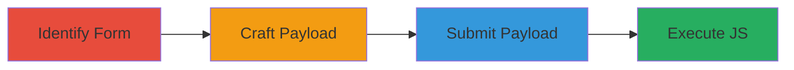

# Reflected XSS in FAQ Helpfulness Feedback Form via SVG Payload

Multi-stage attack chain demonstrating exploitation of a reflected Cross-Site Scripting (XSS) vulnerability in the FAQ helpfulness feedback form on developers.mtn.com. The attack involves identifying the vulnerable form, crafting an SVG-based JavaScript payload, submitting it via POST to bypass parsing, and observing execution, leading to potential cookie theft or phishing.

## Chain Metrics Dashboard

| Metric | Value |
|--------|-------|
| Chain Status | Unverified |
| Total Steps | 4 |
| Execution Time | ~5 minutes |
| Skill Level | Intermediate |
| Complexity | Medium |
| Impact Level | High |

## Attack Flow Visualization



## Prerequisites & Requirements

### Required Tools

- Browser developer tools for inspection
- Text editor for crafting HTML payload

### Target Environment

- Web platform running PHP and Drupal
- Access to https://developers.mtn.com
- No authentication required for public FAQ form

### Initial Access Requirements

- Public internet access
- No credentials needed
- Victim must interact with the form response in their browser

## Detailed Attack Procedures

### Step 1: Identify the FAQ Feedback Form
procedure: [[procedures/Identify-FAQ-Feedback-Form]]

**Objective**: Locate the vulnerable FAQ helpfulness feedback form and its submission endpoint to understand the attack surface.

**Instructions**: Navigate to developers.mtn.com and inspect FAQ articles for feedback forms. Use browser developer tools to examine the form's action attribute and parameters.

**Expected Output**: Confirmation of POST endpoint at https://developers.mtn.com/sites/all/themes/mtn/helpers/faq-helpful.php with 'helpful' parameter.

**Success Indicators**:
- Form identified submitting to /faq-helpful.php
- 'helpful' parameter observed as user-controlled

### Step 2: Craft Malicious XSS Payload
procedure: [[procedures/Craft-Malicious-XSS-Payload]]

**Objective**: Create an injectable payload that evades basic filtering and executes JavaScript upon reflection.

**Instructions**: Design a payload using an SVG element with onload attribute, such as '<svg onload=alert(1)>'. Encode it for inclusion in the 'helpful' parameter, e.g., as 'false&lt;svg onload=alert(1)&gt;' to handle HTML entities.

**Expected Output**: Payload string ready for form submission, tested in a local environment if needed.

**Success Indicators**:
- Payload validates without breaking JSON structure
- SVG tag injects without immediate errors

### Step 3: Submit the Payload via POST Request
procedure: [[procedures/Submit-Payload-via-POST-Request]]

**Objective**: Deliver the payload to the server using a method that sends raw text to bypass JSON parsing issues.

**Instructions**: Create a local HTML file (e.g., vse.html) with a form set to enctype='text/plain' for raw POST submission. Use the following equivalent curl command for testing:

Execute [[commands/curl-post-xss-payload]] to send the payload:

```bash
curl -X POST https://developers.mtn.com/sites/all/themes/mtn/helpers/faq-helpful.php \
  -H "Content-Type: text/plain" \
  --data-raw '{"helpful":"false&lt;svg onload=alert(1)&gt;"}'
```

**Expected Output**: Server response reflecting the unsanitized 'helpful' input.

**Success Indicators**:
- POST request succeeds without errors
- Response contains injected payload

### Step 4: Observe JavaScript Execution
procedure: [[procedures/Observe-JavaScript-Execution]]

**Objective**: Verify the payload execution in the victim's browser context, confirming XSS success.

**Instructions**: Load the response in a browser or simulate via the local HTML form submission. Monitor for the alert(1) popup or inspect the DOM for executed script.

**Expected Output**: JavaScript alert or console log indicating execution.

**Success Indicators**:
- alert(1) popup appears
- DOM shows rendered SVG with onload trigger

## Attack Chain Summary

### Key Achievements

1. Identified vulnerable reflection point in FAQ form
2. Injected and executed arbitrary JavaScript via SVG
3. Demonstrated potential for session hijacking or data theft

## Technique & Tactic Coverage

### MITRE ATT&CK Techniques

- [[JavaScript]]

### MITRE ATT&CK Tactics

- [[Execution]]
- [[Collection]]

---
*Last updated: 2023-10-01T00:00:00Z*
