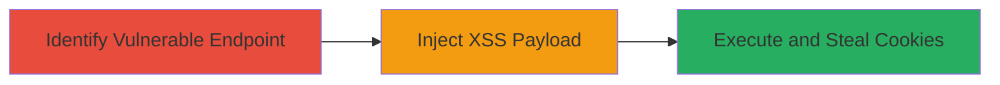

---
tags:
  - xss
  - reflected-xss
  - javascript-injection
  - session-hijacking
type: attack_chain
tools: []
tactics:
  - '[[Execution]]'
verified: false
platforms:
  - Web
submitted: true
complexity: medium
created_at: '2023-10-01T00:00:00Z'
procedures:
  - '[[procedures/Identify-Reflected-XSS-Endpoint]]'
  - '[[procedures/Inject-XSS-Payload-in-Error-Description]]'
  - '[[procedures/Demonstrate-XSS-Impact-with-Cookie-Theft]]'
step_count: 3
techniques:
  - '[[JavaScript]]'
updated_at: '2025-12-13T23:56:03.900Z'
description: >-
  A multi-step attack exploiting a reflected XSS vulnerability in the
  error_description parameter of the Facebook callback endpoint to inject and
  execute JavaScript, demonstrating session compromise via cookie theft.
skill_level: intermediate
impact_level: high
id: b3aaf4e6-77ee-4439-8c58-75f38d2a4a53
validated: true
mitre_tactics:
  - '[[Execution]]'
mitre_techniques:
  - '[[JavaScript]]'
---
# Reflected XSS in Facebook Authentication Callback for Cookie Theft

Multi-stage attack chain demonstrating a reflected XSS vulnerability in the /authentication/fb_callback endpoint of twitterflightschool.com, allowing arbitrary JavaScript execution to steal user cookies and hijack sessions.

## Chain Metrics Dashboard

| Metric | Value |
|--------|-------|
| Chain Status | Unverified |
| Total Steps | 3 |
| Execution Time | ~5 minutes |
| Skill Level | Intermediate |
| Complexity | Medium |
| Impact Level | High |

## Attack Flow Visualization

## Prerequisites & Requirements

### Required Tools

- Web browser (e.g., Chrome with developer tools)
- URL encoding tool (built-in or online encoder)

### Target Environment

- Web platform
- Access to twitterflightschool.com
- No specific ports required; standard HTTPS (443)

### Initial Access Requirements

- Public access to the authentication endpoint
- Ability to trigger error responses (e.g., simulate failed Facebook login)
- No credentials needed for initial identification

## Detailed Attack Procedures

### Step 1: Identify Vulnerable Endpoint
procedure: [[procedures/Identify-Reflected-XSS-Endpoint]]

**Objective**: Locate the /authentication/fb_callback endpoint and confirm the error_description parameter reflects user input without sanitization.

**Instructions**: Navigate to twitterflightschool.com and attempt a Facebook authentication flow to trigger an error response. Observe the URL parameters in the callback, such as error=access_denied, error_code=200, and error_description. Append a test string like 'test' to error_description and check if it appears unsanitized in the page source.

**Expected Output**: The test input reflects directly in the HTML without encoding, e.g., 
error_description=test
.

**Success Indicators**:
- Input appears in page source unescaped
- HTML context allows tag injection

### Step 2: Inject XSS Payload
procedure: [[procedures/Inject-XSS-Payload-in-Error-Description]]

**Objective**: Craft and inject a JavaScript payload into the error_description parameter to break out of the HTML context and execute code.

**Instructions**: URL-encode a payload to close the attribute and inject an  tag with an onerror event. Example payload: ">. Encode it as %22%3E%3Cimg+src%3Dx+onerror%3Dprompt%28document.domain%29%3E and append to the callback URL: https://twitterflightschool.com/authentication/fb_callback?error=access_denied&error_code=200&error_description=%22%3E%3Cimg+src%3Dx+onerror%3Dprompt%28document.domain%29%3E. Load the URL in a browser to trigger execution.

**Expected Output**: A prompt box displaying the document domain (twitterflightschool.com) appears, confirming JS execution in the victim's context.

**Success Indicators**:
- Alert/prompt executes without errors
- No CSP blocks the inline script

### Step 3: Demonstrate Impact with Cookie Theft
procedure: [[procedures/Demonstrate-XSS-Impact-with-Cookie-Theft]]

**Objective**: Modify the payload to exfiltrate sensitive data like cookies, simulating session hijacking.

**Instructions**: Update the payload to prompt(document.cookie) and encode it: %22%3E%3Cimg+src%3Dx+onerror%3Dprompt%28document.cookie%29%3E. Append to the URL as before and load it. In a real attack, replace prompt with a request to an attacker-controlled server to send cookies.

**Expected Output**: A prompt displays the victim's cookies, such as session tokens.

**Success Indicators**:
- Cookies are revealed in the prompt
- Potential for data exfiltration confirmed

## Attack Chain Summary

### Key Achievements

1. Identified unsanitized reflection in error_description parameter
2. Successfully injected and executed arbitrary JavaScript
3. Demonstrated ability to steal session cookies for account compromise

## Technique & Tactic Coverage

### MITRE ATT&CK Techniques

- [[JavaScript]]

### MITRE ATT&CK Tactics

- [[Execution]]

---
*Last updated: 2023-10-01T00:00:00Z*
