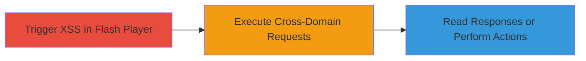

---
tags:
  - xss
  - flash
  - crossdomain
  - csrf
  - data-exfiltration
type: attack_chain
tools: []
tactics:
  - '[[Initial Access]]'
  - '[[Execution]]'
  - '[[Collection]]'
verified: false
platforms:
  - Web
  - Flash
submitted: true
complexity: medium
created_at: '2023-10-01T00:00:00Z'
procedures:
  - '[[procedures/Trigger-Reflected-XSS-in-Flash-Player]]'
  - '[[procedures/Exploit-Cross-Domain-Policy-for-Requests]]'
step_count: 2
techniques:
  - '[[Exploit Public-Facing Application]]'
  - '[[Drive-by Compromise]]'
  - '[[JavaScript]]'
updated_at: '2025-12-14T03:16:20.369Z'
description: >-
  A multi-stage attack exploiting a reflected XSS vulnerability in a Flash
  player SWF file to execute JavaScript and leverage a permissive
  crossdomain.xml policy for cross-domain requests to the target site.
skill_level: intermediate
impact_level: high
id: 73e5f48d-c94c-4f90-bb9c-582a412f4f7d
validated: true
mitre_tactics:
  - '[[Initial Access]]'
  - '[[Execution]]'
  - '[[Collection]]'
mitre_techniques:
  - '[[Exploit Public-Facing Application]]'
  - '[[Drive-by Compromise]]'
  - '[[JavaScript]]'
---
# Reflected XSS in Flash Player Leading to Cross-Domain Requests on Chaturbate

Multi-stage attack chain demonstrating exploitation of a reflected XSS in a Flash SWF file hosted on a static domain, combined with a misconfigured crossdomain.xml to enable cross-site requests to the main application domain.

## Chain Metrics Dashboard

| Metric | Value |
|--------|-------|
| Chain Status | Unverified |
| Total Steps | 2 |
| Execution Time | ~5 minutes |
| Skill Level | Intermediate |
| Complexity | Medium |
| Impact Level | High |

## Attack Flow Visualization



## Prerequisites & Requirements

### Required Tools

- Web browser with Flash support (e.g., legacy Firefox or Chrome with Flash enabled)

### Target Environment

- Web platform
- Flash-enabled environment
- Access to ssl-ccstatic.highwebmedia.com and chaturbate.com

### Initial Access Requirements

- No credentials required for initial trigger
- Victim must load the malicious URL (e.g., via phishing or direct link)
- Authenticated session on chaturbate.com for full impact

## Detailed Attack Procedures

### Step 1: Trigger Reflected XSS
procedure: [[procedures/Trigger-Reflected-XSS-in-Flash-Player]]

**Objective**: Inject and execute arbitrary JavaScript in the context of the ssl-ccstatic.highwebmedia.com domain by exploiting the unsanitized 'playerready' parameter in the Flash SWF.

**Instructions**: Construct a malicious URL appending a JavaScript payload to the playerready parameter and load it in a browser with Flash enabled. For testing, use a simple alert payload to confirm execution:

Open the following URL in a browser:

```url
https://ssl-ccstatic.highwebmedia.com/jwplayer/player.swf?playerready=alert(document.domain)
```

Replace the payload with more complex JavaScript if needed, such as fetching external scripts.

**Expected Output**: An alert box pops up displaying 'ssl-ccstatic.highwebmedia.com', confirming JavaScript execution.

**Success Indicators**:
- Alert or other JS effect triggers
- No errors in browser console related to Flash loading

### Step 2: Exploit Cross-Domain Policy
procedure: [[procedures/Exploit-Cross-Domain-Policy-for-Requests]]

**Objective**: Use the executed JavaScript from the XSS to initiate Flash-based cross-domain requests to chaturbate.com, bypassing SOP/CORS and potentially reading responses or performing authenticated actions.

**Instructions**: In the XSS payload, embed ActionScript code that leverages Flash's ExternalInterface and the permissive crossdomain.xml to send requests. For example, modify the payload to load a custom SWF or directly use Flash APIs to request chaturbate.com endpoints:

Example payload concept (requires Flash development for full exploit):

```javascript
// Injected via playerready
ExternalInterface.call('sendCrossDomainRequest', 'https://chaturbate.com/api/endpoint');
```

The crossdomain.xml at chaturbate.com/crossdomain.xml allows *.highwebmedia.com with 'all' policies, enabling headers='*' and broad access. Test by attempting to load and read a response from an authenticated page.

**Expected Output**: Successful cross-domain request; ability to read HTTP responses or submit forms on behalf of the victim.

**Success Indicators**:
- Cross-domain request completes without Flash security errors
- Response data from chaturbate.com is accessible in the Flash context
- Potential CSRF token exfiltration or action performance

## Attack Chain Summary

### Key Achievements

1. Successful XSS trigger in Flash context without authentication
2. Bypass of same-origin restrictions via crossdomain.xml
3. Potential for data exfiltration or authenticated actions on chaturbate.com

## Technique & Tactic Coverage

### MITRE ATT&CK Techniques

- [[Exploit Public-Facing Application]] Exploit Public-Facing Application
- [[Drive-by Compromise]] Drive-by Compromise
- [[JavaScript]] JavaScript

### MITRE ATT&CK Tactics

- [[Initial Access]] Initial Access
- [[Execution]] Execution
- [[Collection]] Collection

---

*Last updated: 2023-10-01T00:00:00Z*
