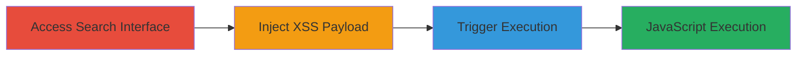

# Reflected XSS in GitHub Algolia Search Leading to Arbitrary JavaScript Execution

Multi-stage attack chain demonstrating a complete attack workflow exploiting unsanitized search queries on github.algolia.com.

## Chain Metrics Dashboard

| Metric | Value |
|--------|-------|
| Chain Status | Unverified |
| Total Steps | 3 |
| Execution Time | ~1 minutes |
| Skill Level | Beginner |
| Complexity | Low |
| Impact Level | High |

## Attack Flow Visualization

## Prerequisites & Requirements

### Required Tools

- Browser with developer tools (e.g., Chrome DevTools)

### Target Environment

- Web platform
- Services: Algolia Search integrated with GitHub
- Tech stack: JavaScript
- Network access: Public internet access to github.algolia.com

### Initial Access Requirements

- No credentials required
- Direct access to the public-facing search interface
- No prior access needed

## Detailed Attack Procedures

### Step 1: Access the Search Interface
procedure: [[procedures/Access-Algolia-Search-Interface]]

**Objective**: Navigate to the vulnerable search functionality on github.algolia.com to prepare for payload injection.

**Instructions**: Open a web browser and navigate directly to the github.algolia.com subdomain. Locate the search input field, which is designed to accept queries sourced from GitHub integrations.

**Expected Output**: The search page loads with an input field visible and ready for user input.

**Success Indicators**:
- Search interface is accessible without errors
- Input field accepts text entry

### Step 2: Inject XSS Payload
procedure: [[procedures/Inject-XSS-Payload-in-Search]]

**Objective**: Input a malicious JavaScript payload into the search field to test for lack of sanitization.

**Instructions**: In the search input field, enter a proof-of-concept XSS payload such as `<svg onload=alert('XSS')>` or `javascript:alert('document domain')`. These payloads leverage SVG elements or JavaScript URIs to execute code when reflected.

**Expected Output**: The payload is accepted into the input field without immediate validation errors.

**Success Indicators**:
- Payload text is entered successfully
- No client-side filtering blocks the input

### Step 3: Trigger XSS Execution
procedure: [[procedures/Trigger-XSS-Execution-via-Search]]

**Objective**: Submit the search to cause the unsanitized payload to be reflected and executed in the browser context.

**Instructions**: Press Enter or click the search button to submit the query. The server reflects the input without proper escaping, rendering it as executable JavaScript in the page.

**Expected Output**: An alert popup appears in the browser displaying 'XSS' or the document domain, confirming JavaScript execution.

**Success Indicators**:
- Alert dialog triggers
- Browser console shows no errors, but execution occurs

## Attack Chain Summary

### Key Achievements

1. Successful access to the vulnerable search interface
2. Injection and reflection of arbitrary JavaScript via unsanitized GitHub-sourced queries
3. Demonstration of client-side code execution, enabling potential session hijacking or data theft

## Technique & Tactic Coverage

### MITRE ATT&CK Techniques

- [[JavaScript]]

### MITRE ATT&CK Tactics

- [[Execution]]

---
*Last updated: 2024-10-01T00:00:00Z*
