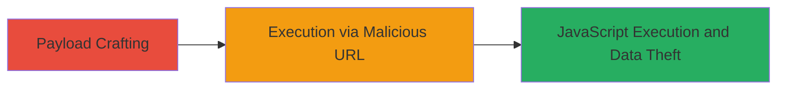

---
tags:
  - xss
  - reflected-xss
  - svg-payload
  - glassdoor
type: attack_chain
tools:
  - '[[tools/Chrome]]'
  - '[[tools/OWASP-XSS-Filter-Evasion-Cheat-Sheet]]'
tactics:
  - '[[Execution]]'
  - '[[Collection]]'
verified: false
platforms:
  - Web
submitted: true
complexity: medium
created_at: '2023-10-01T00:00:00Z'
procedures:
  - '[[procedures/Execute-Reflected-XSS-via-Encoded-SVG-in-DIFFICULT-Parameter]]'
step_count: 1
techniques:
  - '[[JavaScript]]'
updated_at: '2025-12-13T23:52:21.114Z'
description: >-
  A reflected XSS attack exploiting insufficient sanitization in the DIFFICULT
  URL parameter on Glassdoor's office locations page, using encoded SVG onload
  payloads to execute JavaScript.
skill_level: intermediate
impact_level: high
id: cce44388-d7a5-4ec6-9335-68015e0d6df0
validated: true
mitre_tactics:
  - '[[Execution]]'
  - '[[Collection]]'
mitre_techniques:
  - '[[JavaScript]]'
---
# Reflected XSS in Glassdoor DIFFICULT Parameter via Encoded SVG Payload

Multi-stage attack chain demonstrating a complete attack workflow exploiting a reflected XSS vulnerability in Glassdoor's office locations page.

## Chain Metrics Dashboard

| Metric | Value |
|--------|-------|
| Chain Status | Unverified |
| Total Steps | 1 |
| Execution Time | ~1 minutes |
| Skill Level | Intermediate |
| Complexity | Medium |
| Impact Level | High |

## Attack Flow Visualization

## Prerequisites & Requirements

### Required Tools

- [[tools/Chrome]]
- [[tools/OWASP-XSS-Filter-Evasion-Cheat-Sheet]]

### Target Environment

- Web platform
- Access to Glassdoor office locations page
- No specific services/ports required beyond HTTP/HTTPS

### Initial Access Requirements

- Public internet access
- No credentials needed
- Victim must visit the malicious URL

## Detailed Attack Procedures

### Step 1: Payload Execution
procedure: [[procedures/Execute-Reflected-XSS-via-Encoded-SVG-in-DIFFICULT-Parameter]]

**Objective**: Inject and execute a malicious JavaScript payload via the reflected DIFFICULT parameter to demonstrate arbitrary code execution in the victim's browser.

**Instructions**: Craft the encoded payload using HTML decimal entities for bypass, then navigate to the vulnerable URL in a browser. The payload uses an SVG onload attribute to trigger alert(1), which can be extended for cookie theft or page modification.

The malicious URL is: https://www.glassdoor.com/Location/All-Tesla-Office-Locations-E43129.htm?DIFFICULT=%3E%3Csvg%20onload%3d%26%23x00000000061;%26%23x0000000006c%26%23x0000000065%26%23x0000000072%26%23x00000000074(1%26%230000000000000041;%20%3C%2fscript%20

This decodes to execute alert(1) via the SVG onload event.

**Expected Output**: Upon visiting the URL, an alert box pops up displaying "1", confirming JavaScript execution.

**Success Indicators**:
- Alert dialog appears in the browser
- Page source shows injected SVG element
- No filter blocks the encoded payload

## Attack Chain Summary

### Key Achievements

1. Bypassed input filters using HTML decimal entity encoding
2. Achieved arbitrary JavaScript execution via SVG onload
3. Demonstrated potential for cookie theft and webpage manipulation

## Technique & Tactic Coverage

### MITRE ATT&CK Techniques

- [[JavaScript]]

### MITRE ATT&CK Tactics

- [[Execution]]
- [[Collection]]

---
*Last updated: 2023-10-01T00:00:00Z*
