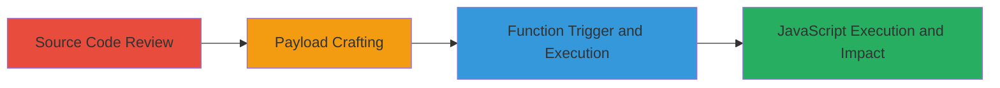

---
tags:
  - xss
  - gocd
  - javascript-uri
  - reflected-xss
type: attack_chain
tools: []
tactics:
  - '[[Execution]]'
  - '[[Collection]]'
verified: false
platforms:
  - Web
submitted: true
complexity: medium
created_at: '2023-10-01T00:00:00Z'
procedures:
  - '[[procedures/Review-GoCD-Source-Code-for-redirect-to-Handling]]'
  - '[[procedures/Craft-Malicious-javascript-URI-for-redirect-to]]'
  - '[[procedures/Trigger-redirectToLanding-Function-to-Execute-XSS]]'
step_count: 3
techniques:
  - '[[JavaScript]]'
updated_at: '2025-12-13T23:52:49.930Z'
description: >-
  A multi-step attack chain exploiting a reflected XSS vulnerability in GoCD's
  new.loading.page.html by manipulating the redirect_to query parameter to
  inject and execute arbitrary JavaScript during server startup.
skill_level: intermediate
impact_level: high
id: 3ee3ac41-09a1-48a5-9a69-bc438b0ccbf8
validated: true
mitre_tactics:
  - '[[Execution]]'
  - '[[Collection]]'
mitre_techniques:
  - '[[JavaScript]]'
---
# Reflected XSS in GoCD Loading Page via Unvalidated redirect_to Parameter

Multi-stage attack chain demonstrating exploitation of a reflected Cross-Site Scripting (XSS) vulnerability in GoCD's new.loading.page.html file. The attack leverages inadequate validation of the 'redirect_to' query parameter in the redirectToLanding function, allowing injection of javascript: URIs to execute arbitrary JavaScript. This can lead to session cookie theft or unauthorized actions, though limited to the loading page during server startup.

## Chain Metrics Dashboard

| Metric | Value |
|--------|-------|
| Chain Status | Unverified |
| Total Steps | 3 |
| Execution Time | ~5 minutes |
| Skill Level | Intermediate |
| Complexity | Medium |
| Impact Level | High |

## Attack Flow Visualization

## Prerequisites & Requirements

### Required Tools

- Web browser (e.g., Chrome Developer Tools)
- Access to GoCD source code on GitHub

### Target Environment

- GoCD server running with Jetty
- Web platform
- Loading page accessible during server startup

### Initial Access Requirements

- Ability to view the GoCD loading page (publicly accessible or authenticated)
- No prior credentials needed, but victim interaction required for practical impact

## Detailed Attack Procedures

### Step 1: Source Code Review
procedure: [[procedures/Review-GoCD-Source-Code-for-redirect-to-Handling]]

**Objective**: Identify the vulnerability in the redirectToLanding function by examining the source code for improper handling of the redirect_to parameter.

**Instructions**: Navigate to the GoCD GitHub repository and inspect the new.loading.page.html file. Focus on lines 397-404 where the function parses window.location.search and assigns the decoded redirect_to value to window.location without validation for javascript: schemes.

**Expected Output**: Confirmation that the function uses decodeURIComponent on the parameter without checks, enabling javascript: injection.

**Success Indicators**:
- Identified lack of URI scheme validation
- Noted the direct assignment to window.location

### Step 2: Payload Crafting
procedure: [[procedures/Craft-Malicious-javascript-URI-for-redirect-to]]

**Objective**: Construct a malicious URL incorporating a javascript: URI in the redirect_to parameter to prepare for XSS payload injection.

**Instructions**: Build the URL as `http://target-gocd/loading/new.loading.page.html?redirect_to=javascript:alert("XSS")`. Ensure the payload is URL-encoded if necessary, but in this case, the javascript:alert("XSS") is captured directly by the query parsing logic.

**Expected Output**: A valid malicious URL ready for use in the browser.

**Success Indicators**:
- Payload correctly formatted to bypass basic checks
- javascript: URI scheme intact for execution

### Step 3: Function Trigger and Execution
procedure: [[procedures/Trigger-redirectToLanding-Function-to-Execute-XSS]]

**Objective**: Invoke the vulnerable redirectToLanding function to execute the injected JavaScript payload, demonstrating XSS.

**Instructions**: Load the crafted URL in a browser targeting the GoCD loading page during server startup. The function will automatically trigger, decoding and assigning the payload to window.location, resulting in JavaScript execution.

**Expected Output**: Alert box displaying "XSS" or execution of the injected script.

**Success Indicators**:
- Arbitrary JavaScript executes in the browser context
- Potential for cookie theft via document.cookie access

## Attack Chain Summary

### Key Achievements

1. Discovered unvalidated redirect_to parameter handling in GoCD source code
2. Successfully injected and executed javascript: URI payload
3. Demonstrated potential for session hijacking or unauthorized actions

## Technique & Tactic Coverage

### MITRE ATT&CK Techniques

- [[JavaScript]]

### MITRE ATT&CK Tactics

- [[Execution]]
- [[Collection]]

---
*Last updated: 2023-10-01T00:00:00Z*
