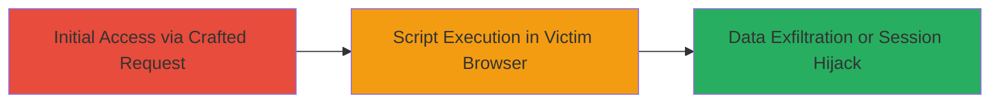

---
tags:
  - xss
  - reflected-xss
  - socketio
  - node.js
  - web-vulnerability
type: attack_chain
tools: []
tactics:
  - '[[Execution]]'
  - '[[Initial Access]]'
verified: false
platforms:
  - Web
submitted: true
complexity: medium
created_at: '2023-10-01T00:00:00Z'
procedures:
  - '[[procedures/Exploit-Reflected-XSS-in-SocketIO-Handling]]'
step_count: 1
techniques:
  - '[[JavaScript]]'
  - '[[Exploit Public-Facing Application]]'
updated_at: '2025-12-14T03:46:31.840Z'
description: >-
  A multi-stage attack exploiting a reflected XSS vulnerability in the
  Hyperledger Cactus cmd-socketio-server component, allowing malicious script
  injection through unsanitized Socket.IO command handling.
skill_level: intermediate
impact_level: high
id: 05d3ee4f-0a3f-4edb-bf18-38828773053f
validated: true
mitre_tactics:
  - '[[Execution]]'
  - '[[Initial Access]]'
mitre_techniques:
  - '[[JavaScript]]'
  - '[[Exploit Public-Facing Application]]'
---
# Reflected XSS in Hyperledger Cactus cmd-socketio-server via Unsanitized Socket.IO Inputs

Multi-stage attack chain demonstrating exploitation of a reflected Cross-Site Scripting (XSS) vulnerability in the Hyperledger Cactus project's cmd-socketio-server component. The vulnerability arises from insufficient input sanitization in Socket.IO command handling, allowing attackers to inject malicious JavaScript payloads that execute in the victim's browser context. This can lead to session hijacking, data theft, or further attacks on the decentralized trust platform.

## Chain Metrics Dashboard

| Metric | Value |
|--------|-------|
| Chain Status | Unverified |
| Total Steps | 1 |
| Execution Time | ~5 minutes |
| Skill Level | Intermediate |
| Complexity | Medium |
| Impact Level | High |

## Attack Flow Visualization



## Prerequisites & Requirements

### Required Tools

- Browser Developer Tools or a WebSocket client like [[tools/wscat]]

### Target Environment

- Hyperledger Cactus instance running cmd-socketio-server
- Node.js backend with Socket.IO enabled
- Web platform accessible via browser

### Initial Access Requirements

- Network access to the target Socket.IO endpoint (typically ws:// or wss://)
- No prior credentials needed for reflected XSS, but victim interaction required (e.g., tricking user to connect via malicious link)
- Basic knowledge of JavaScript payloads

## Detailed Attack Procedures

### Step 1: Inject Malicious Payload via Socket.IO
procedure: [[procedures/Exploit-Reflected-XSS-in-SocketIO-Handling]]

**Objective**: Send a crafted command to the vulnerable Socket.IO endpoint to reflect unsanitized input back to the client, executing arbitrary JavaScript in the browser.

**Instructions**: Connect to the Socket.IO server using a WebSocket client and emit a command with a malicious payload. For example, use a tool like wscat to simulate the connection and injection:

First, install and use [[commands/wscat-connect-socketio]] to establish the connection:

```bash
wscat -c ws://target-host:port/socket.io/?EIO=4&transport=websocket
```

Then, emit a vulnerable command event with a script tag payload using [[commands/socketio-emit-xss]]:

```bash
# After connecting, send: '42["command_event",{"payload":"<script>alert(document.cookie)</script>"}]' 
```

Intercept and modify if using a proxy like Burp Suite to craft the exact payload.

**Expected Output**: The server reflects the unsanitized payload, causing the browser to execute the script (e.g., an alert box showing cookies or network requests for exfiltration).

**Success Indicators**:
- Malicious script executes in the browser console or UI
- Victim's session cookies or data are accessible via the payload
- No server-side errors; reflection occurs immediately

## Attack Chain Summary

### Key Achievements

1. Successful injection of JavaScript via reflected input in Socket.IO commands
2. Execution of arbitrary code in the victim's browser context
3. Potential for session hijacking or data theft from the Hyperledger Cactus application

## Technique & Tactic Coverage

### MITRE ATT&CK Techniques

- [[JavaScript]]
- [[Exploit Public-Facing Application]]

### MITRE ATT&CK Tactics

- [[Execution]]
- [[Initial Access]]

---
*Last updated: 2023-10-01T00:00:00Z*
