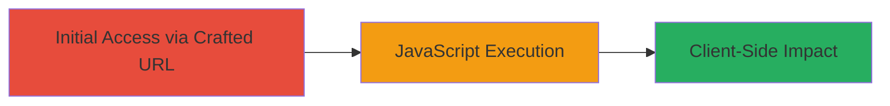

# Reflected XSS in Imgur Mobile User Message Endpoint

Multi-stage attack chain demonstrating a complete attack workflow.

## Chain Metrics Dashboard

| Metric | Value |
|--------|-------|
| Chain Status | Unverified |
| Total Steps | 1 |
| Execution Time | ~1 minute |
| Skill Level | Beginner |
| Complexity | Low |
| Impact Level | High |

## Attack Flow Visualization



## Prerequisites & Requirements

### Required Tools

- Web browser (e.g., Chrome, Firefox)

### Target Environment

- Target Platform: Web (Imgur mobile site)
- Required services/ports: HTTP/HTTPS on port 80/443
- Network access requirements: Internet access to m.imgur.com

### Initial Access Requirements

- No credentials required
- Victim must access the crafted URL
- No prior access needed

## Detailed Attack Procedures

### Step 1: Trigger XSS via Crafted URL
procedure: [[procedures/Exploit-Reflected-XSS-via-Username-Parameter]]

**Objective**: Inject and execute arbitrary JavaScript in the victim's browser by crafting a malicious URL targeting the Imgur mobile user message endpoint.

**Instructions**: Construct the malicious URL by injecting a JavaScript payload into the username path parameter. The payload breaks out of the HTML attribute context using quote closure and executes code via an onerror event on an image tag.

Example crafted URL:

```url
http://m.imgur.com/user/%22%3E%3Cimg%20src=x%20onerror=alert(1)%3E/message
```

Direct the victim to visit this URL. Upon loading, the unsanitized username parameter reflects the payload, resulting in JavaScript execution.

**Expected Output**: An alert box displaying "1" pops up in the browser, confirming XSS execution.

**Success Indicators**:
- JavaScript alert (or custom payload) triggers in the browser
- Browser console shows no errors related to the payload
- Victim's session cookies or data can be exfiltrated if payload is modified (e.g., to send data to attacker-controlled server)

## Attack Chain Summary

### Key Achievements

1. Successful injection of JavaScript payload into the URL path parameter
2. Arbitrary code execution in the context of the Imgur mobile site
3. Potential for session theft or phishing attacks via escalated payloads

## Technique & Tactic Coverage

### MITRE ATT&CK Techniques

- [[Exploit Public-Facing Application]]
- [[JavaScript]]

### MITRE ATT&CK Tactics

- [[Initial Access]]
- [[Execution]]
- [[Collection]]

---
*Last updated: 2023-10-01T12:00:00Z*
